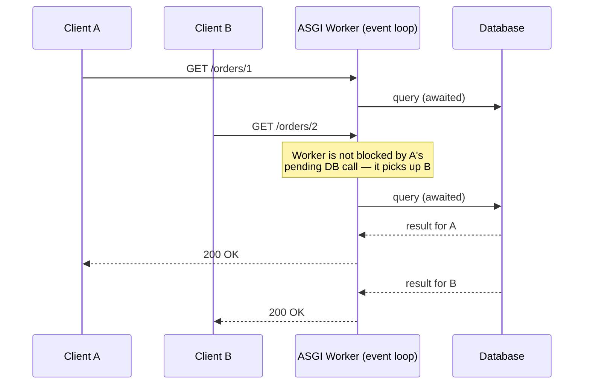
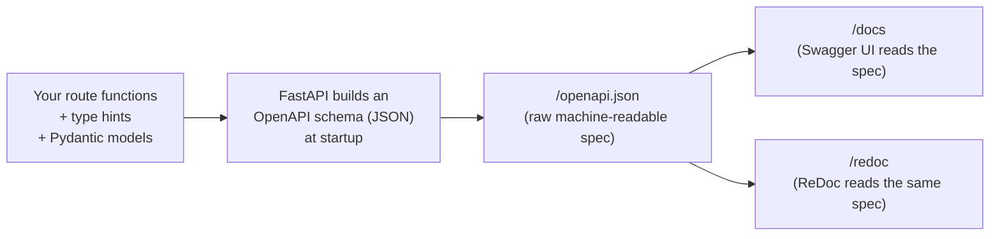

# Chapter 1: Why FastAPI — The Landscape and the Mental Model

> Part I — Foundations · Chapter 1 of 28

## Learning Objectives

By the end of this chapter you will be able to:

- Explain where FastAPI sits relative to Flask, Django, and Django REST Framework, and *why* that positioning exists.
- Explain the difference between WSGI and ASGI, and why it matters for the framework's performance model.
- Name and explain FastAPI's "three pillars" — Starlette, Pydantic, and Python type hints — and what each one is actually responsible for.
- Trace, at a mechanical level, how a single type-hinted function signature becomes request validation, response serialization, *and* interactive documentation simultaneously.
- Scaffold a project with `uv`, run it with the FastAPI CLI, and read the artifacts it generates (`/docs`, `/redoc`, `/openapi.json`).

---

## 1.1 The Problem FastAPI Solves

Every Python web framework answers the same basic question — *how do I turn an incoming HTTP request into a Python function call, and a Python return value into an HTTP response?* — but they answer it with very different amounts of ceremony.

Flask answers it minimally: you get routing and request/response objects, and everything else (validation, serialization, docs) is your problem, solved with third-party extensions. Django answers it maximally: routing, ORM, admin panel, templating, forms — an entire batteries-included ecosystem, with Django REST Framework layered on top for APIs specifically.

FastAPI answers it differently from both: it doesn't try to be a full web platform like Django, and it doesn't leave validation/docs as an exercise for the reader like Flask. Instead, it makes one specific bet — **your Python type hints already contain enough information to derive validation, serialization, and documentation automatically** — and builds the entire framework around cashing in on that bet.

That's the mental model to hold onto for this whole curriculum: *FastAPI is not primarily a routing framework that happens to validate data. It's a validation-and-documentation engine that happens to also route requests.* Routing and the actual request/response plumbing are delegated almost entirely to a library you'll meet in a moment: Starlette.

## 1.2 WSGI vs ASGI — The Foundation Underneath

Before FastAPI, before Flask, before Django — there's a *specification* for how a Python web server talks to a Python web application. For most of Python's web history, that specification was **WSGI** (Web Server Gateway Interface). WSGI's model is simple: one request comes in, your application handles it synchronously, a response goes out, the worker is free for the next request. If your application blocks on a slow database call or an external API, that worker sits idle, blocked, until it's done. To handle more concurrent requests, you spin up more worker processes.

**ASGI** (Asynchronous Server Gateway Interface) is WSGI's successor, designed around Python's `async`/`await`. Under ASGI, a single worker can hold many requests *in flight at once* — while one request is waiting on a database call or an external HTTP call, the event loop is free to make progress on other requests in the meantime. Nothing about ASGI *forces* you to write async code — you can still write plain synchronous `def` route handlers, and FastAPI runs those in a thread pool so they don't block the event loop — but ASGI is what makes it *possible* to write high-concurrency I/O-bound code without spinning up a process per connection.



FastAPI is built on top of **Starlette**, which is an ASGI framework — this is the entire reason FastAPI can claim performance "on par with NodeJS and Go" for I/O-bound workloads: it's not that Python itself got faster, it's that the concurrency model stopped forcing one worker to sit idle per slow request.

**Practical takeaway you'll use constantly:** in FastAPI, `def` handlers and `async def` handlers are both valid, but they are *not* interchangeable in terms of behavior. An `async def` handler that calls a blocking library (like a non-async database driver) *will* block the entire event loop and stall every other concurrent request on that worker. This single mistake is the most common FastAPI performance bug in production code, and it comes directly from misunderstanding this section — so make a mental note now, because we'll come back to it concretely in Chapter 9 when we wire up a real database.

## 1.3 The Three Pillars

FastAPI itself is a relatively thin layer that wires together three things, and understanding the division of labor between them will make everything else in this curriculum click faster.

| Pillar | Responsible for | What FastAPI adds on top |
|---|---|---|
| **Starlette** | Routing, requests/responses, middleware, WebSockets, background tasks, the ASGI plumbing itself | Almost nothing — FastAPI mostly *is* Starlette for this layer |
| **Pydantic** | Parsing raw data into typed Python objects, validation, serialization back to JSON | The wiring that connects Pydantic models to path operation parameters and responses automatically |
| **Python type hints** | Nothing at runtime, on their own — they're just metadata | FastAPI *reads* your type hints at import time and uses them to build validation rules and the OpenAPI schema |

The reason this division matters practically: when you hit a wall later in the curriculum — say, a routing quirk, or a middleware ordering question — the answer is very often "that's Starlette's behavior, not FastAPI's," and you can go straight to Starlette's documentation instead of hunting through FastAPI's. Conversely, validation and serialization questions are Pydantic questions. FastAPI's own surface area is smaller than people expect, and knowing that helps you debug faster.

## 1.4 One Declaration, Three Jobs

Here is the core trick, stated as concretely as possible. Take this function signature:

```python
@app.get("/items/{item_id}")
def read_item(item_id: int, q: str | None = None):
    return {"item_id": item_id, "q": q}
```

The type hints `int` and `str | None` are doing three separate jobs simultaneously, and no other job was written twice:

1. **Validation, at request time.** If a client requests `/items/abc`, FastAPI (via Pydantic) rejects it before your function body ever runs, with a structured `422 Unprocessable Entity` response explaining exactly which field failed and why.
2. **Documentation, at schema-generation time.** FastAPI inspects this signature once at startup and produces an OpenAPI schema entry stating that `item_id` is a required integer path parameter and `q` is an optional string query parameter — which is what powers the interactive `/docs` page you're about to see.
3. **Editor support, at write time.** Because these are real Python type hints, your editor's autocomplete and type checker understand `item_id` is an `int` inside the function body, with no framework-specific plugin required.

This is the "fewer bugs, less time reading docs" claim FastAPI makes about itself — it isn't marketing fluff, it's a direct consequence of refusing to let validation rules, documentation, and type information drift out of sync, because there's only one place they're declared.

## 1.5 How the Auto-Generated Docs Actually Work

It's worth demystifying `/docs` rather than treating it as magic, because you'll be relying on it for the rest of this curriculum.



Nothing about `/docs` or `/redoc` is hand-written by you. Both pages are pre-built JavaScript UIs (Swagger UI and ReDoc respectively) that fetch `/openapi.json` and render it. That means:

- `/openapi.json` is the actual source of truth — `/docs` and `/redoc` are just two different renderers for it.
- If a field is missing or wrong in `/docs`, the bug is upstream, in how your Pydantic model or path operation was declared — not in the docs page itself.
- This same `/openapi.json` file is what lets FastAPI later generate client SDKs in other languages (a feature you'll see referenced in later, more advanced chapters) — because OpenAPI is a widely-supported, language-agnostic standard, not a FastAPI invention.

## 1.6 Where FastAPI Fits Today (2026 Landscape Note)

A brief grounding note, since this ecosystem moves quickly: FastAPI has fully moved to **Pydantic v2** — v1 support was removed, with only a short-lived `pydantic.v1` compatibility shim for stragglers mid-migration. The recommended install is `fastapi[standard]`, which bundles the `fastapi` CLI (`fastapi dev` / `fastapi run`) along with Uvicorn and other commonly-needed extras, rather than installing the bare framework and assembling the rest yourself. There's also a companion CLI framework from the same author, **Typer**, described as "the FastAPI of CLIs" — worth knowing the name exists, even though it's out of scope for this curriculum. None of this changes the mental model above; it's the same three pillars, just with a smoother install and tooling experience than in FastAPI's earlier years.

---

## Hands-On Project: Your First FastAPI Service

### Step 1 — Environment setup with `uv`

```bash
# create a project directory and virtual environment
mkdir fastapi-curriculum && cd fastapi-curriculum
uv venv
source .venv/bin/activate        # Windows: .venv\Scripts\activate

# install FastAPI with the standard extras (CLI, Uvicorn, etc.)
uv pip install "fastapi[standard]"
```

### Step 2 — Write the minimal application

Create `main.py`:

```python
from fastapi import FastAPI

app = FastAPI(
    title="Hello FastAPI",
    description="Chapter 1 hands-on project — the smallest useful FastAPI app.",
    version="0.1.0",
)


@app.get("/")
def read_root():
    return {"message": "Hello, FastAPI"}


@app.get("/items/{item_id}")
def read_item(item_id: int, q: str | None = None):
    return {"item_id": item_id, "q": q}
```

### Step 3 — Run it

```bash
fastapi dev main.py
```

You should see Uvicorn start on `http://127.0.0.1:8000`, with auto-reload enabled (`fastapi dev` is the development-mode command — you'll meet `fastapi run` for production-style running in Chapter 24).

### Step 4 — Explore the artifacts

Visit each of these in a browser and actually look, don't skim:

- **`http://127.0.0.1:8000/`** — the plain JSON response.
- **`http://127.0.0.1:8000/items/5?q=somequery`** — note that `item_id` arrived as a JSON integer `5`, not the string `"5"` you typed in the URL, and `q` arrived as its own field.
- **`http://127.0.0.1:8000/docs`** — the interactive Swagger UI. Expand the `/items/{item_id}` operation and look at the listed parameters and their types.
- **`http://127.0.0.1:8000/redoc`** — the same information, ReDoc's layout instead.
- **`http://127.0.0.1:8000/openapi.json`** — the raw schema powering both pages above. Find the `item_id` parameter definition inside it.

---

## Practice Exercises

**Exercise 1.1 — Break the docs on purpose.**
Remove the `: int` type hint from `item_id` (leave it as a bare parameter) and restart the app. Reload `/docs` and `/openapi.json`. What changed in the schema? What happens now if you request `/items/abc`? Write two sentences explaining, in your own words, what the type hint was actually buying you.

**Exercise 1.2 — Flask side-by-side.**
Without running it, read this Flask equivalent of the same route:

```python
from flask import Flask, jsonify, request

app = Flask(__name__)


@app.route("/items/<int:item_id>")
def read_item(item_id):
    q = request.args.get("q")
    return jsonify({"item_id": item_id, "q": q})
```

List at least three concrete things FastAPI's version gives you "for free" that this version does not (hint: think about what happens with an invalid `item_id`, what documentation exists, and what your editor knows about `q`'s type inside the function body).

**Exercise 1.3 — Trace a request in your own words.**
Using the sequence diagram in section 1.2 as a template, draw (on paper or in Mermaid) what happens when *two* clients hit your `/items/{item_id}` endpoint at nearly the same time, assuming the handler is `async def` and, hypothetically, makes an awaited call to a slow external service. Where does the second request wait, and where doesn't it?

**Exercise 1.4 — Add a third route.**
Add a new `POST /echo` route that accepts a raw JSON body `{"text": "..."}` and returns it back unchanged, using only what's been covered so far (a plain `dict` type hint is fine here — don't reach for Pydantic models yet, that's Chapter 5). Confirm it shows up correctly in `/docs`.

**Exercise 1.5 (stretch) — Read the real spec.**
Open `/openapi.json` in full and find the `paths`, `components`, and `info` top-level keys. Identify which one currently contains your route definitions and which one is empty because you haven't declared any reusable models yet — you'll fill that one in starting in Chapter 5.

---

## Solutions & Discussion

<details>
<summary>Exercise 1.1</summary>

Without `: int`, FastAPI treats `item_id` as a plain string path parameter. In `/openapi.json`, its `schema.type` changes from `"integer"` to `"string"`. Requesting `/items/abc` now succeeds with `200 OK` and returns `{"item_id": "abc", "q": null}` instead of failing — no validation occurs because there's no type information to validate against. The type hint was simultaneously the validation rule *and* the documentation's source of truth; removing it silently disables both at once, which is exactly why it's worth seeing happen once deliberately.
</details>

<details>
<summary>Exercise 1.2</summary>

Three concrete differences: (1) In Flask, `<int:item_id>` gives you basic path coercion via a route converter, but there's no equivalent automatic validation for `q` — if you wanted `q` validated as, say, a minimum length string, you'd need to write that check by hand. In FastAPI that's a one-line `Query()` constraint (Chapter 4). (2) Flask generates no interactive documentation at all out of the box — you'd need an extension like `flask-smorest` or `apispec` and would have to keep its schema declarations in sync with your route code by hand. (3) Inside the Flask function body, `item_id` and `q` have no static type information for your editor — `item_id` could be anything at that point as far as a type checker is concerned, whereas FastAPI's version gives you real autocomplete on `item_id.bit_length()` etc.
</details>

<details>
<summary>Exercise 1.3</summary>

The two requests arrive close together. The event loop starts handling the first request, hits the `await` on the slow external call, and — because it's genuinely non-blocking — the loop is free to pick up the second request's handler and start *its* work (including its own await point) while the first is still pending. Neither client is blocked by the other at the application layer; both are progressing concurrently on a single worker. This is the payoff of ASGI over WSGI described in 1.2 — the "wait" happens at the `await` boundary, not by occupying the whole worker.
</details>

<details>
<summary>Exercise 1.4</summary>

```python
@app.post("/echo")
def echo(payload: dict):
    return payload
```

This works because FastAPI can still validate "this must be a JSON object" even with a bare `dict` hint — it just won't validate the *shape* of that object's fields, which is precisely the gap Pydantic models close starting in Chapter 5.
</details>

<details>
<summary>Exercise 1.5</summary>

Your two route definitions live under `paths` (keyed by URL path and HTTP method). `components.schemas` is currently empty (or absent) because every parameter so far has been a simple path/query parameter with a primitive type — there's no named, reusable data *model* yet for FastAPI to register there. The moment you introduce a Pydantic `BaseModel` as a request body in Chapter 5, you'll see an entry appear under `components.schemas` and get referenced from `paths` via `$ref` — that indirection is exactly how OpenAPI avoids repeating a model's definition at every endpoint that uses it.
</details>

---

## Chapter Summary

- FastAPI isn't a full platform like Django, nor minimal-by-default like Flask — it bets specifically on type hints as a single source of truth for validation, serialization, and docs.
- ASGI (via Starlette) is what enables non-blocking concurrency; writing blocking code inside `async def` defeats that benefit, a mistake worth watching for from day one.
- Three pillars, three responsibilities: Starlette (web mechanics), Pydantic (data), type hints (the contract that ties them together).
- `/docs` and `/redoc` are just two UIs rendering `/openapi.json` — that file is the real source of truth, and it's worth reading directly when debugging.
- The 2026 baseline for this curriculum: Pydantic v2 only, `fastapi[standard]`, the `fastapi` CLI.

**Next:** Chapter 2 backfills the Python fundamentals (type hints in more depth, `async`/`await` mechanics) that this chapter leaned on, before Chapter 3 goes deeper on routing itself.
