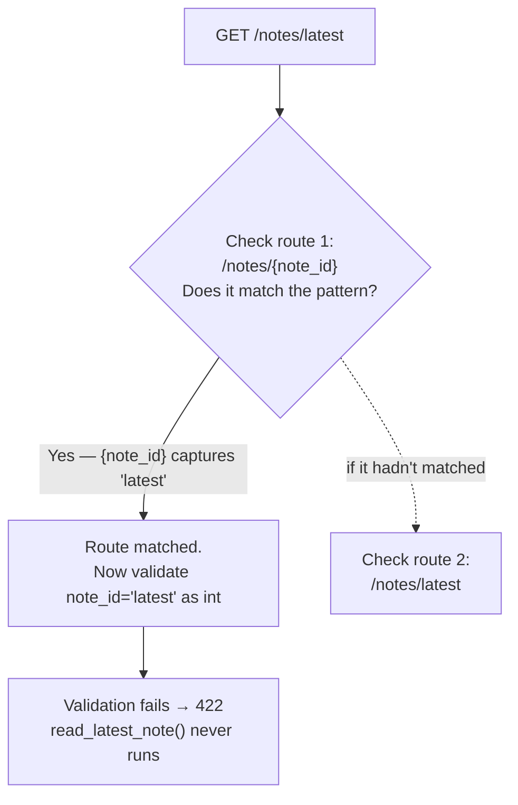

# Chapter 3: Your First API — Path Operations and Routing

> Part I — Foundations · Chapter 3 of 28

Chapters 1 and 2 established the mental model and the Python mechanics underneath it. This chapter is where you start actually building: HTTP verbs, path parameters, the single most common FastAPI routing bug (route ordering), and `APIRouter` — the tool that keeps a real project from becoming one enormous `main.py`.

## Learning Objectives

By the end of this chapter you will be able to:

- Choose the correct HTTP method (`GET`/`POST`/`PUT`/`PATCH`/`DELETE`) for a given operation, based on its safety and idempotency semantics.
- Declare path parameters with type coercion, including the special `:path` converter for values containing slashes.
- Explain — and avoid — the route-ordering bug where a fixed path is silently shadowed by an earlier, more general parameterized route.
- Split routes across multiple files using `APIRouter`, with prefixes and tags, and mount them onto a main `FastAPI` app.
- Build a complete, multi-route in-memory CRUD API from scratch.

---

## 3.1 HTTP Methods and What They Promise

FastAPI exposes a decorator per HTTP method — `@app.get`, `@app.post`, `@app.put`, `@app.patch`, `@app.delete`, plus less common ones (`@app.head`, `@app.options`) you'll rarely declare by hand. Nothing stops you from doing "creates" in a `@app.get` handler mechanically — but the HTTP method carries a *promise* to clients, caches, proxies, and browsers, and breaking that promise causes real bugs (a caching proxy might replay a `GET` it thinks is safe to retry; a browser might prefetch a `GET` link, unexpectedly triggering a side effect).

| Method | Safe? (no side effects) | Idempotent? (same result if repeated) | Typical use | Typical body |
|---|---|---|---|---|
| `GET` | Yes | Yes | Retrieve a resource or collection | None |
| `POST` | No | No | Create a new resource | Yes |
| `PUT` | No | Yes | Replace a resource entirely | Yes |
| `PATCH` | No | Not guaranteed | Partially update a resource | Yes |
| `DELETE` | No | Yes | Remove a resource | Usually none |

"Idempotent" is worth pinning down precisely, because it's easy to say and easy to misjudge: an operation is idempotent if calling it once has the same *end state* as calling it ten times in a row. `DELETE /notes/5` is idempotent — the first call removes note 5 and returns success (or 404 if never existed); every subsequent call finds it already gone. `POST /notes` is *not* idempotent — calling it twice creates two notes, not one. This distinction becomes directly practical the first time a client retries a failed request due to a network timeout: retrying a `PUT` is safe, blindly retrying a `POST` can create duplicates.

## 3.2 Path Parameters and Type Coercion

You met the basic form in Chapter 1:

```python
@app.get("/items/{item_id}")
def read_item(item_id: int):
    return {"item_id": item_id}
```

The type hint on `item_id` drives Pydantic-based coercion and validation *after* Starlette has matched the URL to this route — worth restating from Chapter 2's framing: nothing about the string `"{item_id}"` in the path template itself enforces "must be an integer." That enforcement happens because FastAPI reads your function's type hint and validates the captured string against it, producing a `422` if it can't be parsed as an `int`.

Sometimes a path segment legitimately needs to contain slashes — a file path, for instance. By default, `{item_id}` only ever captures a single path segment (no `/` inside it). Starlette provides a `:path` converter for the rare case where you want to swallow the rest of the URL:

```python
@app.get("/files/{file_path:path}")
def read_file(file_path: str):
    return {"file_path": file_path}
```

`GET /files/reports/2026/q1.csv` now matches, with `file_path == "reports/2026/q1.csv"` — a single string containing slashes, rather than a 404 from the default single-segment matching. You'll reach for this again in Chapter 14 when serving nested static file paths.

## 3.3 Path Matching Order — The Bug You Will Definitely Hit

This is, without exaggeration, one of the most common real-world FastAPI bugs, and it comes directly from a fact about routing that's easy to forget once you're used to type-hinted parameters feeling "smart": **route matching happens in registration order, and it's purely a string/pattern match — your Python type hints play no role in matching, only in validating *after* a match is found.**

Consider a Notes API with these two routes, declared in this order:

```python
@app.get("/notes/{note_id}")
def read_note(note_id: int):
    ...

@app.get("/notes/latest")
def read_latest_note():
    ...
```

A request to `GET /notes/latest` arrives. Starlette walks the route list top to bottom and asks each one, in turn, "does this URL match your pattern?" `/notes/{note_id}` is checked first — and as a *pattern*, `/notes/latest` matches it perfectly fine, because `{note_id}` will happily capture the literal string `"latest"`. Only *after* this match is chosen does FastAPI try to validate `note_id="latest"` against the `int` type hint — and that fails, producing a `422 Unprocessable Entity`. Your `read_latest_note` function is never even called. It doesn't matter that `"latest"` obviously isn't meant to be an ID to a human reading the code; the router doesn't know that, because Python type hints aren't part of the *matching* step at all — exactly the "metadata, not enforcement, except where something chooses to enforce it" theme from Chapter 2, showing up here in a new place.



**The fix is simple once you know to look for it: declare more specific / fixed-string paths *before* more general parameterized ones.**

```python
@app.get("/notes/latest")     # fixed path — declared first
def read_latest_note():
    ...

@app.get("/notes/{note_id}")  # parameterized — declared second
def read_note(note_id: int):
    ...
```

Now `GET /notes/latest` matches the fixed-string route first — an exact match, no ambiguity — and only requests that don't match any fixed path fall through to `/notes/{note_id}`. You'll deliberately reproduce this bug, then fix it, in the hands-on project below — it's much easier to remember after seeing the 422 yourself once.

## 3.4 `APIRouter` — Composing Routes Across Files

Everything so far has lived directly on `app` in a single file. That's fine for a toy example and actively bad for a real project — by Chapter 18 your app will have authentication, products, orders, and more, and cramming all of it into one `main.py` becomes unmanageable fast. `APIRouter` is FastAPI's tool for splitting routes across modules while keeping them mountable onto a single app.

```python
# routers/notes.py
from fastapi import APIRouter

router = APIRouter(prefix="/notes", tags=["notes"])


@router.get("/")
def list_notes():
    ...


@router.get("/{note_id}")
def read_note(note_id: int):
    ...
```

```python
# main.py
from fastapi import FastAPI
from routers import notes

app = FastAPI(title="Notes API")
app.include_router(notes.router)
```

Three things are worth being explicit about:

- **`prefix`** is prepended to every route in the router. `@router.get("/{note_id}")` combined with `prefix="/notes"` produces the effective path `/notes/{note_id}` — you never repeat `/notes` inside the router file itself.
- **`tags`** control grouping in `/docs` — every route registered on this router shows up under a "notes" heading in the Swagger UI, without you tagging each route individually (you *can* still override or add tags per-route if one operation belongs to more than one logical group).
- **A small trailing-slash nuance:** with `prefix="/notes"`, writing `@router.get("/")` produces the path `/notes/` (with a trailing slash), while `@router.get("")` produces `/notes` (no trailing slash) for what's conceptually the "collection root." Both work, but FastAPI's default redirect behavior treats them slightly differently for clients that request the other form. This curriculum uses the `@router.get("/")` convention throughout, matching what you'll see in most FastAPI codebases and the official docs — just be aware the alternative exists so it doesn't surprise you in someone else's code.

`app.include_router(...)` can be called multiple times, for multiple routers, each with its own prefix and tags — this is exactly how a larger application stays organized, and it's the pattern you'll formalize further in Chapter 18's "application architecture at scale."

## 3.5 Tags in Practice

Tags are purely a documentation/organization concern — they have zero effect on routing or validation. Their entire job is grouping related operations together in `/docs` and `/redoc` so a growing API stays navigable. You've already seen the router-level form (`APIRouter(tags=["notes"])`); a single route can also carry its own tags directly, which is useful for cross-cutting operations that don't belong to one obvious module:

```python
@app.get("/health", tags=["monitoring"])
def health_check():
    return {"status": "ok"}
```

---

## Hands-On Project: A Complete Notes API

You'll build this in two passes: first as a single file (to feel the routing bug firsthand), then refactored into an `APIRouter`.

### Step 1 — In-memory storage and the first four routes

`main.py`:

```python
from fastapi import FastAPI, HTTPException

app = FastAPI(title="Notes API")

notes_db: dict[int, dict] = {}
_next_id = 1


@app.get("/notes")
def list_notes():
    return list(notes_db.values())


@app.post("/notes", status_code=201)
def create_note(note: dict):
    global _next_id
    note_id = _next_id
    _next_id += 1
    stored = {"id": note_id, **note}
    notes_db[note_id] = stored
    return stored


@app.get("/notes/{note_id}")
def read_note(note_id: int):
    if note_id not in notes_db:
        raise HTTPException(status_code=404, detail="Note not found")
    return notes_db[note_id]


@app.put("/notes/{note_id}")
def replace_note(note_id: int, note: dict):
    if note_id not in notes_db:
        raise HTTPException(status_code=404, detail="Note not found")
    stored = {"id": note_id, **note}
    notes_db[note_id] = stored
    return stored


@app.patch("/notes/{note_id}")
def update_note(note_id: int, fields: dict):
    if note_id not in notes_db:
        raise HTTPException(status_code=404, detail="Note not found")
    notes_db[note_id].update(fields)
    return notes_db[note_id]


@app.delete("/notes/{note_id}", status_code=204)
def delete_note(note_id: int):
    if note_id not in notes_db:
        raise HTTPException(status_code=404, detail="Note not found")
    del notes_db[note_id]
```

> `note: dict` and `fields: dict` here are deliberately loose — Chapter 4 formalizes request bodies with `Body()`, and Chapter 5 replaces raw `dict` with proper Pydantic models that validate the note's shape (a `title` field, a `content` field, and so on). For now, a plain `dict` is enough to build and feel real routing, without pulling in machinery this chapter hasn't earned yet.

Run it with `fastapi dev main.py`, then exercise it:

```bash
curl -X POST localhost:8000/notes -H "Content-Type: application/json" -d '{"title": "First", "content": "Hello"}'
curl -X POST localhost:8000/notes -H "Content-Type: application/json" -d '{"title": "Second", "content": "World"}'
curl localhost:8000/notes
curl localhost:8000/notes/1
```

Confirm list/create/read/update/delete all work before moving on.

### Step 2 — Reproduce the ordering bug on purpose

Add this route **at the bottom of the file**, after `delete_note`:

```python
@app.get("/notes/latest")
def read_latest_note():
    if not notes_db:
        raise HTTPException(status_code=404, detail="No notes yet")
    latest_id = max(notes_db.keys())
    return notes_db[latest_id]
```

Restart the server and run:

```bash
curl localhost:8000/notes/latest
```

You should get a `422 Unprocessable Entity`, with a validation error complaining that `"latest"` isn't a valid integer — exactly the failure walked through in section 3.3. Confirm this for yourself before reading further; the point of this step is watching the theoretical bug become a real terminal output.

### Step 3 — Fix it by reordering

Move the entire `read_latest_note` function so it's declared **before** `read_note` (i.e., right after `create_note`). Restart the server and re-run the same `curl localhost:8000/notes/latest` — it should now return the most recently created note correctly, and `curl localhost:8000/notes/1` should still work exactly as before for numeric IDs.

### Step 4 — Refactor into an `APIRouter`

Create a `routers/` package and move everything into it:

```python
# routers/notes.py
from fastapi import APIRouter, HTTPException

router = APIRouter(prefix="/notes", tags=["notes"])

notes_db: dict[int, dict] = {}
_next_id = 1


@router.get("/latest")
def read_latest_note():
    if not notes_db:
        raise HTTPException(status_code=404, detail="No notes yet")
    latest_id = max(notes_db.keys())
    return notes_db[latest_id]


@router.get("/")
def list_notes():
    return list(notes_db.values())


@router.post("/", status_code=201)
def create_note(note: dict):
    global _next_id
    note_id = _next_id
    _next_id += 1
    stored = {"id": note_id, **note}
    notes_db[note_id] = stored
    return stored


@router.get("/{note_id}")
def read_note(note_id: int):
    if note_id not in notes_db:
        raise HTTPException(status_code=404, detail="Note not found")
    return notes_db[note_id]


@router.put("/{note_id}")
def replace_note(note_id: int, note: dict):
    if note_id not in notes_db:
        raise HTTPException(status_code=404, detail="Note not found")
    stored = {"id": note_id, **note}
    notes_db[note_id] = stored
    return stored


@router.patch("/{note_id}")
def update_note(note_id: int, fields: dict):
    if note_id not in notes_db:
        raise HTTPException(status_code=404, detail="Note not found")
    notes_db[note_id].update(fields)
    return notes_db[note_id]


@router.delete("/{note_id}", status_code=204)
def delete_note(note_id: int):
    if note_id not in notes_db:
        raise HTTPException(status_code=404, detail="Note not found")
    del notes_db[note_id]
```

```python
# main.py
from fastapi import FastAPI
from routers import notes

app = FastAPI(title="Notes API")
app.include_router(notes.router)
```

Note that `/latest` is still declared before `/{note_id}` inside the router — the ordering rule from section 3.3 applies exactly the same way whether routes live on `app` directly or inside an `APIRouter`; `include_router` doesn't reorder anything, it just appends the router's routes (in the order they were declared) onto the app's overall route list.

Restart and confirm every endpoint still behaves identically to Step 3 — the refactor should be invisible from the outside. Then open `/docs` and confirm all six operations now appear grouped under a "notes" heading, driven purely by the `tags=["notes"]` you set on the router.

---

## Practice Exercises

**Exercise 3.1 — Diagnose a fresh ordering bug.**
Given this router for a "Products" resource:

```python
router = APIRouter(prefix="/products", tags=["products"])

@router.get("/{product_id}")
def read_product(product_id: int):
    ...

@router.get("/featured")
def read_featured_products():
    ...

@router.get("/search")
def search_products(q: str):
    ...
```

Without running it, identify every request path that will be broken by ordering, and explain precisely why each one fails (hint: there are two broken routes here, not one, and they fail slightly differently). Then rewrite the router with correct ordering.

**Exercise 3.2 — Path parameter type coercion in practice.**
Add a `GET /notes/{note_id}/word-count` route to the Notes API that returns the number of words in that note's `content`. Then, deliberately request `/notes/abc/word-count` and `/notes/-1/word-count` and note what each one does differently. Is `-1` a case your current code handles correctly? If not, add a check and return an appropriate error.

**Exercise 3.3 — Add a second resource as its own `APIRouter`.**
Add a "Tags" resource (simple in-memory list of category tags, e.g. `{"id": 1, "name": "personal"}`) as its own router at `routers/tags.py`, mounted at prefix `/tags` with tag `"tags"`, supporting at least list and create. Mount it in `main.py` alongside the notes router and confirm both groups appear separately in `/docs`.

**Exercise 3.4 — The `:path` converter.**
Add a `GET /notes/export/{export_path:path}` route (purely illustrative — it doesn't need to actually write files) that returns the captured `export_path` unchanged. Confirm that a request like `/notes/export/2026/q1/backup.json` is captured as a single string containing slashes, rather than 404ing the way a plain `{export_path}` (without `:path`) would on the same URL.

**Exercise 3.5 (stretch) — Idempotency in practice.**
Using the Notes API, write a short script (using `httpx` or `requests`) that calls `DELETE /notes/1` twice in a row and prints both response status codes. Then do the same for `POST /notes` with an identical body twice in a row. Explain, using the results, which of the two behaved idempotently and which didn't — and why that matches (or doesn't match) the table in section 3.1.

---

## Solutions & Discussion

<details>
<summary>Exercise 3.1</summary>

Both `/products/featured` and `/products/search` are broken, because `/{product_id}` is declared first and matches *any* single path segment.

- `GET /products/featured` matches `/{product_id}` first, and FastAPI then tries to validate `product_id="featured"` as an `int` — this fails validation, producing a `422`. `read_featured_products` never runs.
- `GET /products/search?q=shoe` *also* matches `/{product_id}` first for the same reason — `product_id="search"` fails `int` coercion — also a `422`. It fails "the same way" as `/featured` (both 422s from failed int coercion on the path segment), which is worth noticing: the *query string* (`?q=shoe`) never even becomes relevant, because the failure happens at path-parameter validation, before FastAPI would get to matching `search_products`'s `q` parameter at all.

Fixed version — fixed-string paths first, parameterized path last:

```python
router = APIRouter(prefix="/products", tags=["products"])

@router.get("/featured")
def read_featured_products():
    ...

@router.get("/search")
def search_products(q: str):
    ...

@router.get("/{product_id}")
def read_product(product_id: int):
    ...
```
</details>

<details>
<summary>Exercise 3.2</summary>

```python
@app.get("/notes/{note_id}/word-count")
def note_word_count(note_id: int):
    if note_id not in notes_db:
        raise HTTPException(status_code=404, detail="Note not found")
    content = notes_db[note_id].get("content", "")
    return {"note_id": note_id, "word_count": len(content.split())}
```

(Remember to place this above any conflicting fixed-string sibling routes if you add more later — same rule as section 3.3, just one path segment deeper.)

`/notes/abc/word-count` fails at path validation — `note_id="abc"` can't coerce to `int`, producing a `422`, and the function body never runs. `/notes/-1/word-count` is a different story: `-1` *is* a valid integer, so type coercion succeeds, and the function runs with `note_id=-1`. Since `-1` was never actually created, `notes_db.get(-1)` is falsy in the lookup and the existing `if note_id not in notes_db` check correctly raises a `404` — this case is already handled correctly, but only because the existence check happens after coercion, not because negative numbers are inherently rejected. If negative IDs should be rejected as *invalid input* rather than "not found," that's a job for a validation constraint (`Path(gt=0)`) — which is exactly what Chapter 4 introduces.
</details>

<details>
<summary>Exercise 3.3</summary>

```python
# routers/tags.py
from fastapi import APIRouter

router = APIRouter(prefix="/tags", tags=["tags"])

tags_db: dict[int, dict] = {}
_next_id = 1


@router.get("/")
def list_tags():
    return list(tags_db.values())


@router.post("/", status_code=201)
def create_tag(tag: dict):
    global _next_id
    tag_id = _next_id
    _next_id += 1
    stored = {"id": tag_id, **tag}
    tags_db[tag_id] = stored
    return stored
```

```python
# main.py
from fastapi import FastAPI
from routers import notes, tags

app = FastAPI(title="Notes API")
app.include_router(notes.router)
app.include_router(tags.router)
```

In `/docs`, you should now see two separate collapsible groups — "notes" and "tags" — each containing only their own operations, purely a function of each router's `tags=[...]`.
</details>

<details>
<summary>Exercise 3.4</summary>

```python
@app.get("/notes/export/{export_path:path}")
def export_path_echo(export_path: str):
    return {"export_path": export_path}
```

`GET /notes/export/2026/q1/backup.json` returns `{"export_path": "2026/q1/backup.json"}` — the entire remainder of the URL, slashes included, captured as one string. If you temporarily change the route to a plain `{export_path}` (no `:path`) and repeat the same request, you'll get a `404 Not Found` instead — without `:path`, `{export_path}` only ever matches a single segment (`"2026"`), and the route pattern doesn't account for the additional `/q1/backup.json`, so the URL as a whole doesn't match any registered route at all.
</details>

<details>
<summary>Exercise 3.5</summary>

```python
import httpx

with httpx.Client(base_url="http://localhost:8000") as client:
    r1 = client.delete("/notes/1")
    r2 = client.delete("/notes/1")
    print("DELETE x2:", r1.status_code, r2.status_code)   # e.g. 204, 404

    body = {"title": "Dup", "content": "test"}
    r3 = client.post("/notes", json=body)
    r4 = client.post("/notes", json=body)
    print("POST x2:", r3.status_code, r4.json()["id"], r4.status_code, r4.json()["id"])
```

`DELETE` matches the idempotency table: the first call succeeds (`204`), and the *end state* after the second call is identical (note 1 is still gone) — even though the second call's status code differs (`404`, since it's no longer there to delete), the resource's state didn't change between calls one and two, which is what idempotency actually refers to. `POST` does not: two identical bodies produce two distinct notes with two different auto-assigned IDs — calling it twice changed the end state twice, which is exactly why retrying a `POST` after a network timeout is risky without an idempotency key (a topic you'll see again in the payments/production-reliability context of later chapters).
</details>

---

## Chapter Summary

- HTTP methods carry semantic promises (safety, idempotency) that clients, proxies, and caches rely on — pick the method that matches what your operation actually does, not just whichever is convenient.
- Path parameter type hints drive *validation*, not *matching* — Starlette matches routes as string patterns first, and only afterward does FastAPI try to coerce the captured value to your declared type. This is the root cause of the single most common FastAPI routing bug.
- Fixed-string paths (`/notes/latest`) must be declared *before* parameterized siblings (`/notes/{note_id}`) that could otherwise swallow them.
- `APIRouter` lets you split routes across files with a shared `prefix` and `tags`, mounted via `app.include_router(...)` — the foundation for keeping a growing codebase organized, formalized further in Chapter 18.

**Next:** Chapter 4 goes deeper on everything arriving *into* a request — `Query`, `Path`, and `Body` explicitly, validation constraints (`gt=0`, `max_length=...`), and the first real request-body handling beyond a loose `dict`.
