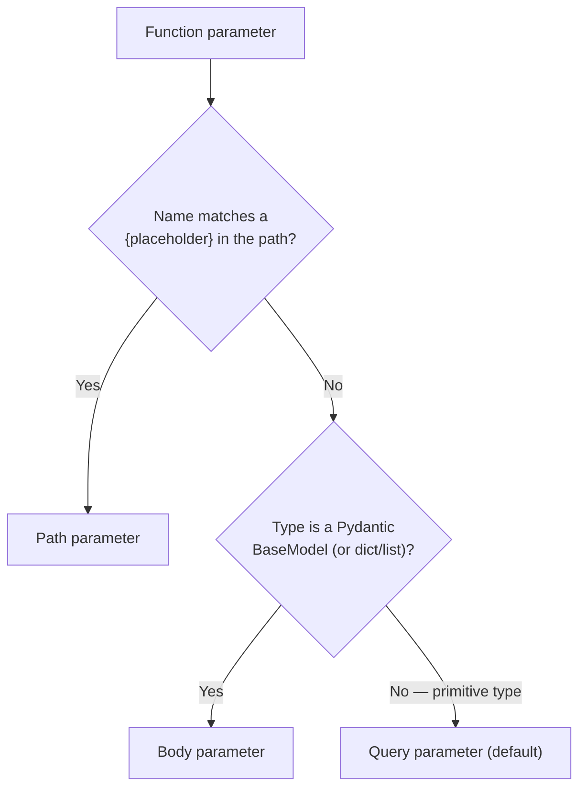

# Chapter 4: Request Data — Path, Query, and Body Parameters

> Part I — Foundations · Chapter 4 of 28

Chapter 3 got routes working with loosely-typed `dict` bodies and unconstrained parameters. This chapter makes request data *explicit and constrained*: how FastAPI decides where a given function parameter comes from, how to attach validation rules to each one, and how multiple body parameters combine into a single JSON payload.

## Learning Objectives

By the end of this chapter you will be able to:

- Explain the exact rule FastAPI uses to infer whether a function parameter is a path, query, or body parameter.
- Attach validation constraints (`gt`, `ge`, `lt`, `le`, `min_length`, `max_length`, `pattern`) to query and path parameters using `Query()` and `Path()`, written in the modern `Annotated` style.
- Predict how multiple body parameters combine into a single request JSON shape, and when `embed=True` is needed.
- Read a `422` validation error response and identify exactly which field failed, and why.

---

## 4.1 How FastAPI Decides Where a Parameter Comes From

FastAPI inspects your function's signature once, at import time — not per request — and sorts every parameter into one of three buckets using a short, deterministic set of rules:

1. **If the parameter's name matches a `{placeholder}` in the path template, it's a path parameter.** No ambiguity possible — this is a pure string match against the route pattern from Chapter 3.
2. **If the parameter's type is a Pydantic model (or, more generally, a compound type like `dict` or `list`), it's a body parameter.** FastAPI assumes anything structured enough to be a model is coming from the JSON request body.
3. **Otherwise — a primitive type (`int`, `str`, `float`, `bool`, etc.) not matched in the path — it's a query parameter** by default.



```python
class NoteCreate(BaseModel):
    title: str
    content: str

@app.post("/notes/{note_id}/duplicate")
def duplicate_note(note_id: int, verbose: bool = False, note: NoteCreate | None = None):
    ...
```

Here `note_id` matches `{note_id}` in the path → path parameter. `verbose` is a primitive `bool`, not in the path → query parameter (`?verbose=true`). `note` is a Pydantic model → body parameter. FastAPI arrived at all three classifications without you writing a single explicit marker — this is what "inferred from type hints" means concretely, and it's why the rest of this chapter is about *overriding* these sane defaults when you need extra behavior (constraints, aliasing, explicit embedding), not about the defaults themselves.

## 4.2 Query Parameters, With Constraints

The default-value style you've used so far (`limit: int = 20`) works, but it can't express constraints like "must be between 1 and 100." For that, you attach a `Query()` marker. The **modern, recommended syntax** uses `Annotated` to separate the actual type from FastAPI's metadata:

```python
from typing import Annotated
from fastapi import Query

@app.get("/notes")
def list_notes(
    tag: Annotated[str | None, Query(max_length=50)] = None,
    limit: Annotated[int, Query(ge=1, le=100)] = 20,
    offset: Annotated[int, Query(ge=0)] = 0,
):
    ...
```

Reading `tag: Annotated[str | None, Query(max_length=50)] = None`: the *type* is `str | None` (as far as Python and your editor are concerned), and `Query(max_length=50)` is metadata riding alongside it that FastAPI reads to build the validation rule and the OpenAPI schema entry — this is the same "type hints carry metadata that something else interprets" idea from Chapter 2, just with FastAPI's own marker classes instead of a bare type. The `= None` at the end is the actual Python default value, same as it always was.

You'll also see an older style in existing codebases, where the `Query()` object itself is the default value:

```python
def list_notes(tag: str | None = Query(default=None, max_length=50)):
    ...
```

Both work identically at runtime. This curriculum uses the `Annotated` style throughout because it's what FastAPI's own documentation now recommends, and because it composes more cleanly — the type and the validation metadata are visually and structurally separate, which matters more once functions have several parameters, each with several constraints.

Common constraints you'll reach for constantly:

| Constraint | Applies to | Meaning |
|---|---|---|
| `gt`, `ge` | numbers | greater than / greater-or-equal |
| `lt`, `le` | numbers | less than / less-or-equal |
| `min_length`, `max_length` | strings | length bounds |
| `pattern` | strings | must match this regex |
| `alias` | any | the name the *client* uses, if different from your Python parameter name |
| `deprecated` | any | marks the parameter as deprecated in `/docs`, without removing it |

```python
status: Annotated[str, Query(pattern="^(draft|published)$")] = "published"
sort_by: Annotated[str, Query(alias="sort-by")] = "created_at"
legacy_page: Annotated[int | None, Query(deprecated=True)] = None
```

`alias` is worth calling out specifically: it exists because valid Python identifiers can't contain hyphens, but query strings commonly use kebab-case (`?sort-by=name`). `alias="sort-by"` tells FastAPI "accept `sort-by` from the client, but let my Python code refer to it as `sort_by`" — the alias affects *only* the wire format, not your function body.

## 4.3 Path Parameters, With the Same Constraint Vocabulary

`Path()` works identically to `Query()`, because they're both built on the same underlying Pydantic field machinery — the only real difference is which part of the request they read from.

```python
from fastapi import Path

@app.get("/notes/{note_id}")
def read_note(note_id: Annotated[int, Path(gt=0)]):
    ...
```

This directly resolves the loose end from Chapter 3's Exercise 3.2: previously, `note_id=-1` passed type coercion (it's a valid integer) and only got caught by your own `if note_id not in notes_db` check, producing a `404` — which is semantically a little off, since `-1` isn't "a note that doesn't exist," it's "not a valid note ID at all." With `Path(gt=0)`, a request for `/notes/-1` now fails *validation* with a `422` before your function body runs, which is the more accurate signal: the client sent a structurally invalid request, not merely a reference to a missing resource.

## 4.4 Body Parameters and How They Combine

A single Pydantic-model parameter is the case you've already seen — the entire JSON request body maps directly onto that model's fields:

```python
@app.post("/notes")
def create_note(note: NoteCreate):
    ...
```

```json
{"title": "Hello", "content": "World"}
```

Things change the moment there's **more than one** body parameter. FastAPI now needs a way to tell them apart inside a single JSON object, so it automatically nests each one under its own key, named after the parameter:

```python
@router.patch("/{note_id}/settings")
def update_note_settings(
    note_id: Annotated[int, Path(gt=0)],
    settings: NoteSettings,
    priority: Annotated[int, Body(ge=0, le=5)] = 0,
):
    ...
```

```json
{
  "settings": {"pinned": true, "archived": false},
  "priority": 3
}
```

`settings` and `priority` are automatically embedded under their own keys the moment there are two or more body parameters — you didn't ask for that nesting explicitly, it's simply how FastAPI disambiguates multiple body parameters sharing one JSON payload. If you have only *one* body parameter but still want that same nested shape (perhaps because your API's contract is `{"note": {...}}` rather than the bare object at the top level, for consistency with other multi-parameter endpoints), force it with `Body(embed=True)`:

```python
@router.post("/")
def create_note(note: Annotated[NoteCreate, Body(embed=True)]):
    ...
```

```json
{"note": {"title": "Hello", "content": "World"}}
```

Without `embed=True`, a single body parameter is expected as the bare top-level JSON object; with it, that same parameter is expected nested under its own key — the same rule (each body parameter gets its own key) that kicks in *automatically* once you have two or more.

## 4.5 Reading a 422 Validation Error Like an Engineer, Not Like a Wall of Text

You've triggered a handful of `422` responses already in previous chapters without stopping to read their shape closely. Now's the time. A typical validation error body looks like this:

```json
{
  "detail": [
    {
      "type": "int_parsing",
      "loc": ["path", "note_id"],
      "msg": "Input should be a valid integer, unable to parse string as an integer",
      "input": "abc"
    }
  ]
}
```

Four fields, each answering a different question:

- **`loc`** — *where* in the request did this go wrong? It's a path *into* the request structure: `["path", "note_id"]` means the path parameter named `note_id`; `["body", "author", "email"]` would mean the `email` field nested inside the `author` object inside the request body. This is the single most useful field for debugging — it tells you exactly which part of your request to fix, without guessing.
- **`msg`** — a human-readable explanation, suitable for logging or (carefully, sanitized) surfacing to a user.
- **`type`** — a machine-readable error code (`int_parsing`, `missing`, `string_too_short`, `less_than_equal`, etc.) — useful if you're writing client-side code that needs to react differently to different failure kinds, rather than pattern-matching on the human-readable message.
- **`input`** — the actual raw value that was rejected, which is invaluable when the bug turns out to be "the client sent the wrong thing entirely" rather than a validation rule being too strict.

`detail` is a *list* specifically because a single request can fail validation on multiple fields simultaneously — FastAPI (via Pydantic) collects every failure it finds in one pass rather than stopping at the first one, so a client fixing their request can address every problem at once instead of playing whack-a-mole one field at a time across several round trips.

---

## Hands-On Project: Filtering, Pagination, and Nested Bodies

Extending the Notes API from Chapter 3.

### Step 1 — A structured note, with a nested `Author`

```python
# routers/notes.py
from typing import Annotated
from fastapi import APIRouter, HTTPException, Query, Path, Body
from pydantic import BaseModel

router = APIRouter(prefix="/notes", tags=["notes"])

notes_db: dict[int, dict] = {}
_next_id = 1


class Author(BaseModel):
    name: str
    email: str | None = None


class NoteCreate(BaseModel):
    title: str
    content: str
    tag: str | None = None
    author: Author
```

> `NoteCreate` and `Author` are genuine Pydantic models — a preview of what Chapter 5 covers in full depth. Here we're using them purely to demonstrate *where request data comes from and how it nests*, not their validation internals; treat the `class NoteCreate(BaseModel): ...` syntax as "a typed container for now" and expect a much deeper look next chapter.

### Step 2 — Fixed routes first (ordering rule from Chapter 3 still applies)

```python
@router.get("/latest")
def read_latest_note():
    if not notes_db:
        raise HTTPException(status_code=404, detail="No notes yet")
    latest_id = max(notes_db.keys())
    return notes_db[latest_id]
```

### Step 3 — List with filtering and pagination

```python
@router.get("/")
def list_notes(
    tag: Annotated[str | None, Query(max_length=50)] = None,
    limit: Annotated[int, Query(ge=1, le=100)] = 20,
    offset: Annotated[int, Query(ge=0)] = 0,
):
    filtered = [n for n in notes_db.values() if tag is None or n.get("tag") == tag]
    page = filtered[offset : offset + limit]
    return {
        "items": page,
        "total": len(filtered),
        "limit": limit,
        "offset": offset,
    }
```

Try it: `GET /notes?tag=work&limit=5&offset=0`, then `GET /notes?limit=999` and confirm you get a `422` (violates `le=100`) instead of silently clamping — that's the constraint doing its job.

### Step 4 — Create, using the nested body

```python
@router.post("/", status_code=201)
def create_note(note: NoteCreate):
    global _next_id
    note_id = _next_id
    _next_id += 1
    stored = {"id": note_id, **note.model_dump()}
    notes_db[note_id] = stored
    return stored
```

```bash
curl -X POST localhost:8000/notes -H "Content-Type: application/json" -d '{
  "title": "Sprint retro",
  "content": "Went well overall.",
  "tag": "work",
  "author": {"name": "Dana", "email": "dana@example.com"}
}'
```

### Step 5 — Read/replace/delete with `Path(gt=0)`

```python
@router.get("/{note_id}")
def read_note(note_id: Annotated[int, Path(gt=0)]):
    if note_id not in notes_db:
        raise HTTPException(status_code=404, detail="Note not found")
    return notes_db[note_id]


@router.put("/{note_id}")
def replace_note(note_id: Annotated[int, Path(gt=0)], note: NoteCreate):
    if note_id not in notes_db:
        raise HTTPException(status_code=404, detail="Note not found")
    stored = {"id": note_id, **note.model_dump()}
    notes_db[note_id] = stored
    return stored


@router.delete("/{note_id}", status_code=204)
def delete_note(note_id: Annotated[int, Path(gt=0)]):
    if note_id not in notes_db:
        raise HTTPException(status_code=404, detail="Note not found")
    del notes_db[note_id]
```

### Step 6 — Multiple body parameters, to feel the embedding rule

```python
class NoteSettings(BaseModel):
    pinned: bool = False
    archived: bool = False


@router.patch("/{note_id}/settings")
def update_note_settings(
    note_id: Annotated[int, Path(gt=0)],
    settings: NoteSettings,
    priority: Annotated[int, Body(ge=0, le=5)] = 0,
):
    if note_id not in notes_db:
        raise HTTPException(status_code=404, detail="Note not found")
    notes_db[note_id]["settings"] = settings.model_dump()
    notes_db[note_id]["priority"] = priority
    return notes_db[note_id]
```

```bash
curl -X PATCH localhost:8000/notes/1/settings -H "Content-Type: application/json" -d '{
  "settings": {"pinned": true, "archived": false},
  "priority": 3
}'
```

Notice the request body nests `settings` and `priority` under their own keys — exactly section 4.4's rule, made concrete: two body parameters, automatically disambiguated by name.

---

## Practice Exercises

**Exercise 4.1 — Query parameter with pattern validation.**
Add a `status` query parameter to `list_notes` that only accepts the literal values `"draft"` or `"published"`, using `Query(pattern=...)`. Request `/notes?status=archived` and confirm you get a `422`; read the `detail` array and identify which `type` code Pydantic used for a pattern mismatch.

**Exercise 4.2 — An optional body field with a sensible default.**
Add a `pinned: bool = False` field to `NoteCreate`. Create a note *without* including `"pinned"` in the JSON body at all, and confirm the stored note correctly defaults to `pinned: false`. Then explain, in one sentence, why this is a body-level default (Pydantic's job) rather than a `Query`/`Path` concern.

**Exercise 4.3 — Trigger and dissect a 422 by hand.**
Send a `POST /notes` request that omits the required `title` field entirely. Paste the resulting `detail` array and annotate each of its four keys (`type`, `loc`, `msg`, `input`) with what it's telling you, in your own words. Then send a second malformed request that fails for a *different* reason (e.g., `author` missing) in the same call as the missing `title`, and confirm both failures appear in the same `detail` list.

**Exercise 4.4 — Alias a query parameter.**
Add a `sort_by` query parameter to `list_notes`, but expose it to clients as `sort-by` (kebab-case) using `alias`. Confirm `GET /notes?sort-by=title` works and that `GET /notes?sort_by=title` does *not* set it (since the alias replaces the name entirely, rather than adding a second accepted name).

**Exercise 4.5 (stretch) — Deprecate a query parameter without breaking clients.**
Imagine `tag` is being replaced by a more flexible `tags` (plural, comma-separated) parameter, but existing clients still use `tag` and can't be broken immediately. Add the new `tags: Annotated[str | None, Query()] = None` parameter, mark the old `tag` parameter with `Query(deprecated=True)`, and confirm `/docs` visually distinguishes the deprecated one (typically shown struck through or greyed out) while both still function.

---

## Solutions & Discussion

<details>
<summary>Exercise 4.1</summary>

```python
status: Annotated[str, Query(pattern="^(draft|published)$")] = "published"
```

Requesting `/notes?status=archived` produces a `422` with an entry whose `type` is `string_pattern_mismatch` (Pydantic v2's error code for a failed `pattern` constraint), `loc` is `["query", "status"]`, and `msg` explains that the string doesn't match the required pattern. This is the query-parameter equivalent of the `int_parsing` error you saw for a bad path parameter — same error *shape*, different `type` code because the underlying constraint that failed is different.
</details>

<details>
<summary>Exercise 4.2</summary>

```python
class NoteCreate(BaseModel):
    title: str
    content: str
    tag: str | None = None
    author: Author
    pinned: bool = False
```

Posting `{"title": "X", "content": "Y", "author": {"name": "Dana"}}` (no `pinned` key at all) results in a stored note with `pinned: false`. This is a body-level default because it's declared on the Pydantic *model* itself (`= False` on the field), evaluated when Pydantic constructs the model from the parsed JSON — it has nothing to do with `Query`/`Path` markers, which only apply to parameters read directly off the URL, not to fields nested inside a body model. Defaults for body-model fields are entirely Pydantic's domain, which is exactly what Chapter 5 unpacks in full.
</details>

<details>
<summary>Exercise 4.3</summary>

Sending `{"content": "Y", "author": {"name": "Dana"}}` (missing `title`) produces something like:

```json
{
  "detail": [
    {
      "type": "missing",
      "loc": ["body", "title"],
      "msg": "Field required",
      "input": {"content": "Y", "author": {"name": "Dana"}}
    }
  ]
}
```

- `type: "missing"` — the machine-readable reason: a required field simply wasn't present at all (distinct from, say, being present but the wrong type).
- `loc: ["body", "title"]` — the failure is in the request body, specifically the `title` field at the top level.
- `msg: "Field required"` — human-readable restatement of the same fact.
- `input` — here it's the *entire body dict* that was being validated when the missing field was discovered, since there's no `title` value to show as "the bad input" — there's nothing there at all.

If you additionally omit `author` (or send `{"content": "Y"}` alone), you'll see **two** entries in the `detail` list — one for `["body", "title"]` and one for `["body", "author"]` — confirming Pydantic collects every failure in a single pass rather than stopping at the first one, exactly as section 4.5 describes.
</details>

<details>
<summary>Exercise 4.4</summary>

```python
sort_by: Annotated[str, Query(alias="sort-by")] = "created_at"
```

`GET /notes?sort-by=title` sets the parameter correctly, because `alias="sort-by"` tells FastAPI that's the name to read from the query string. `GET /notes?sort_by=title` does **not** set it — the alias *replaces* the accepted name rather than adding an alternate spelling, so FastAPI is now only listening for `sort-by`, and a request using `sort_by` is silently ignored (falling back to the `"created_at"` default) rather than erroring, since unknown query parameters are ignored by default rather than rejected.
</details>

<details>
<summary>Exercise 4.5</summary>

```python
tag: Annotated[str | None, Query(max_length=50, deprecated=True)] = None,
tags: Annotated[str | None, Query()] = None,
```

Both parameters remain fully functional — `deprecated=True` has zero effect on runtime validation or behavior. Its only effect is on the generated OpenAPI schema: in `/docs`, the `tag` parameter now renders with a struck-through or visually de-emphasized label (Swagger UI's standard treatment for anything marked `deprecated` in an OpenAPI schema), signaling to API consumers reading the docs that they should migrate to `tags` without you having to remove `tag` and break anyone still depending on it. This is the practical value of the flag: a deprecation *warning* embedded directly in the single source of truth (the OpenAPI schema) rather than a note in a changelog someone has to go find.
</details>

---

## Chapter Summary

- FastAPI infers parameter location from a short, deterministic rule set: path-template name match → path; Pydantic model/compound type → body; primitive and unmatched → query. Everything in this chapter is about *overriding* those sensible defaults, not replacing them.
- `Query()` and `Path()` share the same constraint vocabulary (`gt`/`ge`/`lt`/`le`, `min_length`/`max_length`, `pattern`, `alias`, `deprecated`) — learn it once, apply it to both.
- The modern, recommended syntax is `Annotated[Type, Query(...)] = default` — it separates the real type from FastAPI's metadata cleanly, and is what current FastAPI documentation recommends over the older `= Query(default=...)` form.
- Multiple body parameters are automatically nested under their own keys in the request JSON; a single body parameter can be forced into that same nested shape with `Body(embed=True)`.
- A `422` response's `detail` list gives you `loc` (where), `msg` (human explanation), `type` (machine-readable code), and `input` (what was actually sent) for *every* validation failure in one pass — read `loc` first, it tells you exactly where to look.

**Next:** Chapter 5 goes all the way into Pydantic v2 itself — `field_validator`, `model_validator`, `ConfigDict`, computed fields, and strict mode — treating the `NoteCreate`/`Author` models from this chapter as the starting point rather than the destination.
