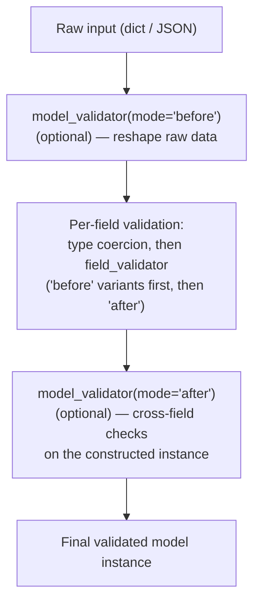

# Chapter 5: Pydantic v2 Deep Dive — Validation and Serialization

> Part I — Foundations · Chapter 5 of 28

Every previous chapter has used Pydantic models as "typed containers" without asking what's actually happening inside them. This chapter stops deferring: `BaseModel` internals, the `model_validate`/`model_dump` API surface, custom validators at the field and model level, configuration via `ConfigDict`, computed fields, strict mode, and `TypeAdapter` for validating things that aren't a full model. By the end, `NoteCreate` and `Author` from Chapter 4 should feel like the simplest possible case of a much more capable tool.

## Learning Objectives

By the end of this chapter you will be able to:

- Explain what actually happens, mechanically, when a Pydantic model is constructed, and why Pydantic v2 is substantially faster than v1.
- Use `model_validate`, `model_validate_json`, `model_dump`, and `model_dump_json` correctly, including the `mode="python"` vs `mode="json"` distinction.
- Write field-level validators with `field_validator` and cross-field validators with `model_validator`, and explain the order in which they run relative to each other.
- Configure model-wide behavior with `ConfigDict` (strict mode, whitespace stripping, `from_attributes`, extra-field policy).
- Add derived, output-only fields with `@computed_field`.
- Use `TypeAdapter` to validate data that isn't naturally a `BaseModel` — a bare list, a dict, or a primitive type with constraints.

---

## 5.1 What Actually Happens When You Construct a Model

Recall from Chapter 2's dataclass comparison: a Pydantic model *actively validates* at construction time, where a dataclass doesn't. The mechanism behind that is worth naming directly, because you'll see it referenced constantly in Pydantic's own error messages and release notes: **`pydantic-core`**, a validation engine written in Rust, compiled once per model class into a fast validation routine, then reused for every instance you construct. This is the entire reason Pydantic v2 is commonly cited as 3x to 50x faster than v1 (which validated in pure Python) — the type-checking and coercion logic for your model's fields isn't being re-interpreted by the Python interpreter on every single instantiation; it's running compiled, native code.

Practically, this means: the *first* time Python imports a module containing your `BaseModel` subclass, Pydantic inspects the class's fields and type hints and builds a "core schema" — a compiled validation plan. Every subsequent `Product(...)` or `Product.model_validate(...)` call reuses that plan rather than re-deriving it. This is also why adding fields or validators to a model has a one-time cost at import/startup, and why validation itself, at request-handling time, is cheap.

There is a way to bypass all of this validation, `model_construct()`, which builds an instance *without* validating — useful only in narrow, deliberate cases (e.g., reconstructing a model from data you already know is valid, such as your own database, where re-validating on every read would be pure overhead). This curriculum won't use it until much later, if at all; mentioned here only so the existence of "an escape hatch" doesn't come as a surprise.

## 5.2 The v2 API Surface: `model_validate` and `model_dump`

Pydantic v2 renamed and restructured its main API compared to v1 (if you encounter `.dict()`, `.json()`, or `.parse_obj()` in older code or tutorials, they're the v1 predecessors of the methods below — FastAPI's minimum supported Pydantic version no longer includes v1 at all, so you won't need those names going forward).

| v2 method | Direction | Notes |
|---|---|---|
| `Model.model_validate(obj)` | dict/object → model | The general-purpose constructor from already-parsed Python data |
| `Model.model_validate_json(json_str)` | raw JSON string → model | Skips a separate `json.loads` step — `pydantic-core` parses the JSON *and* validates in one pass, and is faster than `model_validate(json.loads(s))` |
| `instance.model_dump()` | model → dict | Python dict, by default with Python-native types intact |
| `instance.model_dump_json()` | model → JSON string | Serializes directly to a JSON string |

```python
raw_json = '{"name": "Widget", "price": "9.99"}'

# Slower: two separate steps
import json
p1 = Product.model_validate(json.loads(raw_json))

# Faster: pydantic-core parses AND validates in one pass
p2 = Product.model_validate_json(raw_json)
```

Both `model_dump()` and `model_dump_json()` accept the same family of options, worth knowing by name because you'll reach for them constantly once building real response shaping in Chapter 6:

- **`exclude={"field_name"}` / `include={"field_name"}`** — drop or keep only specific fields.
- **`exclude_none=True`** — drop any field whose value is `None` (handy for APIs that treat "absent" and "explicitly null" as equivalent on output).
- **`exclude_unset=True`** — drop any field the caller never actually provided (as opposed to one that fell back to its default) — this is precisely the mechanism behind clean `PATCH` semantics, which you'll use directly in Chapter 6.
- **`by_alias=True`** — serialize using each field's `alias` (see `ConfigDict` below) instead of its Python attribute name.

There's one more distinction worth internalizing now, because it causes real confusion later: `model_dump()` defaults to `mode="python"`, which keeps Python-native types (a `date` field stays a `datetime.date` object, not a string) — whereas `model_dump(mode="json")` (and `model_dump_json()`, which always behaves this way) converts everything to JSON-safe representations (that same `date` becomes an ISO-8601 string like `"2026-07-07"`). If you've ever wondered why `model_dump()` output sometimes "isn't quite JSON yet," this is why — `mode="python"` is the default because `model_dump()`'s most common use isn't serialization at all, it's getting a plain dict to pass into other Python code (an ORM, another function) that's happy to receive real `date` objects.

## 5.3 `field_validator` vs `model_validator`

These solve two different classes of problem, and mixing them up is the most common early confusion with Pydantic validators.

**`field_validator`** validates *one field*, in isolation, knowing nothing about the model's other fields.

```python
from pydantic import BaseModel, field_validator

class Product(BaseModel):
    name: str
    price: float

    @field_validator("price")
    @classmethod
    def price_must_be_non_negative(cls, v: float) -> float:
        if v < 0:
            raise ValueError("price must be non-negative")
        return v
```

`field_validator` accepts a `mode` argument: `mode="after"` (the default) receives the value *after* Pydantic has already coerced it to the declared type (so `v` above is guaranteed to already be a `float` by the time your check runs); `mode="before"` receives the raw, not-yet-coerced input, which is useful for normalizing messy input before type coercion happens at all (e.g., stripping a currency symbol out of a price string before it's parsed as a number).

**`model_validator`** validates *the whole model at once*, and is the only tool for rules that span multiple fields — exactly the "does field A relate correctly to field B" category of check.

```python
from pydantic import BaseModel, model_validator
from datetime import date

class Product(BaseModel):
    name: str
    price: float
    sale_start: date | None = None
    sale_end: date | None = None

    @model_validator(mode="after")
    def check_sale_window(self) -> "Product":
        if self.sale_start and self.sale_end and self.sale_start >= self.sale_end:
            raise ValueError("sale_start must be before sale_end")
        return self
```

`model_validator(mode="after")` runs once every individual field has already been validated and coerced, receiving `self` as the constructed (but not-yet-returned) instance — exactly the right place for "field A vs field B" logic, since both fields are guaranteed to already be their correct types by this point. `model_validator(mode="before")` is the earlier, rarer counterpart — it runs on the *raw* input (typically a dict) before any field-level validation has happened at all, useful for reshaping malformed input into the shape your fields expect (e.g., accepting either `{"price": 9.99}` or a legacy `{"cost": 9.99}` shape and normalizing to one before Pydantic proceeds).

Putting the full order together:



## 5.4 `ConfigDict` — Configuring a Model's Behavior

Every model can carry a `model_config = ConfigDict(...)` class attribute controlling behavior that applies to the whole model rather than one field.

```python
from pydantic import BaseModel, ConfigDict

class Product(BaseModel):
    model_config = ConfigDict(
        str_strip_whitespace=True,
        extra="forbid",
    )

    name: str
    price: float
```

Options worth knowing from day one:

- **`strict=True`** — disables type *coercion* entirely. In default ("lax") mode, Pydantic will happily turn the string `"9.99"` into the float `9.99` for you, because that's almost always what you want from an HTTP request (query strings and form data arrive as strings no matter what they represent). In strict mode, `"9.99"` is *rejected* for a `float` field — only an actual Python `float` (or `int`, which strict mode still widens to `float`) is accepted. Strict mode matters most for internal service-to-service contracts, where you already control both sides and want to catch a type mismatch as a bug rather than silently coercing around it.
- **`from_attributes=True`** (the v2 name for v1's `orm_mode`) — allows constructing the model from an arbitrary Python *object* with matching attributes (like a SQLAlchemy row), not just a dict. You'll use this directly the moment a real database enters the picture in Chapter 9.
- **`str_strip_whitespace=True`** — automatically strips leading/trailing whitespace from every string field, quietly fixing a very common category of "the user pasted in a name with a trailing space" bugs.
- **`extra="forbid" | "ignore" | "allow"`** — controls what happens when the input contains fields your model doesn't declare. `"ignore"` (the default) silently drops them; `"forbid"` raises a validation error, which is often the *safer* choice for APIs, since it turns a silent typo in a client's request (`"nmae": "Widget"`) into an immediate, actionable `422` instead of a mysteriously-missing field discovered later.

## 5.5 Computed Fields

Sometimes a field belongs in your API's *output* but should never be accepted as *input*, because it's entirely derived from other fields. `@computed_field` (paired with `@property`) handles exactly this:

```python
from pydantic import BaseModel, computed_field

class Product(BaseModel):
    price: float
    currency: str = "USD"

    @computed_field
    @property
    def display_price(self) -> str:
        symbol = {"USD": "$", "EUR": "€", "INR": "₹"}.get(self.currency, "")
        return f"{symbol}{self.price:.2f}"
```

`display_price` now appears in `model_dump()` and `model_dump_json()` output automatically, and in the generated OpenAPI schema as a response field — but attempting to *pass* `display_price` as input (e.g., in a `POST` body) has no effect on construction; it isn't a real settable field, it's computed fresh every time it's accessed. This is the correct tool any time you catch yourself tempted to compute a derived value manually in every route handler that returns this model — put the computation on the model once, and every serialization of it stays consistent for free.

## 5.6 `TypeAdapter` — Validation Without a Full Model

Every example so far has validated into a `BaseModel`. Sometimes what you need to validate isn't naturally a model at all — a bare `list[Product]`, a `dict[str, int]`, or even a single constrained primitive — and wrapping it in a throwaway model just to validate it is awkward. `TypeAdapter` validates *any* type hint directly, with the same Pydantic machinery, no model class required:

```python
from pydantic import TypeAdapter

ProductListAdapter = TypeAdapter(list[Product])

raw_products = [
    {"name": "Widget", "price": 9.99},
    {"name": "Gadget", "price": 19.99},
]

products: list[Product] = ProductListAdapter.validate_python(raw_products)
```

This is especially useful outside of a request/response cycle entirely — validating a config file loaded at startup, a batch import from a CSV, or a message pulled off a queue — anywhere you have "a type hint describing what this data should look like" but no natural reason to define a full model class just to check it once.

---

## Hands-On Project: A Validated Product Domain

### Step 1 — The models

```python
# models.py
from datetime import date
from typing import Literal
from pydantic import BaseModel, ConfigDict, Field, field_validator, model_validator, computed_field


class Dimensions(BaseModel):
    length_cm: float
    width_cm: float
    height_cm: float

    @computed_field
    @property
    def volume_cm3(self) -> float:
        return self.length_cm * self.width_cm * self.height_cm


class Product(BaseModel):
    model_config = ConfigDict(str_strip_whitespace=True, extra="forbid")

    name: str
    price: float
    currency: Literal["USD", "EUR", "INR"] = "USD"
    tags: list[str] = Field(default_factory=list)
    in_stock: bool = True
    dimensions: Dimensions | None = None
    sale_start: date | None = None
    sale_end: date | None = None

    @field_validator("price")
    @classmethod
    def price_must_be_non_negative(cls, v: float) -> float:
        if v < 0:
            raise ValueError("price must be non-negative")
        return v

    @model_validator(mode="after")
    def check_sale_window(self) -> "Product":
        if self.sale_start and self.sale_end and self.sale_start >= self.sale_end:
            raise ValueError("sale_start must be before sale_end")
        return self

    @computed_field
    @property
    def display_price(self) -> str:
        symbol = {"USD": "$", "EUR": "€", "INR": "₹"}[self.currency]
        return f"{symbol}{self.price:.2f}"
```

This single file exercises every mechanism from this chapter: a nested model with its own computed field (`Dimensions.volume_cm3`), a field-level validator (non-negative price), a cross-field model validator (sale window ordering), model-wide config (whitespace stripping, rejecting unknown fields), and a top-level computed field (`display_price`).

### Step 2 — Feel the coercion and validation directly

In a scratch script or REPL:

```python
raw = {"name": "  Widget  ", "price": "9.99", "tags": ["clearance"]}
p = Product.model_validate(raw)

print(p.name)            # "Widget"        -- whitespace stripped
print(p.price, type(p.price))   # 9.99 <class 'float'>  -- coerced from string
print(p.display_price)   # "$9.99"
print(p.model_dump(exclude={"tags", "dimensions"}))
```

Then trigger each validator's failure path on purpose:

```python
Product.model_validate({"name": "Bad", "price": -5})
# ValidationError: price must be non-negative

Product.model_validate({
    "name": "Bad Sale",
    "price": 10,
    "sale_start": "2026-08-01",
    "sale_end": "2026-07-01",
})
# ValidationError: sale_start must be before sale_end

Product.model_validate({"name": "Extra", "price": 10, "discount_codee": "TYPO10"})
# ValidationError: Extra inputs are not permitted  (caught by extra="forbid")
```

### Step 3 — Wire it into a minimal FastAPI router

```python
# routers/products.py
from fastapi import APIRouter, HTTPException
from models import Product

router = APIRouter(prefix="/products", tags=["products"])
products_db: dict[int, Product] = {}
_next_id = 1


@router.post("/", status_code=201)
def create_product(product: Product):
    global _next_id
    product_id = _next_id
    _next_id += 1
    products_db[product_id] = product
    return {"id": product_id, **product.model_dump()}


@router.get("/{product_id}")
def read_product(product_id: int):
    if product_id not in products_db:
        raise HTTPException(status_code=404, detail="Product not found")
    product = products_db[product_id]
    return {"id": product_id, **product.model_dump()}
```

Run it and `POST` a product with a bad `sale_start`/`sale_end` pair through the actual HTTP layer — confirm the `422` you get back matches the shape from Chapter 4.5, with `loc` pointing at the model level (cross-field errors from `model_validator` typically have `loc` ending at the model itself, e.g. `["body"]`, rather than a specific field — a useful thing to notice, since it distinguishes "one field is wrong" errors from "these two fields don't agree" errors at a glance).

### Step 4 — `TypeAdapter` for a startup-time import

```python
# seed_data.py
from pydantic import TypeAdapter
from models import Product

ProductListAdapter = TypeAdapter(list[Product])

raw_catalog = [
    {"name": "Widget", "price": 9.99},
    {"name": "Gadget", "price": 19.99, "tags": ["new"]},
]

catalog: list[Product] = ProductListAdapter.validate_python(raw_catalog)
print(f"Loaded {len(catalog)} valid products")
```

This is deliberately *not* a FastAPI route — it's a plain script, representing the "validate a batch of data outside of any request" use case section 5.6 described, such as seeding a database at application startup from a fixtures file.

---

## Practice Exercises

**Exercise 5.1 — A fresh cross-field validator.**
Add a `Warranty` nested model with `start_date: date` and `end_date: date`, and use `model_validator(mode="after")` to ensure `start_date < end_date`. Attach it to `Product` as an optional `warranty: Warranty | None = None` field. Confirm a `Warranty` with `end_date` before `start_date` fails, and that `Product` as a whole still constructs fine when `warranty` is omitted entirely.

**Exercise 5.2 — `TypeAdapter` on messy legacy data.**
You receive a batch of legacy records shaped like `{"name": "Widget", "cost": "9.99"}` — note `cost` instead of `price`. Using a `model_validator(mode="before")` on `Product` (not `TypeAdapter` alone), normalize `cost` into `price` before validation proceeds, so that `TypeAdapter(list[Product]).validate_python([...])` successfully validates a batch of these legacy-shaped dicts. What happens if a record has *both* `cost` and `price`? Decide on a policy and implement it.

**Exercise 5.3 — Break strict mode on purpose.**
Create a `StrictProduct(Product)` subclass with `model_config = ConfigDict(strict=True)`. Attempt `StrictProduct.model_validate({"name": "Widget", "price": "9.99"})` (note `price` as a string) and read the resulting `ValidationError` closely. Compare it to what happens with the same input against the original (lax) `Product`. Write one sentence on when you'd actually want strict mode in a real API, given that most HTTP input arrives as strings regardless of what it represents.

**Exercise 5.4 — Add a second computed field.**
Add an `is_on_sale` computed field to `Product` that returns `True` if today's date (`datetime.date.today()`) falls within `sale_start`/`sale_end` (inclusive), and `False` if either bound is `None` or today is outside the window. Confirm it appears in `model_dump()` output without being settable as input.

**Exercise 5.5 (stretch) — Serialization modes and `exclude_unset`.**
Construct a `Product` that includes a `sale_start` date. Compare `product.model_dump()` (default `mode="python"`) against `product.model_dump(mode="json")` for that field specifically — what type is `sale_start` in each? Separately, construct two `Product` instances — one where you explicitly pass `in_stock=True` (matching the default) and one where you omit `in_stock` entirely — and compare `model_dump(exclude_unset=True)` for both. Explain, using this comparison, why `exclude_unset` is the mechanism a `PATCH` endpoint needs in order to distinguish "the client explicitly set this back to its default value" from "the client didn't mention this field at all" — a distinction plain equality checks can't make.

---

## Solutions & Discussion

<details>
<summary>Exercise 5.1</summary>

```python
class Warranty(BaseModel):
    start_date: date
    end_date: date

    @model_validator(mode="after")
    def check_dates(self) -> "Warranty":
        if self.start_date >= self.end_date:
            raise ValueError("start_date must be before end_date")
        return self


class Product(BaseModel):
    # ... existing fields ...
    warranty: Warranty | None = None
```

`Product.model_validate({"name": "X", "price": 1, "warranty": {"start_date": "2026-01-01", "end_date": "2025-01-01"}})` raises a `ValidationError` originating from `Warranty`'s own validator — nested models validate independently, and a nested model's `model_validator` runs as part of validating the *field* that holds it, before `Product`'s own `model_validator` (if any referenced `warranty`) would run. Omitting `warranty` entirely is fine, since its default is `None` and the nested model is never constructed at all in that case — the validator only runs when a `Warranty` object is actually being built.
</details>

<details>
<summary>Exercise 5.2</summary>

```python
class Product(BaseModel):
    # ... existing fields ...

    @model_validator(mode="before")
    @classmethod
    def normalize_legacy_cost_field(cls, data):
        if isinstance(data, dict) and "cost" in data:
            if "price" in data and data["price"] != data["cost"]:
                raise ValueError("legacy 'cost' and 'price' disagree — refusing to guess which is correct")
            data = {**data, "price": data.pop("cost")}
        return data
```

This runs in `mode="before"`, meaning `data` is still the raw, unvalidated dict — exactly why it's the right tool for reshaping input *before* Pydantic tries to match it against declared fields, rather than `field_validator` (which only ever sees one already-identified field, not the raw input dict as a whole). The policy implemented here is deliberately strict about conflicts: if both `cost` and `price` are present and disagree, it raises rather than silently picking one — arguably the safer default for a genuine legacy-data-migration scenario, since silently preferring one field could mask a real data quality issue in the source system.
</details>

<details>
<summary>Exercise 5.3</summary>

```python
class StrictProduct(Product):
    model_config = ConfigDict(strict=True)

StrictProduct.model_validate({"name": "Widget", "price": "9.99"})
```

This raises a `ValidationError` with a `type` along the lines of `float_type` (or `string_type`, depending on Pydantic's exact strict-mode error naming) and a message stating that a string input was given where a valid `float` instance was required — critically, in strict mode Pydantic does **not** attempt to parse `"9.99"` as a number at all, it simply rejects the type outright. The same input against the original lax `Product` succeeds, coercing `"9.99"` to `9.99` as a float, no error.

Strict mode earns its keep in internal, service-to-service contracts where both sides are your own code and a type mismatch genuinely indicates a bug worth catching immediately (e.g., a serialization drift between two internal services). For a public-facing HTTP API accepting query strings, form data, or loosely-typed JSON from third-party clients, lax mode's coercion is usually the correct default — rejecting a perfectly sensible `"9.99"` string as a type error would just be needless friction for legitimate clients.
</details>

<details>
<summary>Exercise 5.4</summary>

```python
from datetime import date

@computed_field
@property
def is_on_sale(self) -> bool:
    if self.sale_start is None or self.sale_end is None:
        return False
    today = date.today()
    return self.sale_start <= today <= self.sale_end
```

`model_dump()` on a `Product` with an active sale window now includes `"is_on_sale": true` automatically. Attempting `Product.model_validate({..., "is_on_sale": False})` with `extra="forbid"` set (from this chapter's `ConfigDict`) actually raises a validation error — `is_on_sale` isn't a real settable field, so supplying it as input is treated as an unknown/extra field, exactly the behavior `extra="forbid"` is meant to surface.
</details>

<details>
<summary>Exercise 5.5</summary>

With a `sale_start` of `date(2026, 8, 1)`: `product.model_dump()["sale_start"]` is the Python object `datetime.date(2026, 8, 1)` (type `date`); `product.model_dump(mode="json")["sale_start"]` is the string `"2026-08-01"` (type `str`). `mode="python"` preserves native types because its primary audience is other Python code; `mode="json"` (and `model_dump_json()`, always) converts to JSON-safe primitives because its output is meant to actually *be* valid JSON.

For `exclude_unset`: the instance where `in_stock=True` was passed explicitly retains `"in_stock": true` in `model_dump(exclude_unset=True)` output, while the instance where `in_stock` was omitted entirely has no `"in_stock"` key at all in that same output — even though both instances have the identical *value* `True` for that field. `exclude_unset` tracks *which fields were present in the original input*, not what their current values are, which is precisely the information a `PATCH` handler needs: "the client explicitly wants `in_stock` set to `True`" and "the client said nothing about `in_stock`, leave it alone" are different instructions that happen to produce the same field value here, and only `exclude_unset` (not a value comparison) can tell them apart. You'll build exactly this into a real `PATCH` endpoint in Chapter 6.
</details>

---

## Chapter Summary

- Pydantic v2 compiles a validation plan per model class via `pydantic-core` (Rust) at class-definition time, then reuses it on every instantiation — this is the source of its speed advantage over v1 and over hand-rolled validation.
- `model_validate`/`model_validate_json` construct; `model_dump`/`model_dump_json` serialize. `mode="python"` (the `model_dump()` default) keeps native Python types; `mode="json"` (always used by `model_dump_json()`) converts everything to JSON-safe primitives.
- `field_validator` checks one field in isolation; `model_validator` checks relationships *between* fields, running after all individual fields have already been validated (in `mode="after"`, the common case).
- `ConfigDict` controls model-wide behavior: `strict=True` disables coercion, `from_attributes=True` allows building from arbitrary objects (your bridge to ORMs in Chapter 9), `extra="forbid"` turns unknown input fields into loud errors instead of silent drops.
- `@computed_field` adds derived, output-only fields that appear in serialization but can never be supplied as input.
- `TypeAdapter` validates any type hint directly — a bare list, dict, or primitive — without requiring a full model class, and is the right tool for validation that happens outside a request/response cycle entirely.

**Next:** Chapter 6 takes these models and controls exactly how they're exposed on the way *out* — `response_model`, status codes, `exclude_unset` in a real `PATCH` handler, and the double-validation performance trap that a poorly separated input/output model design can quietly introduce.
