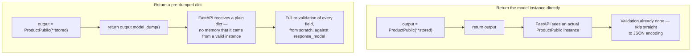

# Chapter 6: Response Models, Status Codes, and Serialization Control

> Part I — Foundations · Chapter 6 of 28

Chapter 5 went deep on validating data *coming in*. This chapter is the mirror image: controlling exactly what goes *out* — declaring a response shape independent of what your function actually returns, choosing the right status code for each operation, separating input models from output models (and why that separation is often a security concern, not just a style preference), and a real, easy-to-reproduce performance trap that a poorly designed response layer can quietly introduce.

## Learning Objectives

By the end of this chapter you will be able to:

- Explain what `response_model` actually does — validating and filtering a returned value against a declared shape, independent of the object's own type.
- Use `response_model_exclude`/`include`/`exclude_none`/`by_alias` to control serialization at the route level.
- Choose and set correct status codes using FastAPI's `status` constants, including the special handling `204 No Content` requires.
- Design separate input (`...Create`), update (`...Update`), and output (`...Public`) models for the same resource, and explain why that separation matters beyond code organization.
- Reproduce and fix the "double validation" trap that happens when a route returns an already-dumped dict instead of a model instance.

---

## 6.1 `response_model`: Declaring Output Independent of What You Return

`response_model` tells FastAPI: *validate and filter whatever this function returns against this shape, regardless of the Python object's actual type, before serializing it.* This decoupling is deliberate and useful — your function is free to return a dict, an ORM row, or a Pydantic model of a completely different (but compatible) shape, and FastAPI will coerce it into `response_model`'s schema on the way out.

```python
@router.get("/{product_id}", response_model=ProductPublic)
def read_product(product_id: int):
    stored = products_db[product_id]   # a plain dict, not a ProductPublic instance
    return stored                       # FastAPI validates & converts this dict into ProductPublic
```

This matters for two reasons that will recur throughout this curriculum: first, it lets your storage layer (a dict today, an ORM row from Chapter 9 onward) stay decoupled from your API's public contract — the *shape clients see* is controlled entirely by `response_model`, not by whatever your data layer happens to look like internally. Second — and this is the one worth sitting with — **`response_model` can *hide* fields that exist on the returned object but aren't declared on the response model.** If `stored` contains an internal `cost_price` key that `ProductPublic` doesn't declare, that field is silently dropped from the response, never reaching the client. This isn't a side effect; it's the entire mechanism section 6.4 builds on.

## 6.2 Fine-Tuning What Gets Serialized

The same `exclude`/`include`/`exclude_none`/`by_alias` family from Chapter 5's `model_dump()` has route-level equivalents, applied automatically to whatever your function returns rather than something you call by hand:

```python
@router.get(
    "/{product_id}",
    response_model=ProductPublic,
    response_model_exclude={"tags"},
    response_model_exclude_none=True,
)
def read_product_summary(product_id: int):
    ...
```

- **`response_model_exclude`/`response_model_include`** — drop or restrict to specific top-level fields, without needing a separate model class just for a "summary" view.
- **`response_model_exclude_none=True`** — drop any field whose value is `None` from the JSON output entirely, rather than serializing it as `null`. Useful when "absent" and "null" should look the same to a client, and you'd rather not clutter every response with a wall of `null` fields for optional data that wasn't set.
- **`response_model_exclude_unset=True`** — the route-level version of Chapter 5's `exclude_unset`; less commonly needed here since it's more naturally used on `model_dump()` directly inside `PATCH` logic (you'll do exactly that in the hands-on project below).
- **`response_model_by_alias`** — defaults to `True`: if a field has an `alias` (e.g., `Field(alias="createdAt")` for a client expecting camelCase), the response uses that alias by default. Set it to `False` if you'd rather the response use your Python field names regardless of any alias defined for input purposes.

## 6.3 Status Codes, Properly

You've been passing bare integers (`status_code=201`) since Chapter 3. FastAPI provides named constants via `fastapi.status`, which read better and self-document intent without memorizing numbers:

```python
from fastapi import status

@router.post("/", status_code=status.HTTP_201_CREATED)
def create_product(product: ProductCreate):
    ...

@router.delete("/{product_id}", status_code=status.HTTP_204_NO_CONTENT)
def delete_product(product_id: int):
    ...
```

| Situation | Status code | Constant |
|---|---|---|
| Successful `GET` | `200` | `status.HTTP_200_OK` |
| Successful `POST` that creates a resource | `201` | `status.HTTP_201_CREATED` |
| Successful operation with nothing to return | `204` | `status.HTTP_204_NO_CONTENT` |
| Resource doesn't exist | `404` | `status.HTTP_404_NOT_FOUND` |
| Request body fails validation | `422` | *(FastAPI sets this automatically)* |

**`204` has a hard rule worth internalizing now, because getting it wrong produces a confusing server-side error rather than a client-facing one:** a `204` response must have an empty body. If you declare `response_model` on a `204` route, FastAPI/Pydantic will try to validate whatever you return against that model — and if you return `None` (as you should, for a "nothing to return" operation), validation fails, because `None` doesn't satisfy a model with required fields. The fix is simple once you know the rule: **routes returning `204` should not declare a `response_model` at all**, and should return `None` (or simply have no `return` statement — an implicit `None` works identically). You'll trigger this exact failure on purpose in the exercises, because the error message alone doesn't make the rule obvious until you've seen it happen.

## 6.4 Input, Update, and Output Models — Three Different Shapes for One Resource

It's tempting to use a single Pydantic model for a resource everywhere — as the request body, the stored representation, *and* the response. This works for a toy example and breaks down the moment a real field needs different treatment on the way in versus the way out. Consider a `cost_price` field: your business needs it (to compute margins internally), your create endpoint needs to *accept* it, but no output should ever expose it to whoever's calling your public API — a competitor scraping your product listings has no business seeing your cost basis.

The fix is structural, not a filter you remember to apply by hand every time: **use separate models for separate purposes.**

```python
class ProductBase(BaseModel):
    model_config = ConfigDict(str_strip_whitespace=True, extra="forbid")

    name: str
    price: float
    currency: Literal["USD", "EUR", "INR"] = "USD"
    tags: list[str] = Field(default_factory=list)
    in_stock: bool = True
    sale_start: date | None = None
    sale_end: date | None = None


class ProductCreate(ProductBase):
    cost_price: float          # required on input, deliberately absent from ProductPublic below


class ProductUpdate(BaseModel):
    """Every field optional — this is what a PATCH body looks like."""
    model_config = ConfigDict(str_strip_whitespace=True, extra="forbid")

    name: str | None = None
    price: float | None = None
    currency: Literal["USD", "EUR", "INR"] | None = None
    tags: list[str] | None = None
    in_stock: bool | None = None
    sale_start: date | None = None
    sale_end: date | None = None


class ProductPublic(ProductBase):
    id: int
    created_at: datetime
    # cost_price is simply never declared here — it cannot leak, structurally,
    # regardless of what the storage layer happens to contain.
```

Notice `cost_price`'s protection isn't a filter someone has to remember to apply on every route — it's a fact about `ProductPublic`'s *schema*. Even if a future engineer, six months from now, carelessly does `return stored_dict_with_everything_in_it` from a new endpoint, `response_model=ProductPublic` will still strip `cost_price` out, because that field simply doesn't exist in the declared output shape. This is the practical payoff of the input/output separation: security-relevant filtering that survives careless code changes, rather than depending on every route author remembering to exclude the sensitive field by hand.

`ProductUpdate`, with every field optional and no `cost_price` at all, does double duty: it makes partial updates possible (nothing is required, so a client sends only what's changing), and it structurally prevents a `PATCH` request from ever touching `cost_price` — combined with `extra="forbid"`, an attempt to sneak `cost_price` into a `PATCH` body is rejected outright as an unrecognized field, rather than silently ignored.

## 6.5 The Double-Validation Trap

Here's a subtle but real performance mistake, and it's worth catching now precisely because it *looks* harmless:

```python
@router.get("/{product_id}", response_model=ProductPublic)
def read_product_slow(product_id: int):
    stored = products_db[product_id]
    output = ProductPublic(**stored)   # validation pass #1 — constructing a real instance
    return output.model_dump()          # <-- throws the instance away, returns a plain dict
```

`output` is already a fully validated `ProductPublic` instance the moment it's constructed. But `output.model_dump()` converts it *back* into a plain dict before returning — and a plain dict carries none of the "I'm already a validated instance of this exact class" information that Pydantic could otherwise use to skip redundant work. FastAPI now has no choice but to run the *entire* `response_model` validation pass again, from scratch, against that dict — re-checking every field, re-running every validator — even though you had a perfectly valid instance one line earlier and threw the useful part of that fact away.



The fix is to simply not call `model_dump()` yourself when you're about to return the object anyway — let FastAPI do that conversion exactly once, at the point it actually needs to serialize:

```python
@router.get("/{product_id}", response_model=ProductPublic)
def read_product_fast(product_id: int):
    stored = products_db[product_id]
    output = ProductPublic(**stored)
    return output   # FastAPI recognizes this is already a ProductPublic instance
```

This relies on a specific, real Pydantic v2 default worth naming: the `revalidate_instances` config setting, which defaults to `"never"` — meaning that when Pydantic is asked to validate a value against a model, and that value is *already* an instance of that exact model class, it skips re-running validators entirely and trusts the instance as-is. Returning the dict in the "slow" version throws away that shortcut, because a `dict` obviously isn't "already an instance of `ProductPublic`" no matter how recently it was one. The rule to take away: **when a route has a `response_model`, return the model instance itself, not the result of calling `.model_dump()` on it** — let FastAPI's own serialization step be the only place that conversion happens.

One related caveat worth a sentence, since it's the natural next question: relying on `revalidate_instances="never"` also means that if you *mutate* an already-constructed instance afterward (`output.price = -999`) and then return it, nothing re-checks that mutation against your validators by default — Pydantic models don't validate on attribute assignment unless you opt in with `model_config = ConfigDict(validate_assignment=True)`. This isn't this chapter's main topic, but it's worth remembering the next time a "the validator clearly should have caught this" bug turns out to be a mutation-after-construction rather than a validator that was never written.

---

## Hands-On Project: Input/Output Separation for the Products API

### Step 1 — The three models

```python
# models.py
from datetime import date, datetime
from typing import Literal
from pydantic import BaseModel, ConfigDict, Field, field_validator, model_validator, computed_field


class ProductBase(BaseModel):
    model_config = ConfigDict(str_strip_whitespace=True, extra="forbid")

    name: str
    price: float
    currency: Literal["USD", "EUR", "INR"] = "USD"
    tags: list[str] = Field(default_factory=list)
    in_stock: bool = True
    sale_start: date | None = None
    sale_end: date | None = None

    @field_validator("price")
    @classmethod
    def price_must_be_non_negative(cls, v: float) -> float:
        if v < 0:
            raise ValueError("price must be non-negative")
        return v

    @model_validator(mode="after")
    def check_sale_window(self) -> "ProductBase":
        if self.sale_start and self.sale_end and self.sale_start >= self.sale_end:
            raise ValueError("sale_start must be before sale_end")
        return self


class ProductCreate(ProductBase):
    cost_price: float

    @field_validator("cost_price")
    @classmethod
    def cost_price_must_be_non_negative(cls, v: float) -> float:
        if v < 0:
            raise ValueError("cost_price must be non-negative")
        return v


class ProductUpdate(BaseModel):
    model_config = ConfigDict(str_strip_whitespace=True, extra="forbid")

    name: str | None = None
    price: float | None = None
    currency: Literal["USD", "EUR", "INR"] | None = None
    tags: list[str] | None = None
    in_stock: bool | None = None
    sale_start: date | None = None
    sale_end: date | None = None


class ProductPublic(ProductBase):
    id: int
    created_at: datetime

    @computed_field
    @property
    def display_price(self) -> str:
        symbol = {"USD": "$", "EUR": "€", "INR": "₹"}[self.currency]
        return f"{symbol}{self.price:.2f}"
```

### Step 2 — Routes using all three, plus correct status codes

```python
# routers/products.py
from datetime import datetime
from fastapi import APIRouter, HTTPException, status
from models import ProductCreate, ProductUpdate, ProductPublic

router = APIRouter(prefix="/products", tags=["products"])
products_db: dict[int, dict] = {}
_next_id = 1


@router.post("/", response_model=ProductPublic, status_code=status.HTTP_201_CREATED)
def create_product(product: ProductCreate):
    global _next_id
    product_id = _next_id
    _next_id += 1
    stored = {
        "id": product_id,
        "created_at": datetime.utcnow(),
        **product.model_dump(exclude={"cost_price"}),
    }
    stored["_cost_price"] = product.cost_price   # kept for internal use, never in ProductPublic
    products_db[product_id] = stored

    output = ProductPublic(**{k: v for k, v in stored.items() if k != "_cost_price"})
    return output   # instance, not output.model_dump() — see section 6.5


@router.get("/{product_id}", response_model=ProductPublic)
def read_product(product_id: int):
    if product_id not in products_db:
        raise HTTPException(status_code=status.HTTP_404_NOT_FOUND, detail="Product not found")
    stored = products_db[product_id]
    return ProductPublic(**{k: v for k, v in stored.items() if k != "_cost_price"})


@router.patch("/{product_id}", response_model=ProductPublic)
def update_product(product_id: int, update: ProductUpdate):
    if product_id not in products_db:
        raise HTTPException(status_code=status.HTTP_404_NOT_FOUND, detail="Product not found")
    stored = products_db[product_id]
    changes = update.model_dump(exclude_unset=True)   # only what the client actually sent
    stored.update(changes)
    return ProductPublic(**{k: v for k, v in stored.items() if k != "_cost_price"})


@router.delete("/{product_id}", status_code=status.HTTP_204_NO_CONTENT)
def delete_product(product_id: int):
    if product_id not in products_db:
        raise HTTPException(status_code=status.HTTP_404_NOT_FOUND, detail="Product not found")
    del products_db[product_id]
    # no return statement — implicit None, correct for 204, and no response_model declared above
```

Confirm end-to-end: `POST /products` with a body including `cost_price` returns `201` and a `ProductPublic` payload with **no `cost_price` field anywhere in it**. `PATCH /products/1` with `{"price": 12.99}` alone updates only `price`, leaving every other field untouched — the `exclude_unset=True` behavior from Chapter 5, now doing real work in a real endpoint. `DELETE /products/1` returns `204` with a genuinely empty body (check this with `curl -i` and confirm there's no `Content-Length` beyond `0` and no JSON at all).

---

## Practice Exercises

**Exercise 6.1 — Reproduce and fix the double-validation trap, with numbers.**
Write both `read_product_slow` (returning `.model_dump()`) and `read_product_fast` (returning the instance) as plain Python functions (not routes — just call the underlying logic directly, bypassing HTTP, so you're timing validation, not networking). Using `timeit` or a manual loop with `time.perf_counter()`, call each one 20,000 times against the same stored dict and compare total elapsed time. Report the numbers you observed and explain, in your own words, where the extra time in the "slow" version is actually going.

**Exercise 6.2 — Trigger the 204-with-response_model failure on purpose.**
Add a `POST /products/{product_id}/restock` endpoint with `status_code=status.HTTP_204_NO_CONTENT` **and** `response_model=ProductPublic` (the incorrect combination), having the function body increment some internal stock counter and return `None`. Call it and observe the resulting server-side error. Then fix it by removing `response_model` from the decorator, leaving `status_code=204` and `return None` in place, and confirm it now behaves correctly.

**Exercise 6.3 — `response_model_exclude_none` in practice.**
Create a product with `sale_start` and `sale_end` both left as `None` (i.e., not provided). Compare the raw JSON of `GET /products/{id}` with and without `response_model_exclude_none=True` added to that route's decorator. What's different in the response body? When would you *not* want this behavior (hint: think about a client that needs to distinguish "this field is null" from "this field was omitted by the server").

**Exercise 6.4 — Confirm `cost_price` really can't leak through `PATCH`.**
Send a `PATCH /products/{id}` request with a body of `{"cost_price": 0.01}` — an attempt to sneak a cost-price change through the update endpoint. Confirm what actually happens (given `ProductUpdate` doesn't declare `cost_price` at all, and has `extra="forbid"` set), and explain why this is a *structural* guarantee rather than something that depends on a developer remembering to check for it.

**Exercise 6.5 (stretch) — `response_model_by_alias`.**
Add `created_at: datetime = Field(alias="createdAt")` to `ProductPublic` (you'll also need `model_config = ConfigDict(populate_by_name=True, ...)` alongside the existing config, so the model can still be constructed using the Python name `created_at` internally). Confirm the JSON response now shows `createdAt` instead of `created_at`. Then add `response_model_by_alias=False` to the route decorator and confirm the response reverts to `created_at`. Explain, in one sentence, a realistic scenario where you'd want the alias behavior only for *output* and not for how your own backend code constructs the model.

---

## Solutions & Discussion

<details>
<summary>Exercise 6.1</summary>

```python
import time
from models import ProductPublic

stored = {
    "id": 1, "created_at": __import__("datetime").datetime.utcnow(),
    "name": "Widget", "price": 9.99, "currency": "USD",
    "tags": [], "in_stock": True, "sale_start": None, "sale_end": None,
}

def read_product_slow():
    output = ProductPublic(**stored)
    return output.model_dump()

def read_product_fast():
    output = ProductPublic(**stored)
    return output

N = 20_000

start = time.perf_counter()
for _ in range(N):
    ProductPublic.model_validate(read_product_slow())   # simulating FastAPI's re-validation of the dict
slow_time = time.perf_counter() - start

start = time.perf_counter()
for _ in range(N):
    read_product_fast()   # no extra re-validation step needed — it's already the right instance
fast_time = time.perf_counter() - start

print(f"slow: {slow_time:.4f}s   fast: {fast_time:.4f}s")
```

You should observe the "slow" path taking measurably longer — the exact multiplier depends on your machine and how many fields/validators `ProductPublic` has, but the pattern holds: the slow path does the full construction-and-validation work *twice* per call (once building `output`, once re-validating the dumped dict), while the fast path only does it once. The extra time in the slow version is spent entirely in Pydantic re-running every field's type check and every validator (`price_must_be_non_negative`, `check_sale_window`) a second time, against data that had already passed those exact checks moments earlier.
</details>

<details>
<summary>Exercise 6.2</summary>

```python
@router.post(
    "/{product_id}/restock",
    status_code=status.HTTP_204_NO_CONTENT,
    response_model=ProductPublic,   # <-- the mistake
)
def restock_product_broken(product_id: int):
    if product_id not in products_db:
        raise HTTPException(status_code=404, detail="Product not found")
    products_db[product_id]["in_stock"] = True
    return None
```

Calling this produces a server-side error — FastAPI attempts to validate `None` against `ProductPublic`'s schema (which has several required fields: `name`, `price`, `id`, `created_at`, etc.), and `None` obviously satisfies none of them, raising a `ResponseValidationError` that surfaces as a `500`-level failure. This is a server bug, not a client input problem — the client sent a perfectly reasonable request; the contract mismatch is entirely on the route's own declaration.

Fix:

```python
@router.post("/{product_id}/restock", status_code=status.HTTP_204_NO_CONTENT)
def restock_product(product_id: int):
    if product_id not in products_db:
        raise HTTPException(status_code=404, detail="Product not found")
    products_db[product_id]["in_stock"] = True
```

No `response_model`, no explicit `return` — the function correctly produces an empty `204` response.
</details>

<details>
<summary>Exercise 6.3</summary>

Without `response_model_exclude_none=True`, the response includes `"sale_start": null, "sale_end": null` explicitly. With it added, both keys are omitted from the JSON entirely — the response body simply has no `sale_start`/`sale_end` keys at all.

You would *not* want this behavior in an API where "the field is explicitly null" and "the server chose not to include this field" are meaningfully different states to a client — for instance, a client that renders "No sale scheduled" only when it sees an explicit `null`, versus treating a *missing* key as "this API version doesn't support sale windows at all." Collapsing both cases into "just omit it" removes information a well-designed client might have legitimately depended on.
</details>

<details>
<summary>Exercise 6.4</summary>

The request is rejected with a `422`, because `ProductUpdate` has `extra="forbid"` set and doesn't declare a `cost_price` field anywhere in its schema — from Pydantic's point of view, `cost_price` in the request body is simply an unrecognized field, exactly like any other typo'd or unexpected key, and is rejected before your route function's body ever runs.

This is a *structural* guarantee, not a runtime check, because it doesn't depend on any code path in `update_product` remembering to strip or reject `cost_price` — the protection exists purely because of what fields `ProductUpdate` does and doesn't declare. Even a future engineer who rewrites `update_product`'s internals carelessly can't accidentally let `cost_price` through via this endpoint, short of deliberately adding the field back to the model — which is exactly the kind of mistake input/output model separation is meant to make hard to make by accident, per section 6.4.
</details>

<details>
<summary>Exercise 6.5</summary>

```python
class ProductPublic(ProductBase):
    model_config = ConfigDict(populate_by_name=True)   # in addition to any inherited config

    id: int
    created_at: datetime = Field(alias="createdAt")
    ...
```

With `response_model_by_alias` left at its default (`True`), the response shows `"createdAt": "..."`. Adding `response_model_by_alias=False` to the route decorator reverts the output to `"created_at": "..."`, using the Python attribute name instead of the alias, even though the alias is still declared on the field.

A realistic scenario for wanting the alias on output only: your backend team writes and reads `created_at` throughout your own Python codebase (matching PEP 8 / Python convention), while a separate frontend team's JavaScript/TypeScript codebase expects camelCase (`createdAt`) to match their own language's conventions — `populate_by_name=True` plus the alias lets both conventions coexist, with the alias controlling the wire format for API consumers while your own code never has to write `createdAt` anywhere.
</details>

---

## Chapter Summary

- `response_model` validates and filters whatever your function returns against a declared shape — independent of the returned object's actual type — and this is exactly what makes it possible to hide fields (like `cost_price`) that exist on your internal data but shouldn't reach a client.
- `response_model_exclude`/`include`/`exclude_none`/`by_alias` give route-level control over serialization, mirroring the `model_dump()` options from Chapter 5.
- `204 No Content` routes must not declare `response_model` and should return `None` — declaring both is a common, easy-to-hit mistake that produces a server-side validation error rather than a helpful client-facing one.
- Separate `...Create`, `...Update`, and `...Public` models per resource turn sensitive-field protection into a structural property of your schema, rather than something every route author has to remember to enforce by hand.
- Returning `.model_dump()` instead of the model instance itself forces a wasteful second full validation pass — return the instance, and let FastAPI's own serialization step handle the single necessary conversion to JSON.

**Next:** Chapter 7 covers what happens when things go wrong on purpose — `HTTPException`, custom exception classes, global exception handlers, and designing one consistent error response shape across an entire API instead of ad hoc error bodies per route.
