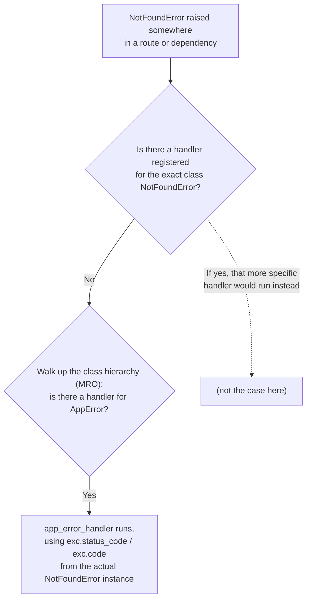

# Chapter 7: Error Handling and Custom Exceptions

> Part I — Foundations · Chapter 7 of 28

Every prior chapter has raised `HTTPException` directly, inline, wherever an error occurred. That's fine for a chapter-sized example; it does not scale to a real API, where you want one consistent error *shape* regardless of whether the failure was a missing resource, a validation error, a domain-specific business rule, or a genuine bug. This chapter builds that consistency layer, and closes out Part I.

## Learning Objectives

By the end of this chapter you will be able to:

- Use `HTTPException` correctly, including structured `detail` payloads and custom headers.
- Design custom exception classes that keep business logic decoupled from HTTP-specific concerns, and register handlers that translate them into responses.
- Override FastAPI's default `422` validation error format to match your own error envelope.
- Build a catch-all handler for unexpected exceptions that logs the real error server-side while never leaking internals to the client.
- Explain how FastAPI/Starlette decides *which* registered handler applies when an exception is raised, including how subclasses are matched.

---

## 7.1 `HTTPException`, Properly

You've used `HTTPException(status_code=404, detail="Note not found")` since Chapter 3. Two things about it are worth making explicit now:

```python
from fastapi import HTTPException, status

raise HTTPException(
    status_code=status.HTTP_404_NOT_FOUND,
    detail={"resource": "note", "id": note_id, "reason": "not_found"},
)
```

First, **`detail` doesn't have to be a string** — it can be any JSON-serializable structure (a dict, a list), which matters the moment you want to give a client more than a plain sentence to work with. Second, `HTTPException` accepts a `headers` argument, which matters for status codes that are contractually required to carry specific headers — the canonical example being `401 Unauthorized`, which per the HTTP spec should include a `WWW-Authenticate` header:

```python
raise HTTPException(
    status_code=status.HTTP_401_UNAUTHORIZED,
    detail="Invalid credentials",
    headers={"WWW-Authenticate": "Bearer"},
)
```

You'll use this exact pattern for real in Chapter 11's authentication system.

## 7.2 Custom Exception Classes — Decoupling Business Logic From HTTP

`HTTPException` has a structural problem once your codebase grows past a single file: raising it directly inside business logic *couples that logic to the web framework*. A function like `get_product_or_404(product_id)` that raises `HTTPException` can only ever be called from inside a FastAPI route — it can't be reused from a CLI script, a background job (Chapter 13), or a test that doesn't want to spin up the whole HTTP stack, without dragging FastAPI along for no reason.

The fix: define your own exception classes that carry *domain* information — nothing FastAPI- or HTTP-specific — and let a registered handler translate them into an actual HTTP response, in exactly one place.

```python
# exceptions.py
class AppError(Exception):
    """Base class for every domain-specific error in this application."""
    status_code: int = 400
    code: str = "app_error"

    def __init__(self, message: str, details: dict | None = None):
        self.message = message
        self.details = details or {}
        super().__init__(message)


class NotFoundError(AppError):
    status_code = 404
    code = "not_found"

    def __init__(self, resource: str, resource_id):
        super().__init__(
            message=f"{resource} {resource_id} not found",
            details={"resource": resource, "id": resource_id},
        )


class InsufficientStockError(AppError):
    status_code = 409
    code = "insufficient_stock"

    def __init__(self, product_id: int, requested: int, available: int):
        super().__init__(
            message="Not enough stock to fulfill this request",
            details={"product_id": product_id, "requested": requested, "available": available},
        )
```

Notice none of this imports `fastapi` at all — `NotFoundError` is a plain Python exception that happens to carry a `status_code` and `code` as class attributes, for a *web layer* to consult later if and when one exists. A service function can now do this:

```python
def get_product_or_raise(product_id: int) -> dict:
    if product_id not in products_db:
        raise NotFoundError("Product", product_id)
    return products_db[product_id]
```

— and that function is equally usable from a FastAPI route, a background script, or a unit test, none of which need to know or care that `NotFoundError` will *eventually* become a `404` somewhere downstream.

The translation happens once, via `@app.exception_handler(...)`:

```python
# main.py
from fastapi import FastAPI, Request
from fastapi.responses import JSONResponse
from exceptions import AppError

app = FastAPI()


@app.exception_handler(AppError)
async def app_error_handler(request: Request, exc: AppError):
    return JSONResponse(
        status_code=exc.status_code,
        content={"error": {"code": exc.code, "message": exc.message, "details": exc.details}},
    )
```

This single handler, registered once against the *base* class `AppError`, automatically catches `NotFoundError`, `InsufficientStockError`, and any future subclass you add — you don't need a separate `@app.exception_handler(...)` call per exception type. This works because of how Starlette (which FastAPI's exception handling sits on top of) resolves which handler applies:



Starlette looks for a handler registered for the *exact* exception class first, and if none exists, walks up the class's method resolution order (its parent classes) looking for a match — which is precisely why registering one handler on `AppError` covers every subclass automatically, while still leaving room to register a *more specific* handler for one particular subclass later, if some error type ever needs special-cased handling that the general one doesn't provide.

## 7.3 Customizing the `422` Validation Error

Chapter 4.5 covered FastAPI's default validation error shape (`{"detail": [{"type", "loc", "msg", "input"}, ...]}`). That default shape is genuinely useful for debugging, but it's inconsistent with whatever error envelope you design for the rest of your API — a client parsing your error responses shouldn't need a special case just for `422`s. `RequestValidationError`, the exception FastAPI raises internally when request validation fails, can be intercepted and reshaped exactly like any other exception:

```python
from fastapi.exceptions import RequestValidationError

@app.exception_handler(RequestValidationError)
async def validation_error_handler(request: Request, exc: RequestValidationError):
    return JSONResponse(
        status_code=422,
        content={
            "error": {
                "code": "validation_error",
                "message": "Request validation failed",
                "details": exc.errors(),
            }
        },
    )
```

`exc.errors()` returns exactly the `loc`/`msg`/`type`/`input` list from Chapter 4.5 — nothing about that useful, precise information is lost; it's simply re-homed under `details`, inside the same `{"error": {...}}` envelope every other error type in your API now uses.

## 7.4 One Consistent Error Envelope, End to End

Pulling this together: a well-designed API has exactly **one** JSON shape for every error, regardless of its source — a missing resource, a failed validation, a domain-specific business rule, or a genuine unhandled bug should all come back looking like variations on the same theme:

```json
{"error": {"code": "not_found", "message": "Product 42 not found", "details": {"resource": "Product", "id": 42}}}
```

This means the plain `HTTPException` calls scattered through Chapters 3–6 also deserve a handler that reshapes their (differently-shaped, FastAPI-default) output into the same envelope:

```python
from fastapi import HTTPException

_STATUS_CODE_TO_ERROR_CODE = {
    400: "bad_request",
    401: "unauthorized",
    403: "forbidden",
    404: "not_found",
    409: "conflict",
}


@app.exception_handler(HTTPException)
async def http_exception_handler(request: Request, exc: HTTPException):
    code = _STATUS_CODE_TO_ERROR_CODE.get(exc.status_code, "http_error")
    message = exc.detail if isinstance(exc.detail, str) else "Request failed"
    details = exc.detail if not isinstance(exc.detail, str) else {}
    return JSONResponse(
        status_code=exc.status_code,
        content={"error": {"code": code, "message": message, "details": details}},
        headers=exc.headers,
    )
```

With this in place, a plain `raise HTTPException(status_code=404, detail="Note not found")` anywhere in your codebase — including every one you already wrote in earlier chapters, unmodified — now comes back through the same `{"error": {...}}` shape as a custom `AppError` or a validation failure. Nobody had to go back and rewrite those earlier routes; the consistency is enforced centrally, once.

## 7.5 The Catch-All: Never Leak a Stack Trace

Everything so far handles errors you *expected* — a missing resource, bad input, a known business rule violation. Real applications also raise exceptions nobody anticipated: a bug, a downstream service outage, an edge case nobody thought of. Those need a handler too, and that handler carries a genuine security responsibility: **log the real error in full, server-side — and return something generic and safe to the client.**

```python
import logging

logger = logging.getLogger("app")


@app.exception_handler(Exception)
async def unhandled_exception_handler(request: Request, exc: Exception):
    logger.exception("Unhandled exception on %s %s", request.method, request.url)
    return JSONResponse(
        status_code=500,
        content={
            "error": {
                "code": "internal_error",
                "message": "An unexpected error occurred. Please try again later.",
                "details": {},
            }
        },
    )
```

`logger.exception(...)` automatically captures and logs the full traceback of whatever exception is currently being handled — that traceback goes to your own logs (or, from Chapter 20 onward, your observability pipeline), where an engineer debugging the issue can see exactly what went wrong. The response the *client* receives contains none of that — no file paths, no library versions, no raw exception message, nothing that could hint at your internal implementation to someone probing your API for weaknesses. This is a real, not theoretical, security concern: unhandled exception messages routinely leak database connection strings, internal hostnames, or library version numbers (useful for finding known CVEs against your stack) to anyone who can trigger a 500.

One reassurance worth stating plainly: registering a handler for the base `Exception` class does **not** hijack the more specific handlers you registered for `HTTPException` or `AppError` above — per the MRO-based lookup from section 7.2's diagram, Starlette finds the most specific matching handler first, and `Exception` is about as generic as it gets, sitting above everything else in the hierarchy. Your existing `raise HTTPException(...)` calls throughout Chapters 3–6 will still hit `http_exception_handler`, not this catch-all — this handler only ever fires for the exceptions *nothing else* was registered to catch.

---

## Hands-On Project: A Global Error-Handling Layer for the Products API

### Step 1 — `exceptions.py`

```python
class AppError(Exception):
    status_code: int = 400
    code: str = "app_error"

    def __init__(self, message: str, details: dict | None = None):
        self.message = message
        self.details = details or {}
        super().__init__(message)


class NotFoundError(AppError):
    status_code = 404
    code = "not_found"

    def __init__(self, resource: str, resource_id):
        super().__init__(
            message=f"{resource} {resource_id} not found",
            details={"resource": resource, "id": resource_id},
        )


class InsufficientStockError(AppError):
    status_code = 409
    code = "insufficient_stock"

    def __init__(self, product_id: int, requested: int, available: int):
        super().__init__(
            message="Not enough stock to fulfill this request",
            details={"product_id": product_id, "requested": requested, "available": available},
        )
```

### Step 2 — Register every handler in `main.py`

```python
import logging
from fastapi import FastAPI, HTTPException, Request
from fastapi.exceptions import RequestValidationError
from fastapi.responses import JSONResponse
from exceptions import AppError
from routers import products

logger = logging.getLogger("app")
app = FastAPI(title="Products API")
app.include_router(products.router)

_STATUS_CODE_TO_ERROR_CODE = {
    400: "bad_request", 401: "unauthorized", 403: "forbidden",
    404: "not_found", 409: "conflict",
}


@app.exception_handler(AppError)
async def app_error_handler(request: Request, exc: AppError):
    return JSONResponse(
        status_code=exc.status_code,
        content={"error": {"code": exc.code, "message": exc.message, "details": exc.details}},
    )


@app.exception_handler(HTTPException)
async def http_exception_handler(request: Request, exc: HTTPException):
    code = _STATUS_CODE_TO_ERROR_CODE.get(exc.status_code, "http_error")
    message = exc.detail if isinstance(exc.detail, str) else "Request failed"
    details = exc.detail if not isinstance(exc.detail, str) else {}
    return JSONResponse(
        status_code=exc.status_code,
        content={"error": {"code": code, "message": message, "details": details}},
        headers=exc.headers,
    )


@app.exception_handler(RequestValidationError)
async def validation_error_handler(request: Request, exc: RequestValidationError):
    return JSONResponse(
        status_code=422,
        content={"error": {"code": "validation_error", "message": "Request validation failed", "details": exc.errors()}},
    )


@app.exception_handler(Exception)
async def unhandled_exception_handler(request: Request, exc: Exception):
    logger.exception("Unhandled exception on %s %s", request.method, request.url)
    return JSONResponse(
        status_code=500,
        content={"error": {"code": "internal_error", "message": "An unexpected error occurred. Please try again later.", "details": {}}},
    )
```

### Step 3 — Refactor the Products API to raise `NotFoundError`, reused across three routes

```python
# routers/products.py (relevant excerpt)
from exceptions import NotFoundError


def get_product_or_raise(product_id: int) -> dict:
    if product_id not in products_db:
        raise NotFoundError("Product", product_id)
    return products_db[product_id]


@router.get("/{product_id}", response_model=ProductPublic)
def read_product(product_id: int):
    stored = get_product_or_raise(product_id)
    return ProductPublic(**{k: v for k, v in stored.items() if k != "_cost_price"})


@router.patch("/{product_id}", response_model=ProductPublic)
def update_product(product_id: int, update: ProductUpdate):
    stored = get_product_or_raise(product_id)
    changes = update.model_dump(exclude_unset=True)
    stored.update(changes)
    return ProductPublic(**{k: v for k, v in stored.items() if k != "_cost_price"})


@router.delete("/{product_id}", status_code=204)
def delete_product(product_id: int):
    get_product_or_raise(product_id)
    del products_db[product_id]
```

One helper function, `get_product_or_raise`, now backs all three routes — the exact "reused across three endpoints" pattern this chapter set out to build. Confirm all three now return the same `{"error": {"code": "not_found", ...}}` shape for a missing product, and that this shape matches exactly what a malformed request or an unhandled bug would also produce — one envelope, three very different causes.

---

## Practice Exercises

**Exercise 7.1 — Apply the same pattern to the Notes API.**
Add a `get_note_or_raise(note_id)` helper to the Notes API (Chapters 3–4) that raises `NotFoundError("Note", note_id)`, and refactor `read_note`, `replace_note`, and `delete_note` to use it instead of their existing `raise HTTPException(status_code=404, ...)` calls. Confirm the Notes API's 404 responses now match the exact same `{"error": {...}}` shape as the Products API — even though the two resources live in entirely separate router files.

**Exercise 7.2 — A new domain exception: duplicate resources.**
Add a `DuplicateResourceError` to `exceptions.py` (status `409`, code `"duplicate_resource"`), and enforce that product names must be unique in `create_product` — raise it if a product with the same `name` already exists. Confirm the resulting `409` response uses the same envelope as everything else, with no new handler needed (since `DuplicateResourceError` inherits from `AppError`).

**Exercise 7.3 — Confirm the `422` reshaping end to end.**
Send a `POST /products` request missing the required `name` field. Confirm the response is now `{"error": {"code": "validation_error", "message": "...", "details": [...]}}` rather than FastAPI's raw default `{"detail": [...]}` shape, and that the `details` list still contains the same `loc`/`msg`/`type`/`input` information from Chapter 4.5 — nothing useful was lost, only re-homed.

**Exercise 7.4 — Trigger the catch-all on purpose, and check both sides.**
Add a deliberately broken endpoint, e.g. `GET /products/__boom` that does `return 1 / 0`. Call it and confirm two things separately: (a) the client-facing response is the generic `{"error": {"code": "internal_error", ...}}` message, with no mention of `ZeroDivisionError` or any traceback; (b) your server's terminal/log output *does* show the full traceback, via `logger.exception`. Explain why checking only one side of this would give you a false sense of security.

**Exercise 7.5 (stretch) — A correlatable `request_id`.**
Add a `request_id` field (a fresh `uuid4` string, generated per request) into every error envelope's top level, alongside `"error"`. For now, generate it directly inside each handler (you'll learn the proper way to make one ID available across an entire request via middleware in Chapter 12) — the point of this exercise is just to see *why* it's useful: imagine a client reports "I got an internal_error at 3:04pm," and explain how a `request_id` in both the client-facing error and your server logs would let you find the exact log entry instantly, without grepping through a timestamp range.

---

## Solutions & Discussion

<details>
<summary>Exercise 7.1</summary>

```python
# routers/notes.py
from exceptions import NotFoundError

def get_note_or_raise(note_id: int) -> dict:
    if note_id not in notes_db:
        raise NotFoundError("Note", note_id)
    return notes_db[note_id]


@router.get("/{note_id}")
def read_note(note_id: int):
    return get_note_or_raise(note_id)


@router.put("/{note_id}")
def replace_note(note_id: int, note: dict):
    get_note_or_raise(note_id)
    stored = {"id": note_id, **note}
    notes_db[note_id] = stored
    return stored


@router.delete("/{note_id}", status_code=204)
def delete_note(note_id: int):
    get_note_or_raise(note_id)
    del notes_db[note_id]
```

A request for a missing note now returns `{"error": {"code": "not_found", "message": "Note 99 not found", "details": {"resource": "Note", "id": 99}}}` — identical in shape to the Products API's equivalent response, because both ultimately raise the same `NotFoundError` class, caught by the same single `app_error_handler` registered once on `app`. The consistency isn't something you had to re-implement per router — it falls out naturally from both routers raising the same shared exception type.
</details>

<details>
<summary>Exercise 7.2</summary>

```python
# exceptions.py
class DuplicateResourceError(AppError):
    status_code = 409
    code = "duplicate_resource"

    def __init__(self, resource: str, field: str, value):
        super().__init__(
            message=f"{resource} with {field}={value!r} already exists",
            details={"resource": resource, "field": field, "value": value},
        )
```

```python
# routers/products.py
from exceptions import DuplicateResourceError

@router.post("/", response_model=ProductPublic, status_code=status.HTTP_201_CREATED)
def create_product(product: ProductCreate):
    if any(p["name"] == product.name for p in products_db.values()):
        raise DuplicateResourceError("Product", "name", product.name)
    ...
```

No new `@app.exception_handler(...)` registration was needed — `DuplicateResourceError` inherits from `AppError`, so it's caught by the existing `app_error_handler` via the MRO lookup from section 7.2, and produces `{"error": {"code": "duplicate_resource", "message": "Product with name='Widget' already exists", ...}}` automatically.
</details>

<details>
<summary>Exercise 7.3</summary>

Sending `{"content": "...", "author": {...}}` (missing `name`... actually missing `title` for Notes, or missing `name` for Products depending which API — for Products, omitting `"name"`) now produces:

```json
{
  "error": {
    "code": "validation_error",
    "message": "Request validation failed",
    "details": [
      {"type": "missing", "loc": ["body", "name"], "msg": "Field required", "input": {"...": "..."}}
    ]
  }
}
```

Every piece of information from Chapter 4.5's raw shape (`type`, `loc`, `msg`, `input`) is still present, unchanged, inside `details` — the only thing that changed is the outer envelope wrapping it, which now matches every other error type in the API instead of being a special case a client had to handle separately.
</details>

<details>
<summary>Exercise 7.4</summary>

```python
@router.get("/__boom")
def deliberately_broken():
    return 1 / 0
```

Client-side: `curl -i localhost:8000/products/__boom` returns `500` with body `{"error": {"code": "internal_error", "message": "An unexpected error occurred. Please try again later.", "details": {}}}` — no mention of `ZeroDivisionError`, no file paths, nothing.

Server-side: your terminal (running `fastapi dev`) shows a full traceback via `logger.exception`, ending in `ZeroDivisionError: division by zero`, pointing at the exact line in `deliberately_broken`.

Checking only the client-facing side would tell you *that* something failed but nothing about *why* — you'd be debugging blind, unable to reproduce or fix the actual bug. Checking only the server-side logs (without verifying the client response) risks accidentally shipping an endpoint that leaks internals — it's entirely possible to have correct logging and *also* have a bug in your handler that accidentally includes `str(exc)` in the client response; verifying both sides independently is the only way to confirm you have both debuggability and safety at the same time.
</details>

<details>
<summary>Exercise 7.5</summary>

```python
import uuid

@app.exception_handler(Exception)
async def unhandled_exception_handler(request: Request, exc: Exception):
    request_id = str(uuid.uuid4())
    logger.exception("Unhandled exception [request_id=%s] on %s %s", request_id, request.method, request.url)
    return JSONResponse(
        status_code=500,
        content={
            "request_id": request_id,
            "error": {"code": "internal_error", "message": "An unexpected error occurred. Please try again later.", "details": {}},
        },
    )
```

With a `request_id` in both the log line and the client-facing response, a support workflow becomes precise instead of approximate: a client reports "I got `request_id: 7f3a...`," and you `grep 7f3a... server.log` to jump directly to the exact request — no need to correlate by approximate timestamp across what might be thousands of log lines from other concurrent requests in the same second. This exercise is deliberately a preview: generating the ID *inside* the exception handler only helps for the 500 case, and doesn't let you tag *successful* requests or other error types with the same ID for tracing. Chapter 12 (middleware) fixes that by generating one ID per request, before any handler runs, and Chapter 20 (observability) builds this into a proper structured-logging and tracing setup.
</details>

---

## Chapter Summary

- `HTTPException`'s `detail` can be structured (a dict, not just a string), and `headers` lets you attach response headers some status codes require (like `WWW-Authenticate` for `401`).
- Custom exception classes (a plain `Exception` subclass carrying `status_code`/`code`/`details`) decouple business logic from the web framework — a service function can raise a domain error without importing anything from `fastapi`.
- One handler registered on a *base* exception class (`AppError`) automatically catches every subclass, thanks to Starlette's MRO-based handler lookup — you don't register a handler per exception type.
- `RequestValidationError` and `HTTPException` can both be intercepted and reshaped into your own consistent error envelope, so a client never needs a special case for any particular error source.
- A catch-all `Exception` handler must log the real error (with full traceback) server-side while returning a generic, safe message to the client — conflating those two responsibilities is a real, common information-disclosure bug, not a hypothetical one.

**This closes Part I — Foundations.** You can now build a multi-route, validated, correctly-status-coded, consistently-error-handled API with an organized file structure. Part II starts in Chapter 8 with dependency injection — the mechanism that will let the next seven chapters (databases, auth, middleware, background tasks, file uploads, testing) all plug into your routes cleanly, instead of every route re-implementing its own setup and teardown logic.
