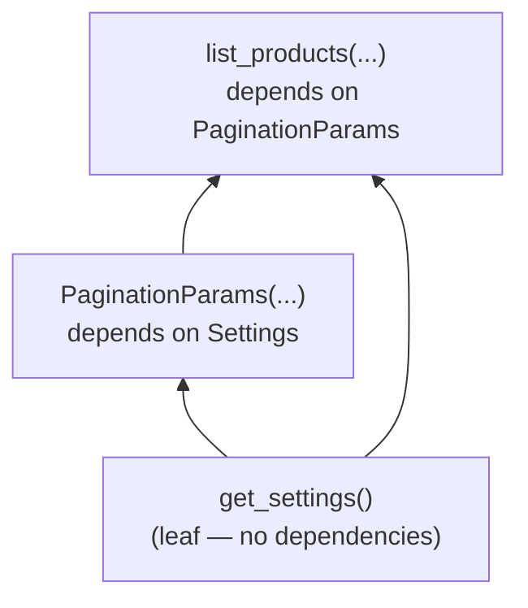

# Chapter 8: Dependency Injection — FastAPI's Core Superpower

> Part II — Intermediate: Building Real APIs · Chapter 8 of 28

Part I built a complete, validated, correctly error-handled API — but every route so far has done all of its own setup work inline. This chapter introduces `Depends()`, the mechanism that lets routes *declare what they need* and have FastAPI supply it, resolved, cached, and torn down correctly — the foundation every chapter in Part II builds directly on top of, starting with real databases in Chapter 9.

## Learning Objectives

By the end of this chapter you will be able to:

- Explain what a dependency actually is: a callable whose return value FastAPI resolves and injects into your route, the same way it resolves `Query`/`Path`/`Body` values.
- Build dependency trees where one dependency depends on another, and explain the order in which FastAPI resolves them.
- Write `yield`-based dependencies for setup/teardown (opening and closing a resource around a request).
- Explain FastAPI's per-request dependency caching — and when you'd deliberately disable it.
- Convert a function-based dependency into a class-based one, and explain when that conversion is worth doing.

---

## 8.1 What a Dependency Actually Is

A "dependency" in FastAPI is nothing more exotic than: **a callable (a function, or a class) whose return value FastAPI computes for you and passes into your route function as an argument.** You mark a parameter as depending on one with `Depends(...)`, exactly parallel to how `Query(...)`/`Path(...)`/`Body(...)` marked where a value comes from in Chapter 4 — the only difference is the *source* is "the result of calling this function," not "a piece of the incoming request."

```python
from typing import Annotated
from fastapi import Depends

def get_greeting() -> str:
    return "Hello"

@app.get("/greet")
def greet(greeting: Annotated[str, Depends(get_greeting)]):
    return {"message": f"{greeting}, world"}
```

FastAPI calls `get_greeting()` before running `greet`, and passes its return value in as `greeting`. This looks almost pointless for a function this trivial — and that's deliberate, because the *value* of dependency injection isn't visible until a dependency does something worth sharing across many routes: reading configuration, opening a database session, checking authentication, enforcing a rate limit. Those are exactly the cases Part II is about to build, one per chapter — this chapter is the plumbing all of them share.

Dependencies can themselves take the same kinds of parameters a route can — `Query`, `Path`, other `Depends(...)` — because, from FastAPI's point of view, a dependency function *is* just another callable it inspects the same way it inspects your route functions.

## 8.2 Dependency Trees and Resolution Order

Once a dependency can itself declare a `Depends(...)` parameter, you get a *tree* rather than a flat list — dependency A can depend on B, which depends on C. FastAPI resolves this depth-first, from the leaves inward: the deepest dependencies (the ones with no further `Depends(...)` of their own) run first, and each result flows back up to whatever depended on it, ending with your route function itself running last, once everything it (directly or transitively) depends on has already been resolved.



`get_settings` is a leaf — it runs first. `PaginationParams` depends on it, so it runs next, using `get_settings`'s result. `list_products` (the route itself) depends on both `PaginationParams` and, separately, `get_settings` directly — and runs last, once everything above it in the tree has resolved. You'll build exactly this shape in the hands-on project, and use it to observe something important about *how many times* `get_settings` actually runs, in section 8.4.

## 8.3 `yield`-Based Dependencies: Setup and Teardown

Everything so far returns a plain value with `return`. Dependencies can also use `yield`, which splits the function into a "before" half and an "after" half — code before the `yield` runs *before* your route executes, and code after it (typically in a `finally` block) runs *after* the response has been produced, regardless of whether the route succeeded or raised an exception:

```python
def get_audit_context():
    ctx = AuditContext()
    print("[audit] context opened")
    try:
        yield ctx
    finally:
        print(f"[audit] context closed — actions recorded: {ctx.actions}")
```

This is precisely the "open a resource, hand it to the route, clean it up afterward no matter what" pattern — and it's exactly how you'll manage real database sessions starting in Chapter 9 (`yield` a session, `finally` close it). The `try`/`finally` here isn't decorative: if the route raises an exception partway through using `ctx`, the exception propagates back up *through* the `yield` point, and your `finally` block still runs — cleanup happens whether the request succeeded or failed, which is exactly the guarantee you want from something like a database connection that must never be left open on an error path.

## 8.4 Dependency Caching Within a Request

Here's a detail that matters the moment the same dependency is needed in more than one place within a single request's tree: **FastAPI calls each distinct dependency at most once per request, and reuses the cached result everywhere else it's needed**, by default.

```python
def get_settings() -> Settings:
    print("[settings] get_settings() called")
    return Settings()

class PaginationParams:
    def __init__(
        self,
        limit: Annotated[int, Query(ge=1)] = 20,
        settings: Annotated[Settings, Depends(get_settings)] = None,
    ):
        self.limit = min(limit, settings.max_page_size)

@router.get("/")
def list_products(
    pagination: Annotated[PaginationParams, Depends(PaginationParams)],
    settings: Annotated[Settings, Depends(get_settings)],   # same dependency, referenced again
):
    ...
```

`get_settings` is depended on twice in this tree — once indirectly, through `PaginationParams`, and once directly, by `list_products` itself. Despite that, calling this route once produces exactly **one** `"[settings] get_settings() called"` print line, not two — FastAPI resolved `get_settings` the first time it was needed (while building `PaginationParams`), cached that result for the duration of this one request, and simply reused it when `list_products` asked for the same dependency a moment later.

This caching is scoped strictly to a single incoming request — it does **not** persist across requests. A second, separate request to the same endpoint will print `"[settings] get_settings() called"` again, once, for that new request's own tree. The caching only ever prevents *duplicate calls within one request's resolution*, not repeated calls across the lifetime of your application — for that kind of longer-lived caching, you're looking at Chapter 19's Redis-backed caching, a different tool entirely.

You can opt a specific dependency usage out of this caching with `Depends(get_settings, use_cache=False)`, forcing a fresh call even if the same dependency was already resolved earlier in the same request's tree — useful for the rare dependency whose whole point is to be non-deterministic per-call (capturing "the exact current time" at two genuinely different moments during one request, for instance), where reusing a cached value would be actively wrong.

## 8.5 Class-Based Dependencies

A dependency doesn't have to be a plain function — a class works too, in two distinct, useful shapes.

**Shape one: the class itself is the dependency**, and FastAPI calls its constructor the same way it would call a function, using `__init__`'s parameters exactly like a function dependency's parameters:

```python
class PaginationParams:
    def __init__(
        self,
        limit: Annotated[int, Query(ge=1, le=100)] = 20,
        offset: Annotated[int, Query(ge=0)] = 0,
    ):
        self.limit = limit
        self.offset = offset

@router.get("/")
def list_products(pagination: Annotated[PaginationParams, Depends(PaginationParams)]):
    ...
```

FastAPI reads `PaginationParams.__init__`'s signature exactly as it would read a function's, extracts `limit`/`offset` from the query string using the same `Query(...)` machinery from Chapter 4, and constructs an instance — which becomes the injected value. This is a genuinely nice pattern for grouping several related query parameters into one reusable, named unit, instead of repeating `limit: Annotated[int, Query(...)]`, `offset: Annotated[int, Query(...)]` on every route that needs pagination.

**Shape two: an *instance* of a class is the dependency**, where the class defines `__call__`, and you construct the instance once, up front, with whatever configuration that particular usage needs:

```python
class RateLimiter:
    def __init__(self, max_calls: int):
        self.max_calls = max_calls   # configured once, at instantiation

    def __call__(self, request: Request):
        # simplified placeholder — real rate limiting arrives in Chapter 19
        ...

strict_limit = RateLimiter(max_calls=5)
lenient_limit = RateLimiter(max_calls=100)

@router.post("/", dependencies=[Depends(strict_limit)])
def create_product(...):
    ...

@router.get("/", dependencies=[Depends(lenient_limit)])
def list_products(...):
    ...
```

This shape earns its keep the moment you need *the same kind of dependency, configured differently, in different places* — one `RateLimiter` class, two independently-configured instances, each reused across however many routes need that particular configuration. Note also the `dependencies=[Depends(...)]` argument on the decorator itself, rather than a function parameter — this runs a dependency purely for its side effects, without capturing a return value into the route function's signature at all, which is exactly the shape you want for a check like "has this request passed rate limiting" where the route body has no actual use for the dependency's return value, only for the fact that it didn't raise. You'll use this same `dependencies=[...]` pattern constantly for authentication checks starting in Chapter 11.

---

## Hands-On Project: Shared Pagination and Settings Dependencies

### Step 1 — `dependencies.py`

```python
from typing import Annotated
from fastapi import Depends, Query


class Settings:
    def __init__(self):
        self.default_currency = "USD"
        self.max_page_size = 100


def get_settings() -> Settings:
    print("[settings] get_settings() called")
    return Settings()


class PaginationParams:
    def __init__(
        self,
        limit: Annotated[int, Query(ge=1, le=100)] = 20,
        offset: Annotated[int, Query(ge=0)] = 0,
        settings: Annotated[Settings, Depends(get_settings)] = None,
    ):
        self.limit = min(limit, settings.max_page_size)
        self.offset = offset


class AuditContext:
    def __init__(self):
        self.actions: list[str] = []

    def log(self, action: str):
        self.actions.append(action)


def get_audit_context():
    ctx = AuditContext()
    print("[audit] context opened")
    try:
        yield ctx
    finally:
        print(f"[audit] context closed — actions recorded: {ctx.actions}")
```

### Step 2 — Wire both into the Products API

```python
# routers/products.py (relevant excerpt)
from typing import Annotated
from fastapi import APIRouter, Depends
from dependencies import Settings, get_settings, PaginationParams, AuditContext, get_audit_context

router = APIRouter(prefix="/products", tags=["products"])


@router.get("/")
def list_products(
    pagination: Annotated[PaginationParams, Depends(PaginationParams)],
    settings: Annotated[Settings, Depends(get_settings)],
):
    filtered = list(products_db.values())
    page = filtered[pagination.offset : pagination.offset + pagination.limit]
    return {
        "items": page,
        "total": len(filtered),
        "limit": pagination.limit,
        "offset": pagination.offset,
        "currency": settings.default_currency,
    }


@router.post("/", response_model=ProductPublic, status_code=201)
def create_product(
    product: ProductCreate,
    audit: Annotated[AuditContext, Depends(get_audit_context)],
):
    audit.log(f"creating product '{product.name}'")
    # ... existing creation logic from Chapter 6/7 ...
    audit.log(f"product created with id={new_id}")
    return output
```

### Step 3 — Watch the resolution order and caching happen

Run `fastapi dev main.py` and call `GET /products?limit=5`. Watch your terminal: you should see exactly **one** `"[settings] get_settings() called"` line, even though `get_settings` is depended on both indirectly (through `PaginationParams`) and directly (by `list_products` itself) — the caching from section 8.4, made visible. Call the same endpoint a second time, in a separate request, and confirm the line prints again — once — for that new request; caching doesn't carry over between requests.

Then call `POST /products` with a valid body, and watch for `"[audit] context opened"` *before* your route body runs, and `"[audit] context closed — actions recorded: [...]"` *after* it — with the actual list of logged actions your route added via `audit.log(...)` in between, exactly the `yield`-based setup/teardown from section 8.3.

---

## Practice Exercises

**Exercise 8.1 — A request-duration dependency.**
Write a `yield`-based dependency, `get_timer()`, that records `time.perf_counter()` before yielding and logs the elapsed duration after the route completes (in a `finally` block, so it logs even if the route raises). Add it to `list_products` and confirm each request logs its own duration. Then verify it still logs a duration even when the route path raises an exception (temporarily add a route that deliberately raises after depending on `get_timer()`, and confirm the "after" logging still runs).

**Exercise 8.2 — A three-level dependency chain, traced.**
Build `get_settings()` (as above) → `get_locale(settings: Annotated[Settings, Depends(get_settings)])` (returns `"en-US"` for `USD`, otherwise `"en-GB"`, say) → `get_currency_formatter(locale: Annotated[str, Depends(get_locale)])` (returns a simple formatting function based on locale). Add a `print(...)` at the start of each of the three functions, hit a route depending only on `get_currency_formatter`, and write down the exact order the three print statements appear in. Does the order match what section 8.2's resolution rule predicts, before you ran it?

**Exercise 8.3 — Function dependency to callable class.**
Start with this function-based dependency for a (deliberately simplified) API-key check:

```python
def verify_api_key(x_api_key: Annotated[str, Header()]):
    if x_api_key != "expected-key-123":
        raise HTTPException(status_code=401, detail="Invalid API key")
```

Convert it into a `class ApiKeyChecker` with `__init__(self, expected_key: str)` and `__call__(self, x_api_key: Annotated[str, Header()])`, so that two different routes can require *different* expected keys via two separately-configured instances (`Depends(ApiKeyChecker("key-for-public-routes"))` vs `Depends(ApiKeyChecker("key-for-admin-routes"))`). Confirm both configurations work independently.

**Exercise 8.4 — Side-effect-only dependency via `dependencies=[...]`.**
Add a dependency, `log_request_path(request: Request)`, that simply prints the request's method and path, with no return value your route needs. Apply it via `dependencies=[Depends(log_request_path)]` at the router level (so it applies to *every* route in that router) rather than as a function parameter on any individual route. Confirm the print statement appears for every route in the router, without you touching any individual route function's signature.

**Exercise 8.5 (stretch) — `use_cache=False` in practice.**
Write a dependency `get_request_uuid()` that returns a fresh `uuid.uuid4()` on every call. Depend on it twice within a single route — once normally, once with `Depends(get_request_uuid, use_cache=False)` — and print both values. Confirm the two values are **identical** for the default (cached) usage referenced twice, versus what you'd see if *both* references used `use_cache=False`. (Hint: you'll need three references total to see all three behaviors clearly — try it and explain what you observe.)

---

## Solutions & Discussion

<details>
<summary>Exercise 8.1</summary>

```python
import time

def get_timer():
    start = time.perf_counter()
    try:
        yield start
    finally:
        elapsed = time.perf_counter() - start
        print(f"[timer] request took {elapsed:.4f}s")


@router.get("/")
def list_products(
    pagination: Annotated[PaginationParams, Depends(PaginationParams)],
    _timer: Annotated[float, Depends(get_timer)],
):
    ...
```

Testing the failure path:
```python
@router.get("/__slow_boom")
def deliberately_broken(_timer: Annotated[float, Depends(get_timer)]):
    raise ValueError("boom")
```
Calling this still prints `"[timer] request took ...s"` before the (now-500, per Chapter 7's catch-all handler) response is returned — the `finally` block runs regardless of whether the route body succeeded or raised, exactly the guarantee `yield`-based dependencies provide, and precisely why database session cleanup (Chapter 9) relies on this same mechanism rather than a plain `return`.
</details>

<details>
<summary>Exercise 8.2</summary>

```python
def get_settings() -> Settings:
    print("1. get_settings called")
    return Settings()

def get_locale(settings: Annotated[Settings, Depends(get_settings)]) -> str:
    print("2. get_locale called")
    return "en-US" if settings.default_currency == "USD" else "en-GB"

def get_currency_formatter(locale: Annotated[str, Depends(get_locale)]):
    print("3. get_currency_formatter called")
    def formatter(amount: float) -> str:
        return f"${amount:.2f}" if locale == "en-US" else f"£{amount:.2f}"
    return formatter
```

Output order: `1. get_settings called`, then `2. get_locale called`, then `3. get_currency_formatter called` — matching section 8.2's rule exactly: resolution proceeds from the deepest leaf (`get_settings`, which depends on nothing) upward through each successive dependency, ending with the one your route actually asked for (`get_currency_formatter`) resolved last, immediately before the route function itself runs.
</details>

<details>
<summary>Exercise 8.3</summary>

```python
from typing import Annotated
from fastapi import Depends, Header, HTTPException

class ApiKeyChecker:
    def __init__(self, expected_key: str):
        self.expected_key = expected_key

    def __call__(self, x_api_key: Annotated[str, Header()]):
        if x_api_key != self.expected_key:
            raise HTTPException(status_code=401, detail="Invalid API key")


public_key_check = ApiKeyChecker("key-for-public-routes")
admin_key_check = ApiKeyChecker("key-for-admin-routes")

@router.get("/", dependencies=[Depends(public_key_check)])
def list_products():
    ...

@router.delete("/{product_id}", dependencies=[Depends(admin_key_check)])
def delete_product(product_id: int):
    ...
```

Each route now enforces its *own* expected key, backed by the same `ApiKeyChecker` class — exactly the payoff described in section 8.5's "shape two": one reusable class, multiple independently-configured instances, each wired to whichever routes need that particular configuration, without duplicating the checking logic itself.
</details>

<details>
<summary>Exercise 8.4</summary>

```python
from fastapi import Request

def log_request_path(request: Request):
    print(f"[access] {request.method} {request.url.path}")


router = APIRouter(
    prefix="/products",
    tags=["products"],
    dependencies=[Depends(log_request_path)],
)
```

Every route registered on this router — `list_products`, `create_product`, `read_product`, and so on — now triggers `log_request_path` before it runs, without a single one of those route functions' signatures changing at all. This is the `dependencies=[...]` mechanism applied at the *router* level rather than one route at a time — useful the moment a cross-cutting concern (logging, auth, rate limiting) needs to apply uniformly across an entire resource, rather than being repeated on every route individually.
</details>

<details>
<summary>Exercise 8.5</summary>

```python
import uuid

def get_request_uuid():
    return uuid.uuid4()

@router.get("/__uuid_test")
def uuid_test(
    id_a: Annotated[uuid.UUID, Depends(get_request_uuid)],
    id_b: Annotated[uuid.UUID, Depends(get_request_uuid)],                    # cached — reuses id_a's result
    id_c: Annotated[uuid.UUID, Depends(get_request_uuid, use_cache=False)],   # forces a fresh call
):
    return {"id_a": id_a, "id_b": id_b, "id_c": id_c}
```

`id_a` and `id_b` are identical — both usages hit the per-request cache from section 8.4, since neither opted out of it, so the second reference simply reuses the first call's already-computed result rather than calling `get_request_uuid()` again. `id_c` is different from both, because `use_cache=False` forces FastAPI to call `get_request_uuid()` again for that specific usage, bypassing the cache entirely. This is a clean, concrete demonstration of exactly what "per-request caching" means: it's not that `get_request_uuid` can only ever be called once in the whole application — it's that *within one request's dependency tree*, repeated un-flagged references to the same dependency reuse one shared result, while `use_cache=False` opts a specific usage back out of that sharing.
</details>

---

## Chapter Summary

- A dependency is just a callable whose return value FastAPI resolves and injects — `Depends(...)` marks "this parameter's value comes from calling this function," the same conceptual slot `Query`/`Path`/`Body` fill for request data.
- Dependencies can depend on other dependencies, forming a tree resolved depth-first, leaves first, ending with your route function itself.
- `yield`-based dependencies split into a "before" half and an "after" half (typically in a `finally`), guaranteeing cleanup runs whether the route succeeded or raised — the exact pattern real database sessions will use starting next chapter.
- FastAPI caches each dependency's result once per request, regardless of how many places in that request's tree ask for it — `use_cache=False` opts a specific usage out when that sharing would be wrong.
- Classes can serve as dependencies two ways: the class itself (its `__init__` read like a function's signature), or a pre-configured instance (via `__call__`), the latter being the right tool whenever the same *kind* of dependency needs different configuration in different places.

**Next:** Chapter 9 puts this machinery to its first serious use — replacing every in-memory `dict` this curriculum has used so far with a real, async database via SQLModel, using exactly the `yield`-based dependency pattern from section 8.3 to manage database sessions correctly per request.
