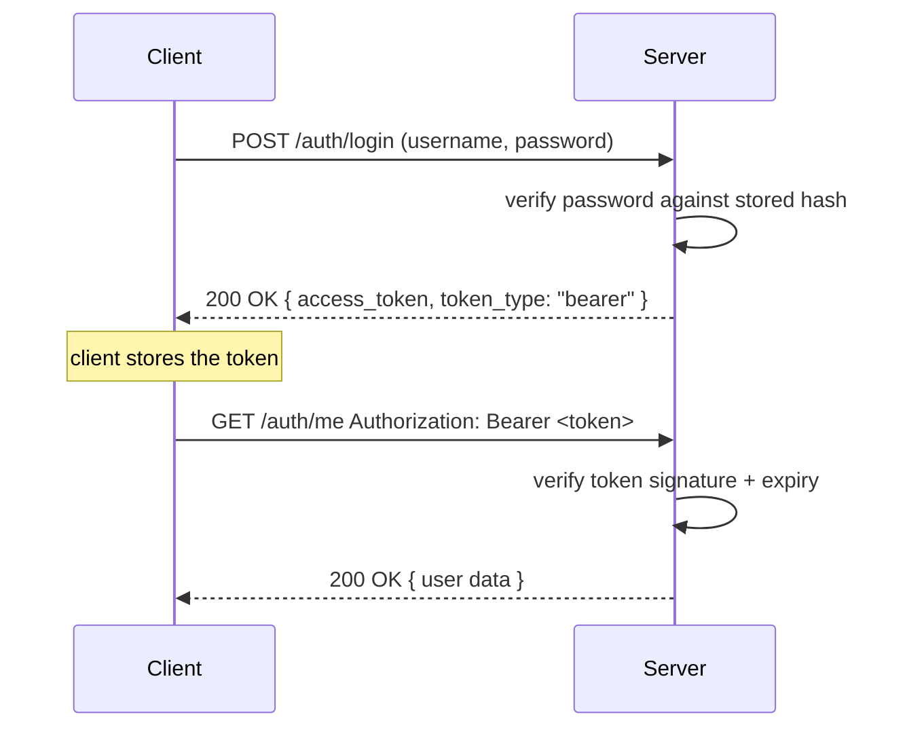
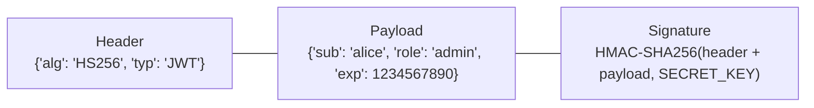

# Chapter 11: Authentication and Authorization

> Part II — Intermediate: Building Real APIs · Chapter 11 of 28

Every route built so far has been open to anyone. This chapter closes that gap: the OAuth2 password flow, JWT structure and verification, password hashing done correctly, and role-based access control — enough to build a real signup/login system with a genuinely protected admin endpoint by the end of the hands-on project.

A brief, current note before starting: FastAPI's own documentation moved away from `passlib` (now unmaintained) to **`pwdlib`** for password hashing, and this curriculum follows that same current recommendation, alongside **PyJWT** (`import jwt`) for token encoding/decoding — if you've seen older tutorials using `passlib`/`python-jose`, that's the previous generation of this same stack, not a wrong approach, just not the current one.

## Learning Objectives

By the end of this chapter you will be able to:

- Explain the OAuth2 password flow: how credentials become a token, and how that token authorizes subsequent requests.
- Explain a JWT's three-part structure, what "verification" actually checks, and why a JWT's payload is readable by anyone who has the token.
- Hash and verify passwords correctly using `pwdlib`, and explain why hashing (not encryption) is the correct operation for stored passwords.
- Implement role-based access control via a dependency, and OAuth2 scopes via `SecurityScopes` for finer-grained permission checks.
- Build a complete signup → login → protected-route → admin-only-route system end to end.

---

## 11.1 The OAuth2 Password Flow

OAuth2 defines several different "flows" (more precisely, grant types) for turning credentials into an access token — the password flow is the simplest one to implement yourself, and it's what FastAPI's built-in security tooling directly targets. It's the right fit specifically for a **first-party** API — one where you control both the client and the server (your own web or mobile app talking to your own backend) — rather than a scenario involving a *third-party* app logging users in on your API's behalf, where a redirect-based flow (authorization code flow) is the more appropriate and more secure choice. Everything in this chapter assumes the first-party case.

The shape of it: a client sends a username and password directly to a token endpoint; the server verifies them and, if valid, issues an access token; the client stores that token and includes it on every subsequent request, in an `Authorization: Bearer <token>` header, rather than resending the password each time.



FastAPI provides `OAuth2PasswordBearer`, a dependency that reads the `Authorization` header, extracts the bearer token string, and makes it available to your route — while also telling FastAPI's OpenAPI schema to render the "Authorize" lock icon in `/docs`, so you can log in and test protected routes directly from the interactive documentation:

```python
from fastapi.security import OAuth2PasswordBearer

oauth2_scheme = OAuth2PasswordBearer(tokenUrl="/auth/login")
```

`tokenUrl` doesn't call anything itself — it's metadata telling `/docs`'s "Authorize" dialog *where* to POST credentials to obtain a token during interactive testing. The actual verification logic lives in a dependency you write yourself, covered in section 11.2.

## 11.2 JWT Structure and Verification

A JWT (JSON Web Token) is three base64url-encoded segments joined by dots: `header.payload.signature`.



**The header** names the signing algorithm. **The payload** ("claims") carries whatever data you choose to embed — commonly `sub` (subject — typically the username or user ID), `exp` (expiration, as a Unix timestamp), and any custom claims your application needs (a role, a set of scopes). **The signature** is what makes the token trustworthy: it's a cryptographic signature over the header and payload, computed using a secret key only your server knows.

The single most important fact about this structure, worth stating plainly because it surprises people the first time they see it demonstrated: **the header and payload are only base64-encoded, not encrypted.** Anyone holding a JWT — including the client it was issued to, and anyone who intercepts it — can decode the payload and read it in plain text, with nothing more than a base64 decoder; there is no secret required to *read* a JWT's claims, only to *forge* a valid one. "Verifying" a JWT means: recomputing the signature yourself, using your server's secret key, over the token's header and payload, and confirming it matches the signature the token actually carries — plus separately checking that the `exp` claim hasn't already passed. If either check fails, the token is rejected. **Never put sensitive data — passwords, full personal details, anything you wouldn't want visible to whoever holds the token — directly in a JWT's payload**, precisely because "signed" does not mean "hidden."

```python
import jwt
from datetime import datetime, timedelta, timezone

SECRET_KEY = "09d25e094faa6ca2556c818166b7a9563b93f7099f6f0f4caa6cf63b88e8d3e7"  # openssl rand -hex 32
ALGORITHM = "HS256"

payload = {"sub": "alice", "exp": datetime.now(timezone.utc) + timedelta(minutes=30)}
token = jwt.encode(payload, SECRET_KEY, algorithm=ALGORITHM)

decoded = jwt.decode(token, SECRET_KEY, algorithms=[ALGORITHM])   # raises if signature or exp check fails
```

`HS256` is a *symmetric* algorithm — the same secret key both signs and verifies, which is simplest for a single-service application (this chapter's scenario) but means every service that needs to verify tokens must share that one secret. Asymmetric algorithms (`RS256`, using a private/public key pair) exist specifically for multi-service architectures where you want many services to *verify* tokens without any of them being able to *issue* new ones — worth knowing the option exists; this chapter's single-service scenario doesn't need it, and Chapter 26's microservices discussion is the more natural place to revisit the distinction.

## 11.3 Hashing Passwords Correctly

A password must never be stored in a form that can be reversed back to the original — not plaintext, and not even encryption (which is reversible by design, given the right key). It must be **hashed**: a one-way transformation, where verifying a login attempt means hashing the *submitted* password the same way and comparing the two hashes, never decrypting anything.

```python
from pwdlib import PasswordHash

password_hash = PasswordHash.recommended()

def hash_password(password: str) -> str:
    return password_hash.hash(password)

def verify_password(plain_password: str, hashed_password: str) -> bool:
    return password_hash.verify(plain_password, hashed_password)
```

`PasswordHash.recommended()` currently defaults to **Argon2** — the winner of the 2015 Password Hashing Competition, and deliberately expensive to compute (both in CPU time and memory), which is the entire point: a login check running once per real login attempt barely notices a hash that takes on the order of a hundred milliseconds, while an attacker who has stolen your entire password database and wants to try billions of guesses against it finds that same deliberate slowness turns a brute-force attack from "hours" into "practically infeasible." Modern hashing libraries also handle **salting** automatically — a random value mixed into each password before hashing, ensuring two users with the identical password still get completely different stored hashes, which defeats precomputed "rainbow table" lookups. You don't need to manage any of this by hand; it's exactly what choosing a modern library correctly buys you.

## 11.4 Role-Based Access Control and OAuth2 Scopes

The simplest form of authorization — "is this logged-in user allowed to do this?" — is a **role** check: embed a role (`"user"`, `"admin"`) somewhere accessible per-request, and gate specific routes on it via a dependency:

```python
def require_role(required_role: str):
    async def role_checker(current_user: Annotated[UserTable, Depends(get_current_active_user)]) -> UserTable:
        if current_user.role != required_role:
            raise HTTPException(status_code=status.HTTP_403_FORBIDDEN, detail="Not enough permissions")
        return current_user
    return role_checker
```

Notice `require_role` is a **dependency factory** — a plain function that *returns* a dependency, parametrized by `required_role` — exactly the same shape as Chapter 8.5's class-based "shape two" (a pre-configured callable, reused with different configuration per route), just written as a function instead of a class. `Depends(require_role("admin"))` on one route and `Depends(require_role("editor"))` on another reuse the identical checking logic, configured differently each time.

For finer-grained permissions than a single role — the kind of system where a token might carry `products:read` without `products:write`, independently of any notion of "role" — OAuth2 defines **scopes**, and FastAPI provides `SecurityScopes` to check them:

```python
from fastapi import Security
from fastapi.security import OAuth2PasswordBearer, SecurityScopes

oauth2_scheme = OAuth2PasswordBearer(
    tokenUrl="/auth/login",
    scopes={"products:read": "Read product data", "products:write": "Create or modify products"},
)

async def get_current_user_with_scopes(
    security_scopes: SecurityScopes,
    token: Annotated[str, Depends(oauth2_scheme)],
):
    payload = jwt.decode(token, SECRET_KEY, algorithms=[ALGORITHM])
    token_scopes = payload.get("scopes", [])
    for scope in security_scopes.scopes:
        if scope not in token_scopes:
            raise HTTPException(status_code=403, detail=f"Missing required scope: {scope}")
    # ...look up and return the user as usual...

@router.post("/products", dependencies=[Security(get_current_user_with_scopes, scopes=["products:write"])])
def create_product(...):
    ...
```

`Security(...)` here is `Depends(...)`'s sibling, specifically for security dependencies that need FastAPI to also track *which scopes* a given route requires (for the OpenAPI schema and the `/docs` Authorize dialog) — this is exactly the mechanism third-party providers like Google, GitHub, and Microsoft use for their own OAuth2 APIs. This chapter's hands-on project uses the simpler role-based approach for its admin endpoint, since it needs no more granularity than "admin or not" — the exercises have you wire up full scope-based checks for a case that genuinely benefits from finer granularity.

---

## Hands-On Project: Signup, Login, Protected Routes, and a Role-Gated Admin Endpoint

### Step 1 — Install dependencies

```bash
uv pip install "pwdlib[argon2]" pyjwt python-multipart
```

(`python-multipart` is required by `OAuth2PasswordRequestForm`, which parses the form-encoded — not JSON — body the OAuth2 password flow expects.)

### Step 2 — The `User` table

```python
# models.py (addition)
from sqlmodel import SQLModel, Field

class UserTable(SQLModel, table=True):
    __tablename__ = "users"
    id: int | None = Field(default=None, primary_key=True)
    username: str = Field(unique=True, index=True)
    hashed_password: str
    role: str = "user"
    disabled: bool = False
```

### Step 3 — Hashing and token helpers

```python
# security.py
from datetime import datetime, timedelta, timezone
import jwt
from pwdlib import PasswordHash

SECRET_KEY = "09d25e094faa6ca2556c818166b7a9563b93f7099f6f0f4caa6cf63b88e8d3e7"  # move to env config in Chapter 16
ALGORITHM = "HS256"
ACCESS_TOKEN_EXPIRE_MINUTES = 30

password_hash = PasswordHash.recommended()


def hash_password(password: str) -> str:
    return password_hash.hash(password)


def verify_password(plain_password: str, hashed_password: str) -> bool:
    return password_hash.verify(plain_password, hashed_password)


def create_access_token(data: dict, expires_delta: timedelta | None = None) -> str:
    to_encode = data.copy()
    expire = datetime.now(timezone.utc) + (expires_delta or timedelta(minutes=ACCESS_TOKEN_EXPIRE_MINUTES))
    to_encode.update({"exp": expire})
    return jwt.encode(to_encode, SECRET_KEY, algorithm=ALGORITHM)
```

### Step 4 — `get_current_user` and role-gating dependencies

```python
# auth_dependencies.py
from typing import Annotated
from fastapi import Depends, HTTPException, status
from fastapi.security import OAuth2PasswordBearer
import jwt
from jwt.exceptions import InvalidTokenError
from sqlmodel import select
from security import SECRET_KEY, ALGORITHM
from models import UserTable
from database import SessionDep

oauth2_scheme = OAuth2PasswordBearer(tokenUrl="/auth/login")


async def get_current_user(token: Annotated[str, Depends(oauth2_scheme)], session: SessionDep) -> UserTable:
    credentials_exception = HTTPException(
        status_code=status.HTTP_401_UNAUTHORIZED,
        detail="Could not validate credentials",
        headers={"WWW-Authenticate": "Bearer"},
    )
    try:
        payload = jwt.decode(token, SECRET_KEY, algorithms=[ALGORITHM])
        username = payload.get("sub")
        if username is None:
            raise credentials_exception
    except InvalidTokenError:
        raise credentials_exception

    result = await session.execute(select(UserTable).where(UserTable.username == username))
    user = result.scalar_one_or_none()
    if user is None:
        raise credentials_exception
    return user


async def get_current_active_user(current_user: Annotated[UserTable, Depends(get_current_user)]) -> UserTable:
    if current_user.disabled:
        raise HTTPException(status_code=400, detail="Inactive user")
    return current_user


def require_role(required_role: str):
    async def role_checker(current_user: Annotated[UserTable, Depends(get_current_active_user)]) -> UserTable:
        if current_user.role != required_role:
            raise HTTPException(status_code=status.HTTP_403_FORBIDDEN, detail="Not enough permissions")
        return current_user
    return role_checker
```

**A deliberate design choice worth calling out:** `get_current_user` looks the user up *fresh from the database* on every single request, by the username embedded in the token's `sub` claim — it does not simply trust a role claim embedded in the token itself. This means if an administrator's role is revoked in the database, that change takes effect on their *very next request*, immediately — rather than only once their existing token happens to expire. The alternative (trusting a `role` claim baked into the token at login time) would be faster (no DB lookup) but would leave a revoked admin with working admin access for as long as their old token remained unexpired — a real, meaningful security trade-off, not a stylistic one.

### Step 5 — Routes

```python
# schemas.py (additions)
from pydantic import BaseModel, ConfigDict

class UserCreate(BaseModel):
    username: str
    password: str

class UserPublic(BaseModel):
    model_config = ConfigDict(from_attributes=True)
    id: int
    username: str
    role: str
    disabled: bool

class Token(BaseModel):
    access_token: str
    token_type: str
```

```python
# routers/auth.py
from typing import Annotated
from fastapi import APIRouter, Depends, HTTPException, status
from fastapi.security import OAuth2PasswordRequestForm
from sqlmodel import select
from database import SessionDep
from models import UserTable
from security import hash_password, verify_password, create_access_token
from schemas import UserCreate, UserPublic, Token
from auth_dependencies import get_current_active_user, require_role

router = APIRouter(prefix="/auth", tags=["auth"])


@router.post("/signup", response_model=UserPublic, status_code=status.HTTP_201_CREATED)
async def signup(user_in: UserCreate, session: SessionDep):
    existing = await session.execute(select(UserTable).where(UserTable.username == user_in.username))
    if existing.scalar_one_or_none() is not None:
        raise HTTPException(status_code=409, detail="Username already registered")
    user = UserTable(username=user_in.username, hashed_password=hash_password(user_in.password))
    session.add(user)
    await session.commit()
    await session.refresh(user)
    return user


@router.post("/login", response_model=Token)
async def login(form_data: Annotated[OAuth2PasswordRequestForm, Depends()], session: SessionDep):
    result = await session.execute(select(UserTable).where(UserTable.username == form_data.username))
    user = result.scalar_one_or_none()
    if user is None or not verify_password(form_data.password, user.hashed_password):
        raise HTTPException(
            status_code=status.HTTP_401_UNAUTHORIZED,
            detail="Incorrect username or password",
            headers={"WWW-Authenticate": "Bearer"},
        )
    access_token = create_access_token(data={"sub": user.username, "role": user.role})
    return Token(access_token=access_token, token_type="bearer")


@router.get("/me", response_model=UserPublic)
async def read_current_user(current_user: Annotated[UserTable, Depends(get_current_active_user)]):
    return current_user


@router.get("/admin/stats", dependencies=[Depends(require_role("admin"))])
async def admin_stats():
    return {"message": "Only admins can see this"}
```

Test the whole flow: `POST /auth/signup`, then `POST /auth/login` (as form data — `username`/`password` fields, not JSON) to get a token, then `GET /auth/me` with `Authorization: Bearer <token>` — and confirm `GET /auth/admin/stats` returns `403` for your newly-signed-up (non-admin) user, but succeeds once you manually set that user's `role` to `"admin"` in the database and log in again.

---

## Practice Exercises

**Exercise 11.1 — Add token refresh.**
Issue a second, longer-lived `refresh_token` alongside the `access_token` at login (e.g., 7 days vs 30 minutes), with a `"type": "refresh"` claim distinguishing it from an access token (which should carry `"type": "access"`). Add a `POST /auth/refresh` endpoint accepting a refresh token and issuing a *new* access token, without requiring the username/password again — but reject the request if a token with `"type": "access"` is presented where a refresh token was expected, and vice versa.

**Exercise 11.2 — Scope-based permissions for two roles.**
Using section 11.4's `SecurityScopes` pattern, add `products:read` and `products:write` scopes. Issue tokens with `scopes: ["products:read"]` for regular users and `scopes: ["products:read", "products:write"]` for admins (embedded at login time, based on the user's role). Gate `GET /products` on `products:read` and `POST /products` on `products:write`, and confirm a regular user can list products but gets a `403` attempting to create one.

**Exercise 11.3 — Token replay: think it through, then defend against it.**
Without writing code first, answer: if an attacker intercepts a valid access token (say, from an unencrypted network or a compromised log), what can they do with it, and for how long? Then implement at least one concrete mitigation from your answer — e.g., shortening `ACCESS_TOKEN_EXPIRE_MINUTES` and relying on Exercise 11.1's refresh flow to keep the *replay window* small even though the token itself remains a bearer credential. Explain why HTTPS everywhere is a prerequisite for any of these mitigations to matter at all.

**Exercise 11.4 — Verify the role gate under both roles.**
Sign up two users. Leave one as `role="user"` and manually promote the other to `role="admin"` in the database. Call `GET /auth/admin/stats` as both, and confirm the exact status code and error message each gets. Then revoke the admin's role back to `"user"` in the database *without* them logging in again, and confirm — using their still-unexpired existing token — that their very next request to the admin endpoint is now rejected, demonstrating the fresh-DB-lookup design choice from Step 4.

**Exercise 11.5 (stretch) — What secret key rotation actually does.**
Change `SECRET_KEY` to a different value (simulating a key rotation) without restarting any active client sessions. Using a token obtained *before* the change, call any protected route and observe what happens. Explain, in your own words, why changing the signing secret invalidates every previously issued token instantly and unconditionally — and why this is a real operational consideration for planning a genuine key rotation in production (hint: think about what "instantly logging out every single user at once" would mean for a live system).

---

## Solutions & Discussion

<details>
<summary>Exercise 11.1</summary>

```python
REFRESH_TOKEN_EXPIRE_DAYS = 7

def create_token(data: dict, token_type: str, expires_delta: timedelta) -> str:
    to_encode = {**data, "type": token_type, "exp": datetime.now(timezone.utc) + expires_delta}
    return jwt.encode(to_encode, SECRET_KEY, algorithm=ALGORITHM)


@router.post("/login", response_model=Token)
async def login(form_data: Annotated[OAuth2PasswordRequestForm, Depends()], session: SessionDep):
    # ...verify user as before...
    access_token = create_token({"sub": user.username}, "access", timedelta(minutes=ACCESS_TOKEN_EXPIRE_MINUTES))
    refresh_token = create_token({"sub": user.username}, "refresh", timedelta(days=REFRESH_TOKEN_EXPIRE_DAYS))
    return {"access_token": access_token, "refresh_token": refresh_token, "token_type": "bearer"}


@router.post("/refresh", response_model=Token)
async def refresh(refresh_token: str):
    try:
        payload = jwt.decode(refresh_token, SECRET_KEY, algorithms=[ALGORITHM])
    except InvalidTokenError:
        raise HTTPException(status_code=401, detail="Invalid refresh token")
    if payload.get("type") != "refresh":
        raise HTTPException(status_code=401, detail="Not a refresh token")
    new_access_token = create_token({"sub": payload["sub"]}, "access", timedelta(minutes=ACCESS_TOKEN_EXPIRE_MINUTES))
    return {"access_token": new_access_token, "refresh_token": refresh_token, "token_type": "bearer"}
```

The `"type"` claim is the entire safeguard here: without it, nothing would stop a client from presenting their long-lived refresh token as if it were an access token on a normal protected route (it would pass signature and expiry checks just fine) — explicitly checking `payload.get("type") == "refresh"` inside `/auth/refresh`, and (symmetrically, if you extend `get_current_user`) rejecting a `"type": "refresh"` token on ordinary protected routes, keeps the two token kinds from being interchangeable even though they're structurally identical JWTs.
</details>

<details>
<summary>Exercise 11.2</summary>

```python
def create_access_token_with_scopes(username: str, scopes: list[str]) -> str:
    return create_token({"sub": username, "scopes": scopes}, "access", timedelta(minutes=ACCESS_TOKEN_EXPIRE_MINUTES))

# at login:
scopes = ["products:read", "products:write"] if user.role == "admin" else ["products:read"]
access_token = create_access_token_with_scopes(user.username, scopes)
```

```python
@router.get("/products", dependencies=[Security(get_current_user_with_scopes, scopes=["products:read"])])
async def list_products(...):
    ...

@router.post("/products", dependencies=[Security(get_current_user_with_scopes, scopes=["products:write"])])
async def create_product(...):
    ...
```

A regular user's token, carrying only `["products:read"]`, satisfies `GET /products`'s requirement but fails `POST /products`'s — `get_current_user_with_scopes` raises a `403` the moment it finds `"products:write"` missing from `security_scopes.scopes` against the token's own `scopes` claim, before `create_product`'s body ever runs.
</details>

<details>
<summary>Exercise 11.3</summary>

An attacker holding a valid, unexpired access token can do *anything that token's holder is authorized to do*, for as long as that token remains valid — there's no built-in mechanism in a stateless JWT to revoke one early short of waiting for `exp` to pass, since the server doesn't track "which tokens are currently valid" anywhere by default; it only checks whether a presented token's signature and expiry are individually correct.

The mitigation implemented: shortening `ACCESS_TOKEN_EXPIRE_MINUTES` (say, to 5–15 minutes) combined with Exercise 11.1's refresh flow shrinks the *replay window* — a stolen access token is only useful to an attacker for a few minutes at most, after which it expires and (assuming the attacker doesn't also have the refresh token, which should be transmitted and stored more carefully, e.g. in an HttpOnly cookie rather than wherever the access token lives) they're locked out again. This doesn't eliminate the risk, it bounds it.

HTTPS is a prerequisite because none of this matters if the token can simply be read off the wire in plaintext in the first place — a bearer token sent over plain HTTP is trivially interceptable by anyone positioned to observe the traffic (a shared network, a compromised router, etc.), making the entire "how long is a stolen token dangerous" conversation moot if the token was never meaningfully protected in transit to begin with.
</details>

<details>
<summary>Exercise 11.4</summary>

The regular user gets `403 Forbidden`, `{"detail": "Not enough permissions"}` — `require_role("admin")`'s check runs and fails, but `get_current_active_user` (and thus `get_current_user`, and thus token verification) all succeeded first, since this is a legitimately authenticated user who simply lacks the required role, distinct from an unauthenticated request (which would get `401`). The admin gets `200 OK` with the endpoint's actual response.

After manually setting the admin's `role` back to `"user"` in the database directly (no new login, no new token issued), their next `GET /auth/admin/stats` call — using the *same, still-unexpired* token as before — now returns `403` as well. This confirms the Step 4 design choice concretely: `get_current_user` re-queries the database by username on every request rather than trusting a role baked into the token, so the role change took effect immediately, without needing the token itself to expire or be reissued.
</details>

<details>
<summary>Exercise 11.5</summary>

Calling any protected route with a token issued under the *old* `SECRET_KEY`, after changing it, produces the same `401 Could not validate credentials` response as a malformed or expired token — `jwt.decode(token, NEW_SECRET_KEY, algorithms=[ALGORITHM])` recomputes the expected signature using the new key, which no longer matches a signature that was computed with the old one, so `InvalidTokenError` is raised regardless of the token's actual expiry timestamp.

This happens instantly and unconditionally because signature verification has no concept of "the old key used to be valid too" — there's exactly one current key, and any token signed under a different key fails verification outright. Operationally, this means a genuine secret-key rotation in production is equivalent to instantly logging out every single currently-authenticated user across your entire system at the moment the key changes — every access token *and* every refresh token becomes worthless simultaneously. Real rotation strategies typically support verifying against *both* the old and new key for a transition window (accepting either signature temporarily, issuing only under the new one), precisely to avoid this all-at-once mass logout — a detail worth knowing exists, even though implementing a dual-key rotation window is beyond this chapter's scope.
</details>

---

## Chapter Summary

- The OAuth2 password flow trades a username/password for a bearer token once, then authorizes every subsequent request via that token — appropriate for first-party APIs, where you control both the client and the server.
- A JWT's payload is readable by anyone holding the token — signing proves it wasn't tampered with, it does not hide the contents. Never put sensitive data directly in a JWT payload.
- `pwdlib`'s `PasswordHash.recommended()` (currently defaulting to Argon2) is the current, actively-maintained choice for password hashing — deliberately slow, to make brute-forcing a stolen password database impractical, and salted automatically.
- Role-based checks (a dependency factory like `require_role(role)`) and OAuth2 scopes (`SecurityScopes` plus `Security(...)`) solve overlapping but distinct problems — role for coarse "is this an admin" checks, scopes for finer per-permission granularity, the same mechanism real OAuth2 providers (Google, GitHub, Microsoft) use themselves.
- Checking a user's role via a fresh database lookup on every request (rather than trusting a claim embedded in the token) trades a small amount of per-request cost for immediate effect when permissions change — a deliberate, worthwhile trade-off for anything security-sensitive.

**Next:** Chapter 12 covers middleware and the full request lifecycle — where authentication-adjacent concerns like CORS actually get enforced, and how to add cross-cutting behavior (request IDs, logging) without touching every route individually.
