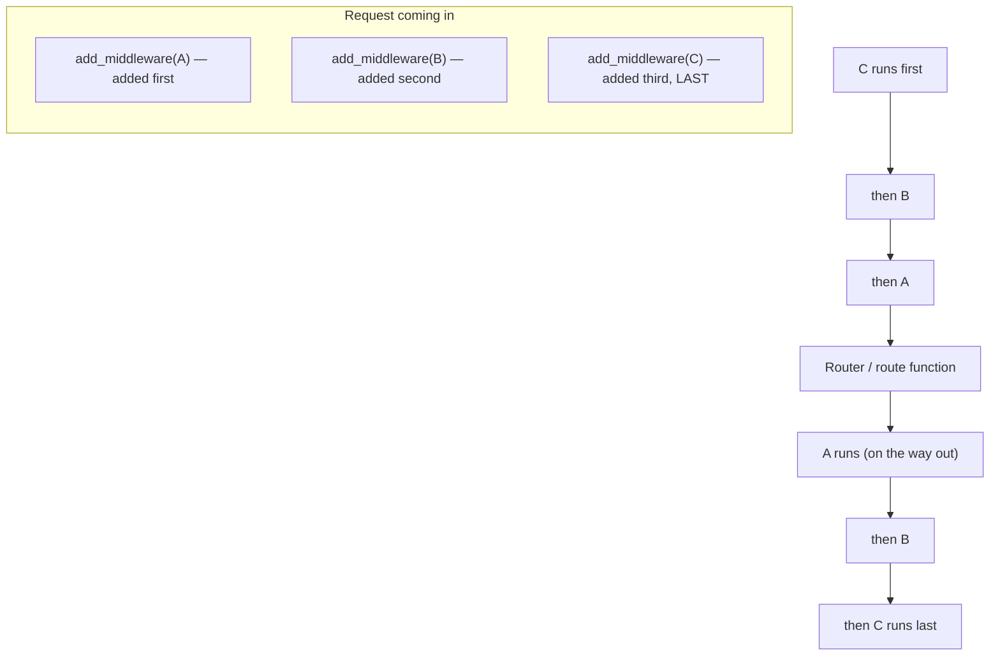
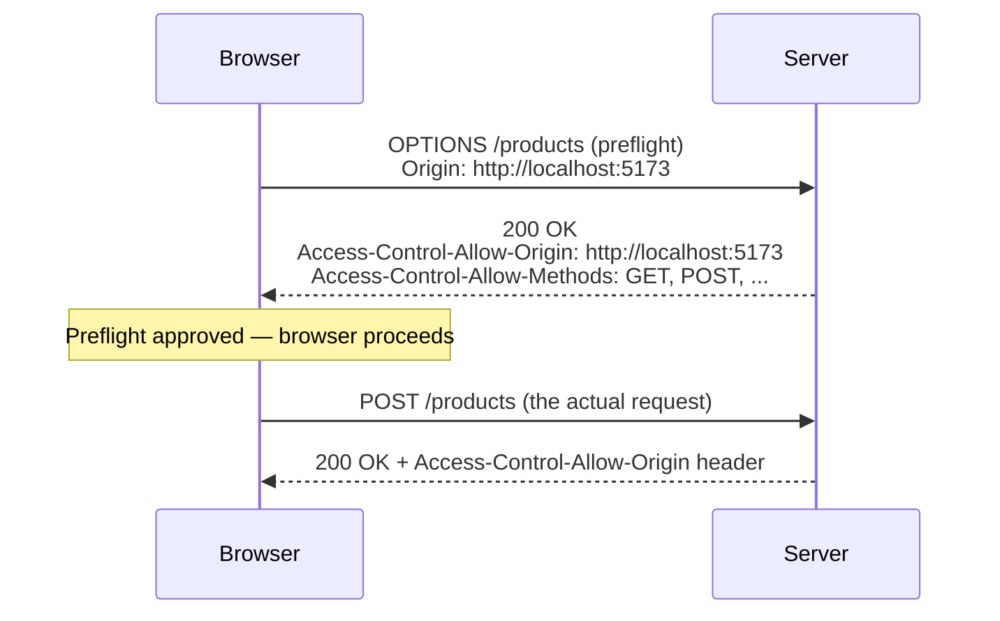
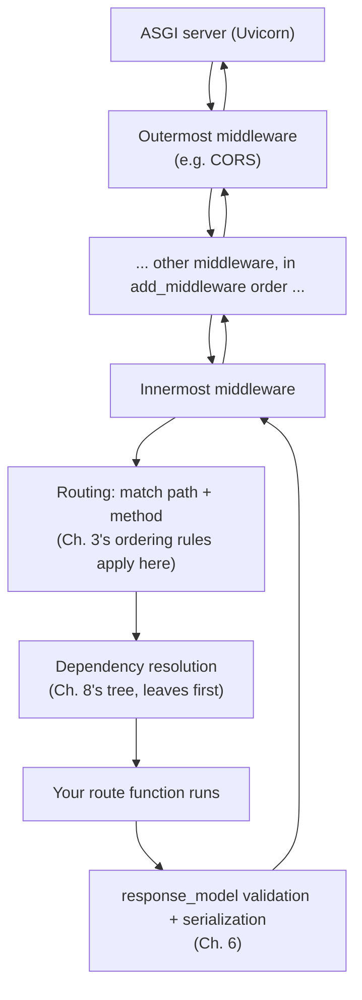

# Chapter 12: Middleware, CORS, and the Request Lifecycle

> Part II — Intermediate: Building Real APIs · Chapter 12 of 28

Chapter 8's dependencies are opt-in — a route only pays for what it declares. This chapter covers the other kind of cross-cutting mechanism: middleware, which wraps *every* request, whether or not it ever reaches a route at all. This is also where CORS actually gets enforced, and where Chapter 7's `request_id` preview (generated inside a single exception handler, with a caveat that it didn't cover the whole request) finally gets done properly.

## Learning Objectives

By the end of this chapter you will be able to:

- Explain how middleware differs from a dependency: scope (every request vs. opt-in per route) and position (wraps routing entirely vs. runs during it).
- Write custom middleware using `BaseHTTPMiddleware`, and know its documented limitations well enough to reach for pure ASGI middleware when they matter.
- Predict the exact order multiple middleware execute in, on both the request and response path.
- Configure CORS correctly for a real frontend origin, including the preflight request mechanics and the credentials/wildcard-origin restriction.
- Explain the complete request lifecycle, end to end, from the ASGI server down to your route function and back.

---

## 12.1 Middleware vs. Dependencies

Both middleware and dependencies let you run code around a request without repeating it in every route — but they differ in a way that matters for what each one is actually for.

| | Dependencies (Ch. 8) | Middleware (this chapter) |
|---|---|---|
| Scope | Opt-in — only routes that declare `Depends(...)` run it | Every request, unconditionally — including ones that never match any route at all |
| Position | Runs *during* request handling, resolved as part of building up a route's arguments | Wraps the *entire* request/response cycle, outside of routing entirely |
| Typical use | Database sessions, current user, pagination params — things a specific route needs | Request IDs, access logging, CORS, response-time headers, blanket size limits — things every request should get |

The scope difference is the one worth sitting with: a request to a URL that matches *no route at all* still passes through every registered middleware (which is exactly why access logging, for instance, belongs in middleware — you want to log the 404s too, not just successful route hits) — but it never triggers any dependency at all, since dependencies only run as part of resolving a route that was actually found.

## 12.2 Writing Custom Middleware with `BaseHTTPMiddleware`

```python
from starlette.middleware.base import BaseHTTPMiddleware
from starlette.requests import Request

class TimingMiddleware(BaseHTTPMiddleware):
    async def dispatch(self, request: Request, call_next):
        import time
        start = time.perf_counter()
        response = await call_next(request)          # everything "inside" this middleware runs here
        response.headers["X-Process-Time"] = str(time.perf_counter() - start)
        return response
```

```python
app.add_middleware(TimingMiddleware)
```

`dispatch` is the entire contract: code before `await call_next(request)` runs on the way *in* (before routing, dependency resolution, or your route function); `call_next(request)` is where everything else — routing, dependencies, your route, response generation — actually happens; code after it runs on the way *out*, with access to the already-built `response` object, letting you add headers or log its final status code.

**A real, documented caveat worth knowing rather than discovering the hard way:** `BaseHTTPMiddleware` has known limitations around streaming responses and background tasks — because of how it has to consume and rebuild the response internally, it can interact awkwardly with responses that stream data incrementally, and with context propagation into background tasks (Chapter 13) in certain edge cases. For the majority of everyday use — logging, headers, simple request inspection — it's the right, simple tool, and this chapter uses it throughout. For a case where those limitations start to bite, the fix is writing a **pure ASGI middleware** instead — implementing `__call__(self, scope, receive, send)` directly, working at the same raw level Starlette itself operates at, with none of `BaseHTTPMiddleware`'s convenience but also none of its overhead or edge cases. You'll build one in Exercise 12.5, once you've felt the convenient version work first.

## 12.3 Middleware Ordering

Multiple middleware form a stack — an "onion," with each layer wrapping the ones registered before it. The rule worth internalizing, because it's the opposite of what "just runs in the order I wrote it" would predict: **the last middleware you `add_middleware(...)` becomes the outermost layer** — it runs *first* on the way in, and *last* on the way out.



You can verify this directly rather than taking it on faith — three dummy middleware, each printing before and after `call_next`:

```python
class Announce(BaseHTTPMiddleware):
    def __init__(self, app, name: str):
        super().__init__(app)
        self.name = name

    async def dispatch(self, request, call_next):
        print(f"{self.name} — before")
        response = await call_next(request)
        print(f"{self.name} — after")
        return response

app.add_middleware(Announce, name="A")
app.add_middleware(Announce, name="B")
app.add_middleware(Announce, name="C")
```

Hitting any route prints, in order: `C — before`, `B — before`, `A — before`, then whatever the route itself does, then `A — after`, `B — after`, `C — after` — confirming the rule directly rather than asking you to trust it.

## 12.4 CORS: What It Actually Is, and Who Enforces It

Browsers enforce a "same-origin policy": by default, JavaScript running on `http://localhost:5173` (a typical frontend dev server) cannot read the response from a request to `http://localhost:8000` (your API) — a different origin (different scheme, host, or port counts as different). **CORS (Cross-Origin Resource Sharing) is the mechanism by which a server explicitly grants permission for specific other origins to make that request anyway**, via response headers the browser checks before handing the response to your JavaScript code.

Here's the detail that resolves a common point of confusion: **CORS is enforced by the browser, not the server.** Your API will happily respond to a request from any origin, or from `curl`, or from Postman — none of those enforce same-origin policy, because that policy is a browser security feature, not an HTTP protocol requirement. This is exactly why a request that "works fine in Postman" can still fail from your actual frontend: Postman never checks CORS headers at all, so a misconfigured server can look completely fine right up until real browser JavaScript tries to use it.

For requests beyond simple `GET`/`POST` with basic content types (a `PUT`, a custom header like `Authorization`, credentials), the browser first sends a **preflight** request — an `OPTIONS` request, asking "would you allow this?" — before sending the real one:



FastAPI (via Starlette) provides `CORSMiddleware` to handle both the preflight and the actual response headers:

```python
from fastapi.middleware.cors import CORSMiddleware

app.add_middleware(
    CORSMiddleware,
    allow_origins=["http://localhost:5173"],
    allow_credentials=True,
    allow_methods=["*"],
    allow_headers=["*"],
)
```

**One restriction worth knowing before you hit it as a confusing error:** `allow_origins=["*"]` (wildcard, allow any origin) cannot be combined with `allow_credentials=True` — browsers themselves reject that combination outright, regardless of what your server sends, because "any website at all may make authenticated requests as if it were you" is precisely the security hole CORS exists to prevent. If your API needs both broad origin access *and* credentialed requests, you need an explicit, real list of allowed origins — there's no wildcard shortcut available for that combination.

## 12.5 The Full Request Lifecycle

Putting every chapter so far into one picture:



Middleware wraps *everything* — including dependency resolution and routing itself, which is exactly why a request to a URL matching no route still passes through every middleware layer (there's simply nothing for routing, at step E, to match), while dependencies only ever run once a route has actually been found.

---

## Hands-On Project: Request IDs, Structured Logging, and CORS

### Step 1 — Request ID and logging middleware

```python
# middleware.py
import time
import uuid
import logging
from starlette.middleware.base import BaseHTTPMiddleware
from starlette.requests import Request

logger = logging.getLogger("app.requests")


class RequestIDMiddleware(BaseHTTPMiddleware):
    async def dispatch(self, request: Request, call_next):
        request_id = str(uuid.uuid4())
        request.state.request_id = request_id
        response = await call_next(request)
        response.headers["X-Request-ID"] = request_id
        return response


class RequestLoggingMiddleware(BaseHTTPMiddleware):
    async def dispatch(self, request: Request, call_next):
        start = time.perf_counter()
        response = await call_next(request)
        duration_ms = (time.perf_counter() - start) * 1000
        request_id = getattr(request.state, "request_id", "-")
        logger.info(
            "request_id=%s method=%s path=%s status=%s duration_ms=%.2f",
            request_id, request.method, request.url.path, response.status_code, duration_ms,
        )
        return response
```

### Step 2 — Wire them in, in the right order, plus CORS

```python
# main.py
from fastapi.middleware.cors import CORSMiddleware
from middleware import RequestIDMiddleware, RequestLoggingMiddleware

app = FastAPI(lifespan=lifespan)

app.add_middleware(RequestLoggingMiddleware)   # added first  → innermost of these three
app.add_middleware(RequestIDMiddleware)         # added second → wraps logging
app.add_middleware(                             # added last  → outermost of all user middleware
    CORSMiddleware,
    allow_origins=["http://localhost:5173"],
    allow_credentials=True,
    allow_methods=["*"],
    allow_headers=["*"],
)
```

The ordering here is deliberate, not arbitrary, and worth reasoning through explicitly using section 12.3's rule: `RequestIDMiddleware` is added *after* `RequestLoggingMiddleware`, making it the outer of the two — so it runs first on the way in, setting `request.state.request_id` *before* control ever reaches `RequestLoggingMiddleware`'s `dispatch`, which needs that value already present when it logs. `CORSMiddleware`, added last of all, becomes the outermost layer overall — ensuring CORS headers get attached to *every* response leaving the application, including error responses generated deep inside (a `404`, a `500` from Chapter 7's catch-all handler), since it's the very last thing a response passes through before reaching the client.

### Step 3 — Confirm it end to end

Run the app, hit any route, and check the response headers for `X-Request-ID`. Check your terminal for a structured log line containing that same request ID, the method, path, status code, and duration. Then start a tiny frontend on a different port (or just use `fetch()` from your browser's console while on a page served from a different origin) and confirm a request to your API succeeds only when its origin matches what `allow_origins` permits.

---

## Practice Exercises

**Exercise 12.1 — Diagnose a CORS failure from the console message alone.**
A frontend developer reports this exact browser console error:

```
Access to fetch at 'http://localhost:8000/products' from origin 'http://localhost:5173'
has been blocked by CORS policy: No 'Access-Control-Allow-Origin' header is present
on the requested resource.
```

Without being told anything else about the server's configuration, list at least three distinct possible root causes consistent with this exact message, and for each, state the specific fix. (Hint: think about what's required for `CORSMiddleware` to add that header at all, and about exact-string matching of origins.)

**Exercise 12.2 — Reject oversized requests before they're processed.**
Write a middleware that checks the `Content-Length` header and returns `413 Payload Too Large` immediately — without letting the request reach routing or your route function at all — if it exceeds some limit (say, 1 MB). Confirm it rejects an oversized request and passes through a normal-sized one unaffected. What's a real limitation of checking `Content-Length` specifically (hint: is this header guaranteed to be present or accurate for every request)?

**Exercise 12.3 — Predict ordering for a new set of middleware, then verify.**
Without running anything first, given `app.add_middleware(X)`, then `app.add_middleware(Y)`, then `app.add_middleware(Z)`, draw the onion diagram (like section 12.3's) and write down the exact print order you'd expect for a single request. Then implement it with the `Announce` pattern from section 12.3 and confirm your prediction.

**Exercise 12.4 — Trigger the wildcard-plus-credentials rejection.**
Configure `CORSMiddleware` with `allow_origins=["*"]` and `allow_credentials=True` together, and make a credentialed cross-origin request (e.g., `fetch(..., {credentials: "include"})` from a browser console on a different origin). Observe what actually happens — does the server error, or does the browser silently refuse to expose the response to your JavaScript? Fix it by replacing the wildcard with your frontend's actual origin.

**Exercise 12.5 (stretch) — A pure ASGI middleware.**
Rewrite `RequestIDMiddleware` as a raw ASGI middleware — a class implementing `__call__(self, scope, receive, send)` directly, without `BaseHTTPMiddleware` — that injects a request ID into `scope["state"]` and adds an `X-Request-ID` header to outgoing messages by wrapping `send`. Confirm it produces the same observable behavior as the `BaseHTTPMiddleware` version. Explain, in your own words, why this version sidesteps the streaming-response caveat mentioned in section 12.2 (hint: think about whether this version needs to fully buffer the response before it can act on it).

---

## Solutions & Discussion

<details>
<summary>Exercise 12.1</summary>

At least three distinct, genuinely different root causes consistent with this exact message:

1. **`CORSMiddleware` isn't configured on the server at all.** No middleware is adding *any* `Access-Control-Allow-Origin` header, to any origin — fix: add `CORSMiddleware` with the frontend's origin included in `allow_origins`.
2. **`allow_origins` is configured, but doesn't include this exact origin string.** CORS origin matching is exact-string, not prefix or fuzzy — `http://localhost:5173` and `http://127.0.0.1:5173` are different origins to a browser even though they resolve to "the same machine," and a trailing slash or `https` vs `http` mismatch also counts as a different origin entirely — fix: match the frontend's origin string exactly, including scheme and port.
3. **The request is failing before reaching `CORSMiddleware`'s successful path at all** — for instance, if `CORSMiddleware` is registered but positioned such that another middleware or a startup error is short-circuiting the response before CORS headers get attached (or, subtly, if the *preflight* `OPTIONS` request itself is failing — a route-level issue, an auth dependency incorrectly firing on `OPTIONS`, etc.) — fix depends on the specific cause, but the diagnostic step is checking the actual preflight `OPTIONS` response in the browser's network tab, not just the failed real request.

The single most useful diagnostic habit this exercise is meant to build: this exact browser message never distinguishes "you didn't configure CORS," "you configured it for the wrong origin," and "something upstream of CORS is failing" — the network tab's actual preflight response is what disambiguates them, the console message alone can't.
</details>

<details>
<summary>Exercise 12.2</summary>

```python
from starlette.responses import JSONResponse

MAX_BODY_SIZE = 1 * 1024 * 1024  # 1 MB

class BodySizeLimitMiddleware(BaseHTTPMiddleware):
    async def dispatch(self, request: Request, call_next):
        content_length = request.headers.get("content-length")
        if content_length is not None and int(content_length) > MAX_BODY_SIZE:
            return JSONResponse(
                status_code=413,
                content={"error": {"code": "payload_too_large", "message": "Request body exceeds the 1 MB limit."}},
            )
        return await call_next(request)
```

This rejects oversized requests *before* `call_next` is ever invoked — meaning routing, dependency resolution, and your route function never run at all for a rejected request, which is exactly the point of doing this check in middleware rather than inside the route.

The real limitation: `Content-Length` is a header the *client* declares — it's not independently verified by anything at this point, and a request using chunked transfer encoding may omit it entirely, meaning a client could send a body larger than this check catches simply by not sending (or lying about) that header. A fully robust size limit needs to also cap the actual number of bytes read while streaming the body, not just trust the declared header — worth knowing as a real gap in this simple version, even though implementing the fully robust version is beyond this chapter's scope.
</details>

<details>
<summary>Exercise 12.3</summary>

Adding `X`, then `Y`, then `Z` (in that order) makes `Z` the outermost layer, per section 12.3's rule (last-added is outermost). Expected print order for one request: `Z — before`, `Y — before`, `X — before`, [route runs], `X — after`, `Y — after`, `Z — after`. Running the `Announce`-style implementation confirms this exactly — the middleware you register *last* is always the first thing a request encounters and the last thing a response passes through, regardless of how many total middleware are in the stack.
</details>

<details>
<summary>Exercise 12.4</summary>

The server itself doesn't error at all — `CORSMiddleware` will happily attempt to respond, but with this specific combination, browsers refuse to honor the wildcard for a credentialed request: the *browser* silently blocks your JavaScript from reading the response (typically surfacing a console message about the wildcard being disallowed alongside credentials), even though the raw HTTP exchange between browser and server may have completed successfully at the network level. This is a good concrete illustration of section 12.4's core point: CORS enforcement is a *browser* behavior, layered on top of an HTTP exchange the server itself considers perfectly fine — the fix, replacing `allow_origins=["*"]` with the frontend's actual origin string, resolves it because a real, specific origin combined with credentials is exactly the case CORS is designed to permit safely.
</details>

<details>
<summary>Exercise 12.5</summary>

```python
import uuid

class ASGIRequestIDMiddleware:
    def __init__(self, app):
        self.app = app

    async def __call__(self, scope, receive, send):
        if scope["type"] != "http":
            await self.app(scope, receive, send)
            return

        request_id = str(uuid.uuid4())
        scope.setdefault("state", {})["request_id"] = request_id

        async def send_with_header(message):
            if message["type"] == "http.response.start":
                headers = message.setdefault("headers", [])
                headers.append((b"x-request-id", request_id.encode()))
            await send(message)

        await self.app(scope, receive, send_with_header)
```

This version never buffers or reconstructs a full `Response` object at all — it inspects and forwards individual raw ASGI messages one at a time as they stream through, adding a header only to the `http.response.start` message (the one that actually carries headers) and passing every other message through completely untouched. This is precisely why it sidesteps `BaseHTTPMiddleware`'s streaming caveat: `BaseHTTPMiddleware` has to await the *entire* inner response before it can hand you a `Response` object to modify, which is at odds with a response that's meant to stream incrementally; a pure ASGI middleware operates at the message level and can pass a streaming response through untouched, message by message, without ever needing to have "the whole response" in hand at once.
</details>

---

## Chapter Summary

- Middleware wraps every request unconditionally, including ones matching no route at all; dependencies only run for routes that declare them — different tools for different scopes.
- `BaseHTTPMiddleware` is the convenient default, with real, documented limitations around streaming responses and background task context — a pure ASGI middleware (`__call__(scope, receive, send)`) is the fix when those limitations actually bite.
- The last middleware registered via `add_middleware(...)` is the outermost layer: it runs first on the request path and last on the response path — the opposite of what "runs in registration order" would suggest.
- CORS is enforced by the browser, not the server — a request that "works in Postman" can still fail from real frontend JavaScript, and `allow_origins=["*"]` cannot be combined with `allow_credentials=True`.
- The full request lifecycle nests in one consistent order: ASGI server → middleware (outermost to innermost) → routing (Ch. 3) → dependency resolution (Ch. 8) → your route → response serialization (Ch. 6) → middleware unwinding in reverse → client.

**Next:** Chapter 13 covers background tasks and async job patterns — including exactly when FastAPI's built-in `BackgroundTasks` is the right tool, and when it silently isn't, a distinction this chapter's middleware caveats have already hinted at.
