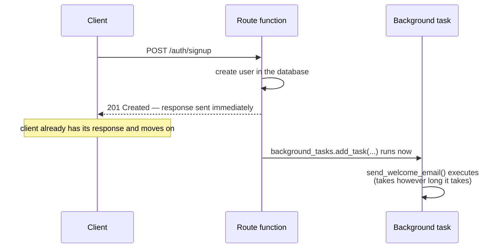

# Chapter 13: Background Tasks and Async Job Patterns

> Part II — Intermediate: Building Real APIs · Chapter 13 of 28

Every route so far has done all of its work before responding. This chapter covers doing some of it *after* — `BackgroundTasks`, what it actually is mechanically, when "fire and forget" is genuinely safe, and a real, concrete limitation (it doesn't survive a worker crash, and it doesn't work correctly across multiple worker processes) that sets up exactly why Chapter 22 replaces it with a real task queue.

## Learning Objectives

By the end of this chapter you will be able to:

- Explain what `BackgroundTasks` actually does mechanically — it is not a separate process, worker, or thread pool of its own.
- Judge when "fire and forget" is an acceptable design and when it silently isn't, using idempotency and durability as the deciding factors.
- Build the "accept immediately, process in the background, poll for status" pattern using `202 Accepted` and a job-status store.
- Handle errors inside a background task correctly, knowing that exceptions there never reach the client.
- Explain a real, concrete failure mode of `BackgroundTasks` in a multi-worker deployment.

---

## 13.1 What `BackgroundTasks` Actually Is

```python
from fastapi import BackgroundTasks

def send_welcome_email(email: str) -> None:
    ...  # some slow operation

@router.post("/signup", status_code=201)
async def signup(user_in: UserCreate, background_tasks: BackgroundTasks):
    user = ...  # create the user
    background_tasks.add_task(send_welcome_email, user.email)
    return user
```

It's easy to read `BackgroundTasks` and assume something like "this spins up a separate worker to handle it" — it doesn't. `background_tasks.add_task(...)` simply *queues* a function call to run **after the response has already been sent**, in the **same process**, on the **same event loop**, as the request that queued it. If the queued function is a plain `def` (as in this example), FastAPI runs it in the same thread pool your Chapter 2/3 sync route handlers use; if it's `async def`, it's awaited directly on the event loop, same as everything else. This isn't a separate execution context in any meaningful sense — it's "run this a little later, after the response, in the process you're already running in."



The client genuinely does get its response before the background task even starts — that's the entire value proposition. But "runs in the same process" has a direct, unglamorous consequence worth stating plainly now, because it's the seed of this whole chapter's caution: **if that process crashes, restarts, or is scaled down before the task finishes, the task is simply gone.** There's no record anywhere that it was supposed to run, no queue entry, nothing to retry from — it existed only as an in-memory callback in a process that no longer exists.

## 13.2 When Fire-and-Forget Is Safe — and When It Isn't

`BackgroundTasks` is the right tool for work that is **genuinely tolerable to lose occasionally** and where the client doesn't need to know whether it succeeded: a welcome email, a "you have a new follower" notification, warming a cache, sending an analytics event. If one of these silently fails to run once in a while — a deploy happens to land mid-task, a rare exception occurs — nothing your business actually depends on breaks.

It is the *wrong* tool for anything where losing it silently would be a real problem: charging a payment, sending a password-reset email a user is actively waiting on right now, anything with a business or compliance requirement that it actually completes. For that category, you need — at minimum — **durability** (the task's existence is recorded somewhere that survives a process restart, typically a database row or a message in an actual queue, written *before* you tell the client "done") and, usually, **retries** (an automatic mechanism to try again if the first attempt fails, rather than a human noticing something silently didn't happen). `BackgroundTasks` provides neither. Chapter 22 covers task queues (ARQ, Celery) that provide both, and this chapter's limitations are exactly the motivation for that later chapter existing.

There's a second consideration worth connecting directly back to Chapter 3: **idempotency**. Recall Chapter 3.1's table — an operation is idempotent if running it twice produces the same end state as running it once. Any operation you queue as a background task (or, later, as a real queued job) should ideally be written idempotently wherever possible, because retries — whether from a client timing out and resubmitting, or a more sophisticated queue's own retry logic in Chapter 22 — mean "ran exactly once" is not a guarantee you actually get in practice. A `send_welcome_email` that checks "have I already sent this user their welcome email?" before sending is more robust than one that blindly sends every time it's called, precisely because "called more than once for the same user" is a realistic scenario, not a hypothetical one.

## 13.3 Accept Immediately, Process in the Background, Poll for Status

Some operations are slow enough (generating a large report, processing an uploaded file) that you don't want to hold the HTTP connection open waiting for them — risking client-side timeouts and a genuinely poor experience for no benefit. The pattern: accept the request, record that a job has started, kick off the actual work in the background, and respond immediately with a job identifier the client can check later.

`202 Accepted` is the status code built exactly for this: "I've accepted your request for processing, but it isn't done yet" — distinct from `200`/`201`, which imply the operation described in the response has already completed.

```python
@router.post("/", status_code=status.HTTP_202_ACCEPTED)
async def create_report(background_tasks: BackgroundTasks):
    job_id = str(uuid.uuid4())
    jobs_db[job_id] = {"status": "pending", "result": None}
    background_tasks.add_task(generate_report, job_id)
    return {"job_id": job_id, "status": "pending"}

@router.get("/{job_id}")
async def get_report_status(job_id: str):
    job = jobs_db.get(job_id)
    if job is None:
        raise HTTPException(status_code=404, detail="Job not found")
    return {"job_id": job_id, **job}
```

The client gets a `job_id` back immediately, and polls `GET /reports/{job_id}` until `status` changes from `"pending"` to `"complete"` (or `"failed"`) — a completely reasonable pattern for a single-process, single-worker deployment, and exactly the pattern you'll build in the hands-on project. Section 13.4 covers a sharp edge this simple version has the moment you run more than one worker process.

## 13.4 Errors Inside Background Tasks Are Invisible to the Client — and to Everyone Else, Unless You Log Them

This is the single most important operational fact about background tasks, and it's easy to miss because nothing in the interface warns you about it: **by the time a background task runs, the HTTP response has already been sent.** There is no request left to attach an error response to. If `send_welcome_email` raises an exception, that exception does not become a `500` anyone sees — Chapter 7's entire exception-handling layer, global handlers included, has nothing to do with it, because there's no active request/response cycle for those handlers to intercept. The exception simply happens, in the background, disconnected from anything the client experiences.

```python
def send_welcome_email(email: str) -> None:
    try:
        # ...actual email-sending logic...
        pass
    except Exception:
        logger.exception(f"Failed to send welcome email to {email}")
```

Without the `try`/`except` (and a real `logger.exception(...)` call, which — recall Chapter 7.5 — captures the full traceback), a failure here can vanish with **no record anywhere** that it happened at all — not a client-visible error, not a log line, nothing. Every background task in this curriculum wraps its actual work in exactly this pattern, for exactly this reason.

---

## Hands-On Project: Welcome Emails and a Polling Report Endpoint

### Step 1 — A background task for signup

```python
# tasks.py
import logging
import time

logger = logging.getLogger("app.tasks")


def send_welcome_email(email: str, username: str) -> None:
    try:
        time.sleep(2)   # simulating a slow call to a real email provider's API
        logger.info(f"Welcome email sent to {email} (user: {username})")
    except Exception:
        logger.exception(f"Failed to send welcome email to {email}")
```

```python
# routers/auth.py (addition to Chapter 11's signup route)
from fastapi import BackgroundTasks
from tasks import send_welcome_email

@router.post("/signup", response_model=UserPublic, status_code=status.HTTP_201_CREATED)
async def signup(user_in: UserCreate, session: SessionDep, background_tasks: BackgroundTasks):
    existing = await session.execute(select(UserTable).where(UserTable.username == user_in.username))
    if existing.scalar_one_or_none() is not None:
        raise HTTPException(status_code=409, detail="Username already registered")
    user = UserTable(username=user_in.username, hashed_password=hash_password(user_in.password))
    session.add(user)
    await session.commit()
    await session.refresh(user)

    background_tasks.add_task(send_welcome_email, f"{user.username}@example.com", user.username)
    return user
```

Call `POST /auth/signup` and time it — the response should return in well under a second, despite `send_welcome_email`'s simulated 2-second delay, with the `"Welcome email sent to..."` log line appearing roughly 2 seconds *after* your client already received its `201`.

### Step 2 — A polling report-generation endpoint

```python
# jobs.py
import time
import logging
from enum import Enum

logger = logging.getLogger("app.jobs")


class JobStatus(str, Enum):
    PENDING = "pending"
    COMPLETE = "complete"
    FAILED = "failed"


jobs_db: dict[str, dict] = {}


def generate_report(job_id: str, product_count: int) -> None:
    try:
        time.sleep(5)   # simulating slow report generation
        jobs_db[job_id]["status"] = JobStatus.COMPLETE
        jobs_db[job_id]["result"] = {"summary": f"Report covering {product_count} products"}
    except Exception:
        logger.exception(f"Report generation failed for job {job_id}")
        jobs_db[job_id]["status"] = JobStatus.FAILED
```

```python
# routers/reports.py
import uuid
from fastapi import APIRouter, BackgroundTasks, HTTPException, status
from jobs import jobs_db, generate_report, JobStatus

router = APIRouter(prefix="/reports", tags=["reports"])


@router.post("/", status_code=status.HTTP_202_ACCEPTED)
async def create_report(background_tasks: BackgroundTasks):
    job_id = str(uuid.uuid4())
    jobs_db[job_id] = {"status": JobStatus.PENDING, "result": None}
    background_tasks.add_task(generate_report, job_id, product_count=42)
    return {"job_id": job_id, "status": JobStatus.PENDING}


@router.get("/{job_id}")
async def get_report_status(job_id: str):
    job = jobs_db.get(job_id)
    if job is None:
        raise HTTPException(status_code=404, detail="Job not found")
    return {"job_id": job_id, **job}
```

Call `POST /reports`, note the `job_id` and immediate `202`, then poll `GET /reports/{job_id}` a few times over the next 5 seconds and watch `status` move from `"pending"` to `"complete"`, with `result` populated only once it's done.

**A limitation worth flagging explicitly, not glossing over:** `jobs_db` is a plain in-memory dict, living in exactly one worker process's memory. If you were to run this application with more than one worker (`fastapi run --workers 4`, say — real production deployments almost always run several), a `POST /reports` handled by worker 2 creates its job entry only in worker 2's memory. If a load balancer then routes your *next* polling `GET /reports/{job_id}` request to worker 3, that worker has never heard of this `job_id` at all, and you'd get a `404` for a job that is, in fact, still running — just not where you're asking. This isn't a hypothetical edge case; it's the default outcome the moment you run more than one worker, and it's a direct, concrete reason Chapter 22 replaces this in-memory store with something shared across workers (Redis, or a database table) as part of introducing a real task queue.

---

## Practice Exercises

**Exercise 13.1 — Identify a scenario where `BackgroundTasks` is the wrong tool.**
Consider an endpoint that processes a customer's refund request: it needs to call a payment provider's API to actually issue the refund, and that call is slow enough that you're tempted to do it via `background_tasks.add_task(...)` and respond `202` immediately. Explain, using this chapter's material, at least two concrete ways this can go wrong in production that wouldn't show up in casual local testing, and what minimum guarantee (name it specifically) a proper solution would need that `BackgroundTasks` doesn't provide.

**Exercise 13.2 — Force a background task failure and confirm what the client sees.**
Modify `send_welcome_email` to deliberately raise an exception every time (simulating an email provider outage), while leaving the `try`/`except`/`logger.exception` wrapper in place. Call `POST /auth/signup` and confirm: (a) the client still receives a normal `201 Created` with the new user's data, with no indication anything went wrong; (b) your server logs show the full exception traceback. Then remove the `try`/`except` entirely, repeat the experiment, and describe the difference in what ends up in your logs.

**Exercise 13.3 — Test a background task's side effect.**
Using `fastapi.testclient.TestClient`, write a test that calls `POST /auth/signup`, and — immediately afterward, in the same test function, with no `sleep()` or wait of any kind — asserts that the welcome email was "sent" (e.g., have `send_welcome_email` append to a shared list instead of just logging, and assert that list has a new entry). Run it and confirm it passes without waiting. Explain why this works given that a *real* running server would need you to actually wait for the 2-second delay to elapse before this same assertion would hold true against a live deployment.

**Exercise 13.4 — Reason through the multi-worker polling failure.**
Without changing any code, explain in detail what happens to the report-polling pattern from Step 2 if this application is deployed with `fastapi run --workers 4` behind a load balancer that distributes requests round-robin across all four workers. Walk through a specific sequence of requests (which worker handles the `POST`, which worker handles each subsequent `GET`) that reproduces the failure, and state precisely what a client would observe.

**Exercise 13.5 (stretch) — Make `generate_report` idempotent.**
Modify `generate_report` so that calling it twice with the same `job_id` (imagine it somehow got queued twice — a client retry, a bug) doesn't redo 5 seconds of work or overwrite a result that's already complete. Add a check at the very start of the function that returns immediately if `jobs_db[job_id]["status"]` is already `"complete"`. Explain, tying back to section 13.2, why this kind of defensive check matters more once you imagine a real task queue with automatic retries (Chapter 22) rather than this chapter's single, one-shot `BackgroundTasks` call.

---

## Solutions & Discussion

<details>
<summary>Exercise 13.1</summary>

Two concrete ways this goes wrong in production, neither obvious from casual local testing (where the process never crashes mid-request and there's only ever one worker):

1. **A deploy or crash between accepting the request and the background task completing loses the refund entirely** — the client already received a success-looking response (or at least no error), the refund was never actually issued, and there is no record anywhere that it was ever supposed to happen, since `BackgroundTasks` keeps no durable record of queued work. The customer believes they're getting a refund; nothing further happens, ever, unless someone notices manually.
2. **A transient failure calling the payment provider's API has no retry mechanism at all** — if their API times out or briefly errors (which real external APIs do, routinely), `BackgroundTasks` makes exactly one attempt, and if that attempt fails, the outcome is whatever your `try`/`except` logs, with no automatic second attempt.

The minimum guarantee a proper solution needs, by name: **durability** — the fact that "this refund needs to happen" is recorded somewhere that survives a process crash (a database row with a status column, or a message in an actual queue) *before* responding to the client — combined with **retry logic**, so a transient failure doesn't silently become a permanently lost refund. This is precisely what Chapter 22's task queue (ARQ or Celery, backed by Redis) provides and `BackgroundTasks` does not.
</details>

<details>
<summary>Exercise 13.2</summary>

With the `try`/`except` in place: the client's `POST /auth/signup` still returns `201 Created` with the user's data, exactly as if nothing had gone wrong — because the response was already fully constructed and sent *before* `send_welcome_email` (now always raising) even started running. Your server logs show a complete traceback via `logger.exception`, ending in whatever exception you raised, with the log message `"Failed to send welcome email to ..."` — the failure is fully visible to you as the operator, just invisible to the client, exactly matching section 13.4's point.

Removing the `try`/`except` entirely: the exception still doesn't reach the client (nothing about that changes — there's still no active request to attach an error response to), but now there is a real risk of **no log record at all**, depending on how your ASGI server/framework's default behavior handles an unhandled exception raised inside a background task — at best you might get a generic, less-informative traceback dump from the server's own internal error handling; at worst, depending on configuration, it can be far less visible than a deliberate `logger.exception` call. The practical lesson: the wrapper isn't decorative, it's the *only* mechanism ensuring this failure is discoverable by anyone at all.
</details>

<details>
<summary>Exercise 13.3</summary>

```python
# tasks.py (test-friendly version)
sent_emails: list[dict] = []

def send_welcome_email(email: str, username: str) -> None:
    try:
        time.sleep(2)
        sent_emails.append({"email": email, "username": username})
    except Exception:
        logger.exception(f"Failed to send welcome email to {email}")
```

```python
# test_signup.py
from fastapi.testclient import TestClient
from main import app
from tasks import sent_emails

client = TestClient(app)

def test_signup_sends_welcome_email():
    response = client.post("/auth/signup", json={"username": "alice", "password": "s3cret"})
    assert response.status_code == 201
    assert any(e["username"] == "alice" for e in sent_emails)   # already true — no sleep needed
```

This passes immediately, with no `sleep()` in the test, because `TestClient` runs the entire ASGI request/response cycle — including any background tasks queued during it — synchronously, within the single call to `client.post(...)`, before returning control to your test code. A real deployed server genuinely sends its response to the client *before* the background task finishes (section 13.1's whole point), so testing against a live server would require actually waiting roughly 2 seconds and polling or re-checking before this same assertion could reliably hold — `TestClient`'s synchronous test harness collapses that timing gap entirely, which is convenient for testing but worth remembering isn't how the real deployed system behaves. Chapter 15 covers `TestClient` properly; this is a preview of exactly the behavior that makes it convenient for testing background tasks specifically.
</details>

<details>
<summary>Exercise 13.4</summary>

Sequence: `POST /reports` arrives and the load balancer routes it to, say, **Worker 2**. Worker 2 generates a `job_id`, writes `{"status": "pending", ...}` into *its own* `jobs_db` dict (existing only in Worker 2's process memory), and queues `generate_report` as a background task within Worker 2. The client receives `202` with that `job_id` and starts polling `GET /reports/{job_id}`.

The load balancer, round-robining, sends the first poll to **Worker 3**. Worker 3's `jobs_db` has never seen this `job_id` — it's a completely separate dict in a separate process — so `jobs_db.get(job_id)` returns `None`, and the client gets a `404 Job not found`, even though the job is, in fact, actively running (inside Worker 2, which nobody asked). A subsequent poll might happen to land back on Worker 2 (where it would correctly show `"pending"` or eventually `"complete"`) purely by chance of round-robin timing — making the bug intermittent and confusing rather than a clean, reproducible failure, which is often worse from a debugging perspective. The client's actual observed experience: some polls return the real status, others return a spurious `404`, unpredictably, depending entirely on which worker happens to receive each individual request.
</details>

<details>
<summary>Exercise 13.5</summary>

```python
def generate_report(job_id: str, product_count: int) -> None:
    if jobs_db.get(job_id, {}).get("status") == JobStatus.COMPLETE:
        logger.info(f"Job {job_id} already complete — skipping redundant generation")
        return
    try:
        time.sleep(5)
        jobs_db[job_id]["status"] = JobStatus.COMPLETE
        jobs_db[job_id]["result"] = {"summary": f"Report covering {product_count} products"}
    except Exception:
        logger.exception(f"Report generation failed for job {job_id}")
        jobs_db[job_id]["status"] = JobStatus.FAILED
```

This check matters far more once real retries enter the picture (Chapter 22): a task queue with automatic retry logic might call `generate_report` a second time for the *same* `job_id` precisely because it couldn't confirm the first attempt succeeded (a worker died mid-task, an ack was lost) — without this guard, a retry would silently redo 5 seconds of work and, worse, could clobber a result that already completed successfully with a fresh (possibly different, if the underlying data changed) one. This is the concrete, practical form of section 13.2's idempotency point: "assume this might run more than once for the same logical job" is the correct default assumption for anything that will eventually sit behind a real retrying task queue, not a paranoid edge case.
</details>

---

## Chapter Summary

- `BackgroundTasks` runs queued work in the *same process*, after the response is sent — not in a separate worker, with no durability: a crashed or restarted process simply loses any task that hadn't finished.
- Fire-and-forget is appropriate for genuinely tolerable-to-lose side effects; anything your business depends on completing needs durability (a persisted record before responding) and retries — neither of which `BackgroundTasks` provides.
- `202 Accepted` plus a job-status store is the right shape for slow operations you don't want to block the response on — but an in-memory job store breaks the moment you run more than one worker process, since each worker has entirely separate memory.
- Exceptions inside a background task never reach the client — Chapter 7's entire exception-handling layer has no bearing on them, because the response is already gone. A `try`/`except` with real logging is the only thing standing between a background failure and it vanishing without a trace.
- `TestClient` runs background tasks synchronously within a single test call, which is convenient for testing but not how a real deployed server behaves — worth remembering as a testing convenience, not a production guarantee.

**Next:** Chapter 14 covers file uploads, static files, and streaming responses — including the `:path` converter from Chapter 3 put to real use, and how to serve or accept large files without loading them entirely into memory.
