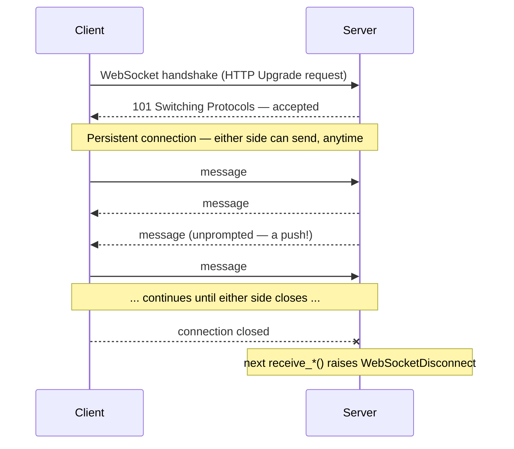

# Chapter 17: WebSockets and Real-Time Communication

> Part III — Advanced: Production Engineering · Chapter 17 of 28

Every endpoint so far has followed the same shape: client asks, server answers, connection ends. This chapter covers the case where that shape doesn't fit — a client that needs to be *pushed* updates as they happen, without repeatedly asking. WebSockets, a connection manager for tracking multiple clients, broadcasting patterns, and a genuine comparison against the two simpler alternatives (polling and Server-Sent Events) that are often the better choice anyway.

## Learning Objectives

By the end of this chapter you will be able to:

- Explain how a WebSocket connection's lifecycle differs from an ordinary HTTP request/response cycle, and implement one in FastAPI.
- Build a connection manager that tracks multiple simultaneously connected clients and broadcasts messages to them.
- Handle client disconnects gracefully, including mid-broadcast, without one dead connection breaking delivery to everyone else.
- Explain the genuine trade-offs between polling, Server-Sent Events, and WebSockets, and choose correctly among them for a given use case.

---

## 17.1 The WebSocket Lifecycle

An ordinary HTTP request opens a connection, gets exactly one response, and closes. A WebSocket connection starts with something that *looks* like an HTTP request (a handshake, using the `Upgrade` header) but, once accepted, stays open — a persistent, full-duplex channel where either side can send messages to the other, at any time, for as long as the connection remains open.

```python
from fastapi import APIRouter, WebSocket, WebSocketDisconnect

router = APIRouter()

@router.websocket("/ws/echo")
async def websocket_echo(websocket: WebSocket):
    await websocket.accept()
    try:
        while True:
            data = await websocket.receive_text()
            await websocket.send_text(f"echo: {data}")
    except WebSocketDisconnect:
        print("Client disconnected")
```

`@router.websocket(...)` is FastAPI's WebSocket-specific decorator — distinct from `@router.get`/`@router.post` and the rest, since a WebSocket connection isn't really "a request" in the same sense. `websocket.accept()` completes the handshake; after that, `receive_text()`/`receive_json()` and `send_text()`/`send_json()` are how messages flow in each direction, and the connection simply stays open across an arbitrary number of them — there's no single "response" the way an HTTP route has one. When the client disconnects, the next attempt to `receive_*()` raises `WebSocketDisconnect` — this is the mechanism by which your server *finds out* a client is gone, not something that happens automatically or silently; you need an active `receive` call in flight (typically inside a `while True` loop, exactly as above) for FastAPI to notice and raise it.



## 17.2 Connection Managers: Tracking Every Connected Client

A single WebSocket route handles one connection. The moment you need to *broadcast* — send the same message to every currently connected client — you need something tracking all of them, since each individual route invocation only knows about its own connection.

```python
# connection_manager.py
from fastapi import WebSocket

class ConnectionManager:
    def __init__(self):
        self.active_connections: list[WebSocket] = []

    async def connect(self, websocket: WebSocket):
        await websocket.accept()
        self.active_connections.append(websocket)

    def disconnect(self, websocket: WebSocket):
        if websocket in self.active_connections:
            self.active_connections.remove(websocket)

    async def broadcast(self, message: dict):
        stale = []
        for connection in self.active_connections:
            try:
                await connection.send_json(message)
            except Exception:
                stale.append(connection)
        for connection in stale:
            self.disconnect(connection)

manager = ConnectionManager()
```

A single shared `manager` instance, module-level (much like Chapter 16's `settings`), holds the list every route can add to, remove from, and iterate over. The `try`/`except` inside `broadcast` matters concretely: if client A's connection has quietly gone stale (network dropped without a clean close handshake, say) and `send_json` to it raises, that failure must not prevent the loop from reaching clients B and C — one bad connection shouldn't take down delivery to everyone else, which is exactly why each `send_json` is individually guarded, with failures collected and cleaned up *after* the broadcast loop finishes, rather than aborting the loop the moment one send fails.

## 17.3 Broadcasting Patterns

Beyond "send to everyone," two common variations are worth naming: broadcasting to everyone *except* whoever sent the triggering message (useful for a chat-style "someone else is typing" indicator, where you don't want to echo a user's own action back to themselves), and sending to one *specific* client rather than everyone — which requires tracking connections by some identifier (a user ID) rather than a flat, anonymous list:

```python
class TargetedConnectionManager:
    def __init__(self):
        self.connections_by_user: dict[int, WebSocket] = {}

    async def connect(self, user_id: int, websocket: WebSocket):
        await websocket.accept()
        self.connections_by_user[user_id] = websocket

    def disconnect(self, user_id: int):
        self.connections_by_user.pop(user_id, None)

    async def send_to_user(self, user_id: int, message: dict):
        websocket = self.connections_by_user.get(user_id)
        if websocket is not None:
            await websocket.send_json(message)
```

A dict keyed by user ID, rather than a flat list, is the structural difference that makes "message this one specific user" possible at all — the flat-list `ConnectionManager` from section 17.2 has no concept of *which* connection belongs to whom, only that a connection exists.

## 17.4 WebSockets vs. Server-Sent Events vs. Polling

WebSockets are not automatically the right answer just because a feature needs "real-time" updates — they're the most powerful of three genuinely different tools, and the most powerful tool is not always the correct one.

| | Polling | Server-Sent Events (SSE) | WebSockets |
|---|---|---|---|
| Direction | Client asks repeatedly | Server → client only | Full duplex, both directions |
| Transport | Ordinary HTTP requests | One long-lived HTTP response (`text/event-stream`) | A dedicated upgraded connection |
| Latency | Bounded by poll interval | Near-instant push | Near-instant, both ways |
| Complexity | Lowest — plain HTTP | Low — still plain HTTP under the hood | Higher — a genuinely different connection lifecycle |
| Infra friendliness | Excellent — works through everything | Good — mostly works through standard HTTP infra | Can need specific proxy/load-balancer configuration |
| Auto-reconnect | You write it | Built into the browser's `EventSource` API | You write it |
| Scaling across workers | Trivial — stateless | Same connection-tracking challenge as WebSockets | Needs a shared broker (Redis pub/sub, etc.) once you have more than one worker |

**Polling** — a client simply requesting `GET /status` every few seconds — is the right choice more often than its reputation suggests: it's stateless, trivially horizontally scalable (any worker can answer any poll, no shared connection state needed), and perfectly adequate when "up to a few seconds of staleness" is genuinely fine for the use case.

**SSE** is the right choice specifically when you need server-to-client push, and only server-to-client — a live log viewer, a progress bar, a notification feed the client never needs to talk back through — and its browser-native auto-reconnect (via `EventSource`) is a real, meaningful advantage you get for free, unlike WebSockets, where reconnect logic is entirely your own responsibility to write.

**WebSockets** earn their added complexity specifically when the client genuinely needs to send messages back over the *same* connection, in real time — a chat application, collaborative editing, anything where both directions matter and matter continuously. Reaching for WebSockets for a one-directional "notify me when this changes" feature is reaching for more machinery than the problem needs; Exercise 17.3 has you build the SSE alternative for this chapter's own use case directly, so the comparison isn't just a table you're asked to trust.

---

## Hands-On Project: A Live Product Update Feed

### Step 1 — The connection manager (section 17.2's version, as-is)

### Step 2 — The WebSocket route

```python
# routers/ws.py
from fastapi import APIRouter, WebSocket, WebSocketDisconnect
from connection_manager import manager

router = APIRouter()

@router.websocket("/ws/products")
async def products_websocket(websocket: WebSocket):
    await manager.connect(websocket)
    try:
        while True:
            await websocket.receive_text()   # clients don't need to send anything meaningful here —
                                               # but an active receive is required to detect disconnects
    except WebSocketDisconnect:
        manager.disconnect(websocket)
```

### Step 3 — Broadcast from an existing HTTP route

```python
# routers/products.py (addition to the existing update_product route)
from connection_manager import manager

@router.patch("/{product_id}", response_model=ProductPublic)
async def update_product(product_id: int, update: ProductUpdate, repo: ProductRepoDep):
    product = await repo.update(product_id, update.model_dump(exclude_unset=True))
    await manager.broadcast({
        "event": "product_updated",
        "product_id": product_id,
        "changes": update.model_dump(exclude_unset=True),
    })
    return product
```

### Step 4 — Confirm it with two simultaneous clients

Open two separate WebSocket connections to `ws://localhost:8000/ws/products` (a simple Python script using `websockets`, or a browser console using `new WebSocket(...)`, works fine for this). Then, from a completely separate terminal, `PATCH` a product's price via `curl`. Confirm **both** connected clients receive the same `{"event": "product_updated", ...}` message, pushed to them without either one having asked again — the entire point of this chapter, made concrete with two windows open side by side.

---

## Practice Exercises

**Exercise 17.1 — Confirm graceful disconnect handling under load.**
Connect three WebSocket clients to `/ws/products`. Forcibly kill one (close its terminal, or call `.close()` on it without a clean disconnect handshake if you're scripting it) while leaving the other two connected. Trigger a `PATCH` broadcast and confirm: (a) the two still-connected clients both receive the message; (b) the server doesn't crash or log an unhandled exception from attempting to send to the dead connection; (c) subsequent broadcasts no longer attempt to send to the now-removed dead connection.

**Exercise 17.2 — Broadcast to everyone except the sender.**
Add a second WebSocket route, `/ws/chat`, where connected clients can send a text message that gets relayed to every *other* connected client, but not echoed back to the sender itself. You'll need to track which `WebSocket` object is currently sending, and add a `broadcast_except(sender, message)` method to `ConnectionManager`. Confirm with three connected clients that sending a message from client A results in B and C receiving it, but A does not receive its own message back.

**Exercise 17.3 — Build the SSE alternative, and compare.**
Add a `GET /sse/products` endpoint using `StreamingResponse` with `media_type="text/event-stream"`, yielding `f"data: {json.dumps(message)}\n\n"` for each product update (you'll need some way to feed updates into this generator — an `asyncio.Queue` that `update_product` also pushes onto, alongside its existing WebSocket broadcast, works well). Connect to it from a browser using `new EventSource("/sse/products")` and confirm it receives the same update events the WebSocket clients do. Write two or three sentences comparing the code complexity of this endpoint against the WebSocket version — which was simpler to write, and does that match section 17.4's characterization?

**Exercise 17.4 — Targeted messaging by user ID.**
Using section 17.3's `TargetedConnectionManager`, build a WebSocket route `/ws/notifications/{user_id}` where each connecting client identifies themselves by a `user_id` path parameter. Add an HTTP endpoint that sends a message to one *specific* connected user (not a broadcast) via `send_to_user`. Confirm that only the targeted user's WebSocket connection receives the message, while other connected users' connections receive nothing.

**Exercise 17.5 (stretch) — Test it, tying back to Chapter 15.**
Using `TestClient`'s `websocket_connect(...)` context manager, write a pytest test that opens a WebSocket connection to `/ws/products`, then (using the `authenticated_client` fixture from Chapter 15 in a separate call) triggers a `PATCH /products/{id}` request, and asserts the WebSocket connection receives the expected `{"event": "product_updated", ...}` message via `websocket.receive_json()`. This is the same testing principles from Chapter 15 applied to a genuinely different connection type — explain, in one or two sentences, what's different about testing a WebSocket route compared to testing an ordinary HTTP route.

---

## Solutions & Discussion

<details>
<summary>Exercise 17.1</summary>

With one client's connection killed uncleanly, the next `broadcast()` call's `await connection.send_json(message)` against that now-dead connection raises an exception (typically a `ConnectionClosedError` or similar, depending on the exact failure mode) — caught by the `try`/`except Exception` inside the loop, which appends that connection to `stale` rather than letting the exception propagate and abort the entire broadcast. The two still-live connections, reached either before or after the dead one in iteration order, still receive their `send_json` calls normally, since each iteration is independently guarded. After the loop, `disconnect(connection)` is called for everything collected in `stale`, removing the dead connection from `active_connections` — confirmed by checking that a *second* broadcast afterward no longer even attempts to send to it (no further exception logged for that connection, since it's no longer in the list at all).
</details>

<details>
<summary>Exercise 17.2</summary>

```python
class ConnectionManager:
    ...
    async def broadcast_except(self, sender: WebSocket, message: dict):
        stale = []
        for connection in self.active_connections:
            if connection is sender:
                continue
            try:
                await connection.send_json(message)
            except Exception:
                stale.append(connection)
        for connection in stale:
            self.disconnect(connection)
```

```python
@router.websocket("/ws/chat")
async def chat_websocket(websocket: WebSocket):
    await manager.connect(websocket)
    try:
        while True:
            data = await websocket.receive_text()
            await manager.broadcast_except(websocket, {"event": "chat_message", "text": data})
    except WebSocketDisconnect:
        manager.disconnect(websocket)
```

With three connected clients, A sending a message results in B and C each receiving `{"event": "chat_message", "text": "..."}`, while A's own `receive_text()` loop simply continues waiting for its *next* incoming message — it was never sent a copy of what it just broadcast, because `broadcast_except` explicitly skips whichever connection *is* the sender (`connection is sender`, an identity check, not an equality check — deliberately, since two different `WebSocket` objects should never be considered "the same" even if some other property matched).
</details>

<details>
<summary>Exercise 17.3</summary>

```python
import asyncio, json
from fastapi.responses import StreamingResponse

update_queue: asyncio.Queue = asyncio.Queue()

async def sse_event_stream():
    while True:
        message = await update_queue.get()
        yield f"data: {json.dumps(message)}\n\n"

@router.get("/sse/products")
async def products_sse():
    return StreamingResponse(sse_event_stream(), media_type="text/event-stream")
```

```python
# update_product, now pushing to both the WebSocket manager and the SSE queue
await manager.broadcast({"event": "product_updated", ...})
await update_queue.put({"event": "product_updated", ...})
```

The SSE version is meaningfully simpler: no connection manager, no explicit disconnect handling, no per-client tracking at all — `StreamingResponse` and a single shared `asyncio.Queue` are the entire mechanism, and the browser's `EventSource` handles reconnection automatically if the connection drops, with zero code on your side for that. This matches section 17.4's characterization directly: for a purely one-directional "notify me of changes" feature, SSE delivers the same practical outcome (real-time push) with noticeably less machinery than the WebSocket version required — the WebSocket version's extra complexity (connection manager, manual disconnect handling) buys bidirectionality this particular feature never actually needed.
</details>

<details>
<summary>Exercise 17.4</summary>

```python
targeted_manager = TargetedConnectionManager()

@router.websocket("/ws/notifications/{user_id}")
async def user_notifications(websocket: WebSocket, user_id: int):
    await targeted_manager.connect(user_id, websocket)
    try:
        while True:
            await websocket.receive_text()
    except WebSocketDisconnect:
        targeted_manager.disconnect(user_id)


@router.post("/notify/{user_id}")
async def notify_user(user_id: int, message: str):
    await targeted_manager.send_to_user(user_id, {"event": "notification", "message": message})
    return {"sent": True}
```

With user 1 and user 2 both connected (to `/ws/notifications/1` and `/ws/notifications/2` respectively), calling `POST /notify/1` results in **only** user 1's connection receiving the message — `send_to_user` looks up `connections_by_user[1]` specifically and sends to that single `WebSocket` object, never touching `connections_by_user[2]` at all. This is the direct payoff of keying by `user_id` (a dict) instead of an anonymous flat list — targeted delivery is possible precisely because the manager knows *which* connection belongs to which identifier.
</details>

<details>
<summary>Exercise 17.5</summary>

```python
def test_websocket_receives_product_update(client_sync, authenticated_client):
    with client_sync.websocket_connect("/ws/products") as websocket:
        # trigger the update via a normal HTTP call (using a sync TestClient here for simplicity)
        client_sync.patch(f"/products/{existing_product_id}", json={"price": 15.0})
        message = websocket.receive_json()
        assert message["event"] == "product_updated"
        assert message["product_id"] == existing_product_id
```

The key difference from ordinary HTTP route testing: an HTTP test makes one call and inspects one response — request and response are a single, self-contained round trip. A WebSocket test instead needs to keep the connection **open** (the `with ... as websocket:` block) while a *separate* action (here, the `PATCH` call) happens elsewhere, and then explicitly wait for and inspect a message that arrives asynchronously, pushed from the server rather than returned as a direct reply to anything the test itself sent — testing a push-based interaction requires the test to model both sides of the interaction (the persistent listener, and the separate trigger) rather than a single call-and-response.
</details>

---

## Chapter Summary

- WebSocket connections persist across many messages in both directions, unlike HTTP's one-request-one-response shape — `WebSocketDisconnect` is how your server finds out a client left, and it only surfaces on an active `receive_*()` call.
- A connection manager (a list or dict of active `WebSocket` objects) is what makes broadcasting possible at all — individual route invocations only know about their own connection.
- Guard each individual `send` during a broadcast — one stale connection failing must not prevent delivery to every other connected client.
- Polling, SSE, and WebSockets solve overlapping but genuinely different problems — SSE's built-in browser reconnect and lower complexity make it the better fit for purely one-directional push, reserving WebSockets for cases that truly need bidirectional, continuous communication.

**Next:** Chapter 18 steps back from any single feature to address structure — layering routers, services, and repositories consistently as an application grows well past what a single `main.py` (or even a handful of router files) can stay organized under.
