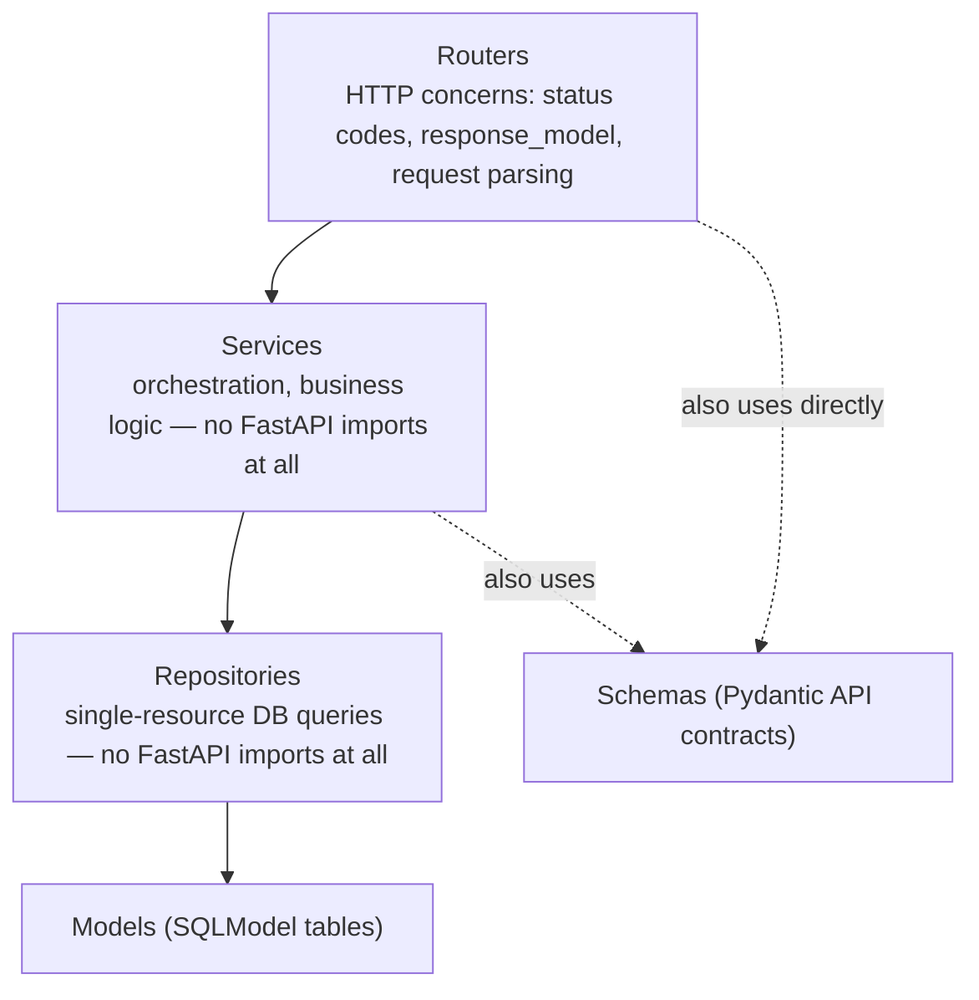

# Chapter 18: Application Architecture at Scale

> Part III — Advanced: Production Engineering · Chapter 18 of 28

No new feature this chapter — instead, a step back to address something that's been quietly accumulating pressure since Chapter 10 introduced the repository pattern: what exactly goes where, once a codebase has routers, repositories, background tasks, WebSocket broadcasts, and business logic that doesn't cleanly belong to any single one of them. This chapter names a fourth layer, gives every layer an explicit rule about what it may and may not depend on, and applies the result to versioning and sub-application mounting.

## Learning Objectives

By the end of this chapter you will be able to:

- Name and apply a four-layer architecture (routers, services, repositories, models/schemas) with explicit rules about what each layer may depend on.
- Organize a growing FastAPI codebase into a directory structure that scales past a handful of files.
- Version an API (`/v1`, `/v2`) by adding a new contract for one changed endpoint without touching or breaking the existing one.
- Mount a genuinely separate sub-application (with its own docs, schema, and middleware boundary) versus using `APIRouter` with a prefix.
- Manage configuration across environments using one codebase and different environment variable values, rather than environment-specific branches in code.

---

## 18.1 A Fourth Layer: Services

Chapter 10 split routes into routers (HTTP concerns) and repositories (database queries). That split works cleanly right up until you have logic that doesn't belong to either — Chapter 17's `update_product` route, for instance, both updated a row *and* broadcast a WebSocket message: neither of those is "how do I talk HTTP" (routing) nor "how do I query this one resource" (repository). This is exactly the gap a **service layer** fills: orchestration logic — coordinating a repository call with a broadcast, or multiple repositories with each other (Chapter 10's `transfer_stock`, touching two products in one atomic operation, is a service-layer operation in spirit even before this chapter formally named the layer) — that is genuine business logic, not database access and not HTTP handling.



The arrows encode a **rule**, not just a suggestion: a router may call a service; a service may call one or more repositories (and other framework-agnostic things, like Chapter 17's connection manager); a repository talks to the database and nothing else. Critically, **services and repositories should never import anything from `fastapi` itself** — no `Request`, no `HTTPException`, no `Depends`. When something goes wrong at those layers, they raise Chapter 7's plain, framework-agnostic exceptions (`NotFoundError`, `InsufficientStockError`) — exactly as Chapter 10's repositories already did — and only the router layer, or the global exception handlers registered on `app`, ever translate those into an HTTP-specific response. This is what makes a service function usable from a background job, a CLI script, or a test with zero dependency on FastAPI or HTTP being involved at all.

```python
# services/product.py — note: nothing here imports fastapi
from repositories.product import ProductRepository
from connection_manager import manager

class ProductService:
    def __init__(self, repo: ProductRepository):
        self.repo = repo

    async def update_product(self, product_id: int, changes: dict):
        product = await self.repo.update(product_id, changes)   # may raise NotFoundError — not caught here
        await manager.broadcast({"event": "product_updated", "product_id": product_id, "changes": changes})
        return product
```

A route calling this service doesn't need its own `try`/`except` either — `NotFoundError`, if raised deep inside `repo.update`, propagates straight up through the service, through the router, to Chapter 7's global handler, unchanged, exactly as it always has.

## 18.2 A Directory Structure That Scales

```
app/
├── main.py                 # creates the app, includes routers, mounts sub-apps
├── config.py                # Settings (Ch. 16)
├── database.py               # engine, get_session (Ch. 9)
├── security.py                # hashing, JWT (Ch. 11)
├── exceptions.py               # AppError and subclasses (Ch. 7)
├── middleware.py                 # RequestID, logging (Ch. 12)
├── connection_manager.py           # WebSocket broadcasting (Ch. 17)
├── dependencies.py                    # shared Depends() wiring
├── tasks.py                             # background tasks (Ch. 13)
├── models/                                # SQLModel table classes (Ch. 9-10)
│   ├── product.py
│   └── user.py
├── schemas/                                 # Pydantic API contracts (Ch. 4-6, 16)
│   ├── product.py
│   └── pagination.py
├── repositories/                              # DB query logic (Ch. 10) — no fastapi imports
│   ├── product.py
│   └── user.py
├── services/                                    # orchestration (this chapter) — no fastapi imports
│   └── product.py
├── routers/
│   ├── v1/
│   │   ├── products.py
│   │   └── auth.py
│   └── v2/
│       └── products.py
├── admin/
│   └── app.py                                      # a separate mounted sub-application (18.4)
└── ws/
    └── products.py

tests/
├── conftest.py
├── test_auth.py
└── test_products.py
```

Nothing here is a new concept — it's every module this curriculum has built since Chapter 3, organized by the layer it belongs to, with `routers/` further split by API version. The organizing principle worth internalizing: **you should be able to guess which directory a piece of logic belongs in by asking which layer's rule it follows**, not by where it happened to be convenient to add it at the time.

## 18.3 Versioning: Adding `/v2` Without Breaking `/v1`

API versioning exists to solve one problem: you need to change a response shape or a contract, but existing clients are already depending on the *current* shape, and breaking them isn't acceptable. The practical rule: **`/v1` must keep behaving exactly as it always has; `/v2` introduces the new contract for the same conceptual operation, served alongside it, not instead of it.**

```python
# schemas/product.py (v2 addition)
class PricingInfo(BaseModel):
    amount: float
    currency: str
    display: str

class ProductPublicV2(BaseModel):
    model_config = ConfigDict(from_attributes=True)
    id: int
    name: str
    pricing: PricingInfo
    in_stock: bool
    created_at: datetime

    @classmethod
    def from_product(cls, product: ProductTable) -> "ProductPublicV2":
        symbol = {"USD": "$", "EUR": "€", "INR": "₹"}.get(product.currency, "")
        return cls(
            id=product.id, name=product.name, in_stock=product.in_stock, created_at=product.created_at,
            pricing=PricingInfo(amount=product.price, currency=product.currency, display=f"{symbol}{product.price:.2f}"),
        )
```

```python
# routers/v2/products.py
router = APIRouter(prefix="/products", tags=["products-v2"])

@router.get("/{product_id}", response_model=ProductPublicV2)
async def read_product_v2(product_id: int, repo: ProductRepoDep):
    product = await repo.get_or_raise(product_id)
    return ProductPublicV2.from_product(product)
```

```python
# main.py
app.include_router(products_v1.router, prefix="/api/v1")
app.include_router(products_v2.router, prefix="/api/v2")
```

Note that `APIRouter`'s own `prefix` (`/products`, set inside the router file — Chapter 3) and `include_router`'s `prefix` (`/api/v1`, set at mount time) *compose* — the final path is `/api/v1/products/{product_id}`, each prefix contributing its own segment. Notice also what did **not** change: `routers/v1/products.py`, `ProductPublic`, and every other v1 route are completely untouched — `/api/v1/products/{id}` still returns exactly the flat shape it always has, while `/api/v2/products/{id}` returns the new nested `pricing` object, for clients that have migrated to expect it. A realistic versioning effort rarely means rewriting every endpoint for a new version simultaneously — usually it's exactly this: one or two contracts changed, served as a new version, while everything unaffected continues on the old one indefinitely (or until it's deliberately deprecated, per Chapter 4.2's `deprecated=True` marker on individual parameters — the same idea, applied here to a whole endpoint version instead of one parameter).

## 18.4 Sub-Applications: Genuine Isolation, Not Just a Prefix

Chapter 14 used `app.mount(...)` for `StaticFiles`. The same mechanism works for mounting an entirely separate **`FastAPI()` instance** — useful when you want more than a URL prefix's worth of separation:

```python
# admin/app.py
from fastapi import FastAPI

admin_app = FastAPI(title="Admin API", version="1.0")

@admin_app.get("/stats")
async def admin_dashboard_stats():
    return {"message": "admin-only statistics"}
```

```python
# main.py
from admin.app import admin_app
app.mount("/admin", admin_app)
```

The distinction from `APIRouter` + `prefix` (Chapter 3) is real, not cosmetic: an `APIRouter` shares the *same* `FastAPI` app instance — same `/docs`, same OpenAPI schema, same middleware stack (Chapter 12's CORS and logging middleware apply to every `APIRouter`-based route automatically). A mounted sub-application is a genuinely separate `FastAPI()` instance, with its **own** `/admin/docs`, its own OpenAPI schema, and — this is the part worth catching before it surprises you — **none** of the main app's middleware applies to it automatically. If `admin_app` needs its own CORS policy, request logging, or auth requirements, you configure those on `admin_app` directly; nothing about mounting it under `app` inherits any of the outer app's configuration. Reach for a sub-application specifically when that isolation is what you actually want (a genuinely separate concern, perhaps eventually deployed or scaled independently) — for anything that's really just "the same API, grouped differently," `APIRouter` remains the simpler, correct tool.

## 18.5 Settings Per Environment: Same Code, Different Values

Chapter 16's `Settings` class reads environment variables. The temptation, once "production" and "development" enter the picture, is to write environment-specific *code* — an `if settings.environment == "production":` branch here, a different `Settings` subclass there. **Resist this by default.** The more robust pattern is the one containerized deployments are actually built around: **one codebase, one `Settings` class, and different real environment variable *values* injected per deployment** — development's `.env` sets `DATABASE_URL` to a local SQLite file; production's actual environment (set by your deployment platform, never committed to a repository) sets it to a real Postgres connection string. The code that reads `settings.database_url` never branches on which environment it's in at all — it just reads the value it was given.

```python
class Settings(BaseSettings):
    environment: str = "development"
    # ...
```

An `environment` field itself is fine to have — genuinely useful for something like conditionally disabling `/docs` in production (`docs_url=None if settings.environment == "production" else "/docs"`) — but treat branching on it as the exception, reserved for a small number of deliberate, security- or operations-relevant decisions, not a general-purpose tool for "make this behave differently in prod." Every environment-conditional branch is a piece of code path that only ever runs in exactly one environment, meaning your development testing never actually exercises it — a real, if easy to overlook, gap in test coverage that grows every time a new branch like this gets added casually.

---

## Hands-On Project: The Full Refactor

### Step 1 — Reorganize existing files into the directory structure from section 18.2, without changing behavior yet. Confirm the full test suite from Chapter 15 still passes after nothing but the reorganization — a refactor that changes file locations only should never break a single test if the layering was already sound.

### Step 2 — Extract `ProductService`, moving the broadcast call out of the router

```python
# services/product.py
from repositories.product import ProductRepository
from connection_manager import manager

class ProductService:
    def __init__(self, repo: ProductRepository):
        self.repo = repo

    async def create_product(self, data: dict):
        return await self.repo.create(data)

    async def update_product(self, product_id: int, changes: dict):
        product = await self.repo.update(product_id, changes)
        await manager.broadcast({"event": "product_updated", "product_id": product_id, "changes": changes})
        return product
```

```python
# dependencies.py (addition)
def get_product_service(repo: ProductRepoDep) -> ProductService:
    return ProductService(repo)

ProductServiceDep = Annotated[ProductService, Depends(get_product_service)]
```

```python
# routers/v1/products.py — now delegates entirely to the service
@router.patch("/{product_id}", response_model=ProductPublic)
async def update_product(product_id: int, update: ProductUpdate, service: ProductServiceDep):
    return await service.update_product(product_id, update.model_dump(exclude_unset=True))
```

### Step 3 — Add `/api/v2/products/{id}` with the restructured `pricing` shape (section 18.3), served alongside the unchanged `/api/v1`.

### Step 4 — Mount the admin sub-app (section 18.4) at `/admin`, and confirm `/admin/docs` renders its own, separate OpenAPI schema — containing only `admin_app`'s own routes, none of the main app's.

---

## Practice Exercises

**Exercise 18.1 — A second `/v2` endpoint, keeping `/v1` untouched.**
Apply section 18.3's pattern to `list_products`: add `GET /api/v2/products/` returning `Paginated[ProductPublicV2]` (combining Chapter 16's generic wrapper with this chapter's new schema), while `GET /api/v1/products/` continues returning `Paginated[ProductPublic]`, completely unchanged. Confirm both work simultaneously, and that no file inside `routers/v1/` needed any edits to make v2 work.

**Exercise 18.2 — A second, independent sub-application.**
Mount a second sub-app, `status_app`, at `/status`, with a single `GET /` route returning `{"status": "ok"}` — a minimal, genuinely separate "is the service up" mini-application, isolated from the main app's docs and middleware, reinforcing that mounting is a general tool, not a one-off pattern specific to the admin API.

**Exercise 18.3 — Draw your project's actual dependency graph, and verify it.**
Using this chapter's layering diagram as a template, draw the *actual* dependency graph of your own refactored project — every router, service, and repository module, with arrows for what imports what. Then write a short script (or a one-off `grep -r "from fastapi" repositories/ services/`) that checks whether any file under `repositories/` or `services/` imports anything from `fastapi` at all, and confirm it finds nothing.

**Exercise 18.4 — An environment-driven `/docs` toggle, done the right way.**
Add `docs_url=None if settings.environment == "production" else "/docs"` (and the equivalent for `redoc_url`) to your `FastAPI(...)` constructor call in `main.py`. Confirm `/docs` is reachable with `ENVIRONMENT=development` and returns `404` with `ENVIRONMENT=production` — using only a changed environment variable value, with no code path added anywhere else in the application.

**Exercise 18.5 (stretch) — Turn the layering rule into an automated test.**
Write a pytest test (tying back to Chapter 15) that walks every `.py` file under `repositories/` and `services/`, and asserts none of them contain the string `"fastapi"` anywhere in their source (a simple text search is sufficient for this exercise; a more rigorous version would parse each file's actual `import` statements via Python's `ast` module). Run it against your current, correctly-layered project and confirm it passes — then deliberately add `from fastapi import HTTPException` to one repository file and confirm the test now fails, catching exactly the kind of layering violation this chapter has been arguing against.

---

## Solutions & Discussion

<details>
<summary>Exercise 18.1</summary>

```python
# routers/v2/products.py
@router.get("/", response_model=Paginated[ProductPublicV2])
async def list_products_v2(repo: ProductRepoDep, limit: int = 20, offset: int = 0):
    products = await repo.list(limit=limit, offset=offset)
    total = await repo.count()
    items = [ProductPublicV2.from_product(p) for p in products]
    return Paginated[ProductPublicV2](items=items, total=total, limit=limit, offset=offset)
```

`GET /api/v1/products/` and `GET /api/v2/products/` both work, returning `Paginated[ProductPublic]` and `Paginated[ProductPublicV2]` respectively — genuinely different shapes for the same underlying data, served side by side. `routers/v1/products.py` required zero changes; the entire v2 addition lived in new files (`schemas/product.py`'s `ProductPublicV2`, already added in the hands-on project, and `routers/v2/products.py`), which is the whole point — versioning that requires editing the previous version's files to add a new one is a sign the versioning boundary isn't as clean as it should be.
</details>

<details>
<summary>Exercise 18.2</summary>

```python
# status/app.py
from fastapi import FastAPI

status_app = FastAPI(title="Status", docs_url=None)   # arguably doesn't even need its own docs

@status_app.get("/")
async def health():
    return {"status": "ok"}
```

```python
# main.py
from status.app import status_app
app.mount("/status", status_app)
```

`GET /status/` returns `{"status": "ok"}`, entirely independent of the main app's routing, middleware, or documentation — confirming section 18.4's mounting mechanism generalizes beyond the admin-API example, to any scenario where a genuinely separate mini-application is the right shape.
</details>

<details>
<summary>Exercise 18.3</summary>

The exact diagram will vary per project, but its *shape* should match section 18.1's template closely: every arrow should point from routers toward services, from services toward repositories, and from repositories toward models — never the reverse, and never a router importing a repository directly, skipping the service layer, for any route that has real orchestration logic (a thin route with no orchestration calling a repository directly, as in most `read`/`list` operations that don't need a service at all, is fine — the rule is about not letting FastAPI-specific concerns leak *downward*, not about mandating a service for every single operation regardless of whether one adds value).

```bash
grep -rl "from fastapi" repositories/ services/
```

A correctly-layered project prints nothing at all from this command — no matches. If it prints anything, that's a concrete, specific layering violation worth fixing before it becomes a habit other contributors copy.
</details>

<details>
<summary>Exercise 18.4</summary>

```python
# main.py
app = FastAPI(
    title="Products API",
    docs_url=None if settings.environment == "production" else "/docs",
    redoc_url=None if settings.environment == "production" else "/redoc",
)
```

With `ENVIRONMENT=development` (or unset, given the field's default), `/docs` renders normally. With `ENVIRONMENT=production` set in the actual environment, `/docs` returns `404 Not Found` — FastAPI simply never registers that route at all when `docs_url=None`. No route, dependency, or business logic anywhere in the application branched on environment — the *entire* difference in behavior is one constructor argument reading one settings value, exactly the "same code, different configuration" principle section 18.5 argued for.
</details>

<details>
<summary>Exercise 18.5</summary>

```python
# test_architecture.py
import pathlib
import pytest

LAYER_DIRS = ["repositories", "services"]

def _python_files(directory: str):
    return list(pathlib.Path(directory).rglob("*.py"))

@pytest.mark.parametrize("directory", LAYER_DIRS)
def test_no_fastapi_imports_in_layer(directory):
    violations = []
    for path in _python_files(directory):
        text = path.read_text()
        if "fastapi" in text:
            violations.append(str(path))
    assert not violations, f"Found fastapi references in {directory}: {violations}"
```

Running this against a correctly-layered project passes cleanly. Adding `from fastapi import HTTPException` to, say, `repositories/product.py` and rerunning makes the test fail immediately, printing exactly which file introduced the violation — turning what was previously a design *principle* you'd have to remember and enforce by code review into an automated check that fails a build the moment someone (possibly you, six months from now, under deadline pressure) violates it. This is a small but genuinely valuable pattern: architectural rules that matter are worth encoding as tests, not just documentation nobody re-reads before making a change.
</details>

---

## Chapter Summary

- A service layer sits between routers and repositories, handling orchestration (coordinating a repository call with a side effect like a broadcast, or multiple repositories together) — and, like repositories, should never import anything from `fastapi`, keeping business logic usable outside of any HTTP context at all.
- A directory structure organized by layer (`routers/`, `services/`, `repositories/`, `models/`, `schemas/`) makes "where does this belong" a question with a principled answer, not a judgment call made fresh each time.
- Versioning means adding a new contract for a changed endpoint *alongside* the old one — `/v1` keeps working unmodified, `/v2` serves the new shape, and a realistic versioning effort usually touches one or two endpoints, not the entire API at once.
- `app.mount(...)` for a full `FastAPI()` sub-application provides genuine isolation (separate docs, separate schema, separate middleware) that `APIRouter` + `prefix` does not — reach for it only when that isolation is actually the goal.
- Environment-specific *values* (via `Settings`) are almost always preferable to environment-specific *code paths* — every conditional branch on environment is a code path your development testing likely never exercises.

**Next:** Chapter 19 covers performance — caching, rate limiting, response class tradeoffs (`ORJSONResponse`), and profiling to find where an endpoint's time actually goes, building directly on the layered architecture this chapter just established.
