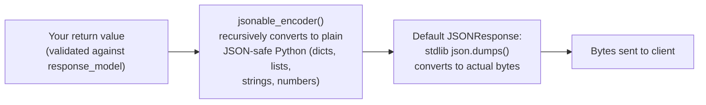
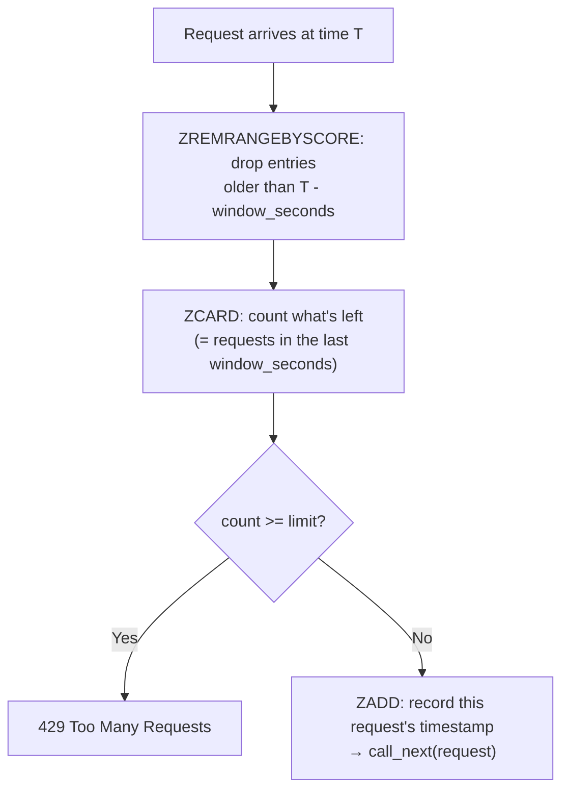

# Chapter 19: Performance — Caching, Rate Limiting, and Profiling

> Part III — Advanced: Production Engineering · Chapter 19 of 28

Chapter 6 deliberately deferred one topic: the actual cost of turning a Python object into response bytes, and what `ORJSONResponse` does about it. This chapter picks that up, alongside the two other performance levers most real APIs eventually need — Redis-backed caching for expensive, frequently-repeated reads, and rate limiting to keep one client from degrading service for everyone else.

## Learning Objectives

By the end of this chapter you will be able to:

- Break down where a request's time actually goes, and distinguish "your code" from framework overhead you can and can't reduce.
- Explain the full response serialization pipeline, and what `ORJSONResponse` changes about it versus the default.
- Implement Redis-backed caching for a read-heavy endpoint, with correct invalidation on writes.
- Implement a sliding-window rate limiter, and explain why it avoids a boundary problem a naive fixed-window counter has.
- Profile a real endpoint under load and identify where its time is actually spent, rather than guessing.

---

## 19.1 Where a Request's Time Actually Goes

A single request's total latency is the sum of several distinct costs, not one undifferentiated blob of "the server was slow":

1. **Routing and dependency resolution** (Chapters 3, 8) — typically negligible, microseconds.
2. **Request validation** (Chapter 5) — fast, thanks to `pydantic-core`'s compiled validation, but not free, and it scales with how much data and how many validators a request body carries.
3. **Your route's own logic** — database queries, external API calls, computation. This is almost always the actual bottleneck in a real application, and profiling should confirm that before you spend effort anywhere else.
4. **`response_model` validation** (Chapter 6) — cheap if you return the already-valid model instance; needlessly doubled if you return a pre-dumped dict instead, exactly as Chapter 6.5 demonstrated.
5. **Response encoding** — the topic Chapter 6 promised this chapter would cover in full: converting the validated response into actual bytes on the wire.

The "hidden taxes" framing worth internalizing: steps 1, 2, 4, and 5 rarely show up distinctly in a casual glance at "my endpoint is slow" — they blend into an undifferentiated sense of framework overhead, and it's tempting to guess at fixes rather than measure. Section 19.5's profiling exercise exists specifically to replace that guessing with a real measurement, for a real endpoint, under real concurrent load.

## 19.2 The Response Pipeline, and `ORJSONResponse`

By default, a route's return value goes through two full serialization passes before it becomes bytes on the wire:



`jsonable_encoder` handles everything Python's `json` module doesn't natively understand — `datetime`, `UUID`, `Decimal`, nested Pydantic models — converting all of it into plain, JSON-safe structures first. Then Starlette's default `JSONResponse` calls the standard library's `json.dumps()` on that already-converted structure to actually produce bytes. Two distinct passes, each doing real work.

`ORJSONResponse`, backed by the `orjson` library (implemented in Rust), collapses much of this: `orjson` can serialize many of the same types `jsonable_encoder` exists to handle — `datetime`, `UUID`, dataclasses, and more — directly, without needing the separate Python-level `jsonable_encoder` walk first for most common cases, and its actual byte-producing step is substantially faster than stdlib `json.dumps` even when a comparable encoding pass is still needed.

```python
from fastapi import FastAPI
from fastapi.responses import ORJSONResponse

app = FastAPI(default_response_class=ORJSONResponse)
```

Setting `default_response_class` once, at app creation, applies it to every route; `response_class=ORJSONResponse` on an individual route's decorator applies it selectively, if you'd rather opt in per-endpoint (useful if some other part of your app depends on default `JSONResponse` behavior you don't want to change everywhere at once). Exercise 19.2 has you measure the actual difference this makes, rather than taking "it's faster" on faith.

**A clarification worth being precise about, since it's easy to conflate with Chapter 6.5's double-validation trap:** these are two genuinely *different* costs. Chapter 6.5's issue was `response_model` re-validating an already-valid Pydantic instance because you threw the instance away and returned a plain dict instead — that's a validation cost, and it happens (or doesn't) regardless of which response class you use. This chapter's `jsonable_encoder`-plus-`json.dumps` cost is an *encoding* cost, happening *after* `response_model` validation has already finished, regardless of whether that validation was done efficiently or wastefully. Fixing one doesn't fix the other — a route that returns the model instance directly (avoiding Chapter 6's trap) *and* uses `ORJSONResponse` (reducing this chapter's encoding cost) has addressed two separate, independent taxes, not the same one twice.

## 19.3 Caching with Redis

Some responses are expensive to compute and requested repeatedly with the same result — a popular product's details, viewed by thousands of different users, none of whom need your server to re-run the same database query on every single view. The **cache-aside** pattern: check a cache first; on a hit, skip all the real work and return the cached value directly; on a miss, do the real work, store the result in the cache before returning it, so the *next* request benefits.

```python
# cache.py
import json
from redis import asyncio as redis

redis_client = redis.from_url("redis://localhost:6379", decode_responses=True)

async def get_cached(key: str) -> dict | None:
    value = await redis_client.get(key)
    return json.loads(value) if value else None

async def set_cached(key: str, value: dict, ttl_seconds: int = 60) -> None:
    await redis_client.set(key, json.dumps(value), ex=ttl_seconds)

async def invalidate_cached(key: str) -> None:
    await redis_client.delete(key)
```

`ex=ttl_seconds` sets a time-to-live — Redis automatically expires the key after that many seconds, bounding how *stale* a cached response can ever get, even if you forget to invalidate it explicitly somewhere. But TTL alone isn't enough for correctness: if the underlying data changes (an update to the exact product a cached response describes), that cache entry needs to be invalidated **immediately**, not left to expire naturally — a cache that only ever expires on TTL, never on write, will confidently serve stale data for however long that TTL happens to be, to every single request, after every single update. Section 19.5's Exercise 19.4 makes you verify this correctness directly with a test, not just trust that the invalidation call is present.

## 19.4 Rate Limiting: Fixed Window vs. Sliding Window

A **fixed window** rate limiter is the simplest to implement: count requests in discrete buckets (e.g., "this calendar minute"), reject once a bucket's count exceeds the limit, reset to zero at the next bucket boundary. Its problem is a genuine, well-known one: a client can send the full limit right at the *end* of one window, and the full limit again right at the *start* of the next — two limits' worth of requests within a much shorter span than the window nominally allows, entirely legally, from the limiter's point of view.

A **sliding window** avoids this by tracking the actual timestamp of every request within a continuously moving period, rather than snapping to fixed buckets — implemented cleanly with a Redis **sorted set**, where each request's timestamp is both the member and the score:



```python
# middleware.py (addition)
import time
from starlette.middleware.base import BaseHTTPMiddleware
from starlette.responses import JSONResponse
from cache import redis_client

RATE_LIMIT = 100
WINDOW_SECONDS = 60

class SlidingWindowRateLimitMiddleware(BaseHTTPMiddleware):
    async def dispatch(self, request, call_next):
        client_id = request.client.host
        key = f"ratelimit:{client_id}"
        now = time.time()

        await redis_client.zremrangebyscore(key, 0, now - WINDOW_SECONDS)
        current_count = await redis_client.zcard(key)

        if current_count >= RATE_LIMIT:
            return JSONResponse(status_code=429, content={"error": {"code": "rate_limited", "message": "Too many requests"}})

        await redis_client.zadd(key, {str(now): now})
        await redis_client.expire(key, WINDOW_SECONDS)
        return await call_next(request)
```

Every request first discards anything older than the rolling window, then counts what remains — the count genuinely reflects "requests in the last `WINDOW_SECONDS`, measured continuously," with no fixed boundary for a client to exploit. `client_id = request.client.host` (the raw IP) is a simplistic identifier, chosen here for a minimal working example — Exercise 19.3 has you replace it with something more meaningful, distinguishing *per-user* limiting from *per-IP* (or global) limiting.

---

## Hands-On Project: Caching a Read-Heavy Endpoint, Rate Limiting the API

### Step 1 — Redis, running locally

```bash
docker run -d --name redis-cache -p 6379:6379 redis:7
uv pip install redis
```

### Step 2 — Cache `read_product`, invalidate on update

```python
# routers/v1/products.py
from cache import get_cached, set_cached

@router.get("/{product_id}", response_model=ProductPublic)
async def read_product(product_id: int, repo: ProductRepoDep):
    cache_key = f"product:{product_id}"
    cached = await get_cached(cache_key)
    if cached is not None:
        return cached

    product = await repo.get_or_raise(product_id)
    result = ProductPublic.model_validate(product)
    await set_cached(cache_key, result.model_dump(mode="json"))
    return result
```

Recall Chapter 5.2's `mode="json"` distinction: `result.model_dump(mode="json")` converts fields like `created_at` (a `datetime`) into JSON-safe strings *before* handing them to `set_cached`, which stores the result as a JSON string in Redis — a plain Python-mode dump would leave a `datetime` object that `json.dumps` inside `set_cached` couldn't serialize at all.

```python
# services/product.py
from cache import invalidate_cached

class ProductService:
    ...
    async def update_product(self, product_id: int, changes: dict):
        product = await self.repo.update(product_id, changes)
        await invalidate_cached(f"product:{product_id}")
        await manager.broadcast({"event": "product_updated", "product_id": product_id, "changes": changes})
        return product
```

Confirm: `GET /products/1` twice in a row — the second call should be noticeably faster (no database query at all, just a Redis lookup). Then `PATCH /products/1`, and confirm the *next* `GET /products/1` reflects the update immediately, rather than serving a minute-old cached value — proof the invalidation call is actually doing its job.

### Step 3 — Rate limit the whole API

Wire `SlidingWindowRateLimitMiddleware` (section 19.4) into `main.py` via `app.add_middleware(...)`, positioned per Chapter 12's ordering rule (likely outermost, alongside CORS, so it applies uniformly regardless of what's inside). Confirm hammering an endpoint with more than `RATE_LIMIT` requests within `WINDOW_SECONDS` produces `429` responses once the limit is reached, and that waiting for the window to roll forward allows requests through again.

### Step 4 — Switch to `ORJSONResponse` and confirm nothing broke

```python
app = FastAPI(default_response_class=ORJSONResponse)
```

Re-run Chapter 15's full test suite and confirm everything still passes — a response-class change should be invisible to correct tests, affecting only the bytes-on-the-wire encoding, not the actual data or status codes any test asserts on.

---

## Practice Exercises

**Exercise 19.1 — Profile a real endpoint and find the actual bottleneck.**
Pick `GET /products/{id}` (uncached — temporarily bypass the cache, or use a fresh, never-cached product ID) and instrument it with manual timing around each phase: dependency/session resolution, the actual database query, `response_model` construction, and response encoding. Run it under light concurrent load (10–20 simulated requests via `asyncio.gather`) and report which phase consumes the largest share of total time. Was it what you expected before measuring?

**Exercise 19.2 — Measure `ORJSONResponse`'s actual difference.**
Using the same endpoint, benchmark repeated calls (a few hundred, in a tight loop or via `asyncio.gather` in batches) with the default `JSONResponse` versus `ORJSONResponse`, holding everything else constant. Report the average latency difference you observed. Is it large enough to matter for this particular endpoint's response size, or is the difference more noticeable for a much larger response (try it against the CSV-adjacent product list endpoint, returning many rows, for comparison)?

**Exercise 19.3 — Per-user vs. per-IP rate limiting.**
Modify the rate limiter to key by authenticated user ID (via Chapter 11's `get_current_user`, when available) rather than raw IP, falling back to IP-based limiting for unauthenticated requests. Demonstrate a scenario where this distinction matters: two different logged-in users sharing one IP (simulating an office network or a shared NAT) should each get their own independent limit, not share one combined limit the way pure IP-based limiting would force them to.

**Exercise 19.4 — Prove cache invalidation is actually correct, with a test.**
Write a pytest test (tying back to Chapter 15) that: creates a product, `GET`s it (populating the cache), `PATCH`es it with a new `price`, and immediately `GET`s it again — asserting the second `GET`'s response reflects the *new* price, not the cached pre-update value. This is exactly the kind of correctness property that's easy to break silently (someone adds a new update path later and forgets to call `invalidate_cached`) without a test actively guarding it.

**Exercise 19.5 (stretch) — Demonstrate the fixed-window boundary burst.**
Implement a naive fixed-window limiter (a simple per-minute-bucket counter, incrementing an integer key with a TTL reset at each new minute) alongside the sliding-window version. Construct a request pattern that straddles a window boundary (e.g., `RATE_LIMIT` requests at second 59 of one window, then `RATE_LIMIT` more at second 1 of the next) and confirm the fixed-window version allows roughly double the intended limit through in that short span, while the sliding-window version — tested with the identical request pattern — does not.

---

## Solutions & Discussion

<details>
<summary>Exercise 19.1</summary>

```python
import time

start = time.perf_counter()
product = await repo.get_or_raise(product_id)
db_time = time.perf_counter() - start

start = time.perf_counter()
result = ProductPublic.model_validate(product)
validation_time = time.perf_counter() - start

print(f"db: {db_time*1000:.2f}ms  validation: {validation_time*1000:.2f}ms")
```

For a simple `SELECT ... WHERE id = ?` against a small local database, expect the database query to dominate — typically the large majority of total time, even though it's "just one indexed lookup" — with `response_model` construction and encoding each contributing a small, roughly-fixed fraction regardless of load. This usually *does* match expectations in direction (I/O dominates) but often surprises people in *magnitude* — a query that "feels instant" in isolation can still be 10-100x the cost of the validation/encoding steps combined, which is exactly why profiling before optimizing matters: without measuring, it's easy to spend effort polishing the encoding step (this chapter's `ORJSONResponse`) when the database query was always the real lever.
</details>

<details>
<summary>Exercise 19.2</summary>

For a single small `ProductPublic` object, expect the `ORJSONResponse` difference to be measurable but modest — often single-digit-percent of total request time, since the response body itself is small and the encoding step was never the dominant cost for this endpoint (Exercise 19.1's finding). Repeating the same comparison against the CSV-adjacent product *list* endpoint (Chapter 14, potentially hundreds of rows) should show a more pronounced difference — the encoding step's cost scales with response size, so a response with many more fields to encode gives `ORJSONResponse`'s Rust-backed serialization more actual work to be faster at, making the improvement more visible in absolute terms even if the *percentage* improvement is similar.
</details>

<details>
<summary>Exercise 19.3</summary>

```python
class SlidingWindowRateLimitMiddleware(BaseHTTPMiddleware):
    async def dispatch(self, request, call_next):
        user = getattr(request.state, "current_user", None)
        client_id = f"user:{user.id}" if user else f"ip:{request.client.host}"
        key = f"ratelimit:{client_id}"
        # ...rest unchanged...
```

(This requires populating `request.state.current_user` somewhere upstream — e.g., a lightweight middleware or dependency that attempts token decoding without *requiring* authentication, distinct from Chapter 11's `get_current_user`, which raises if no valid token is present.)

With per-user keying, two different authenticated users sharing one office IP each accumulate their own independent count under `user:{their_id}`, rather than both being counted against a single `ip:{shared_address}` key — one heavy user hitting their own limit doesn't cause the *other* user's requests, from the same physical network, to start failing too. Pure IP-based limiting can't make this distinction at all, since it has no visibility into *who* is making the request, only *where from* — a real, practical difference for any API with shared-network clients (offices, universities, mobile carriers using NAT).
</details>

<details>
<summary>Exercise 19.4</summary>

```python
@pytest.mark.asyncio
async def test_cache_invalidated_on_update(authenticated_client):
    create_response = await authenticated_client.post("/products/", json={"name": "Cache Test", "price": 10.0, "cost_price": 5.0})
    product_id = create_response.json()["id"]

    first_get = await authenticated_client.get(f"/products/{product_id}")
    assert first_get.json()["price"] == 10.0   # populates the cache

    await authenticated_client.patch(f"/products/{product_id}", json={"price": 25.0})

    second_get = await authenticated_client.get(f"/products/{product_id}")
    assert second_get.json()["price"] == 25.0   # must NOT be the stale cached 10.0
```

If `invalidate_cached(f"product:{product_id}")` were ever accidentally removed from `update_product` (a realistic future mistake — someone refactoring the service layer, say), this test fails immediately and specifically: `second_get.json()["price"]` would still read `10.0`, the stale cached value, clearly distinguishing "cache invalidation is broken" from any other kind of test failure. This is exactly the value of testing a correctness property directly, rather than only testing that the *code path* for invalidation exists — the test doesn't care how invalidation is implemented, only that its observable effect (fresh data after a write) actually holds.
</details>

<details>
<summary>Exercise 19.5</summary>

```python
async def fixed_window_check(client_id: str, limit: int) -> bool:
    bucket = int(time.time() // 60)   # current minute as the bucket key
    key = f"fixedwindow:{client_id}:{bucket}"
    count = await redis_client.incr(key)
    if count == 1:
        await redis_client.expire(key, 60)
    return count <= limit
```

Sending `RATE_LIMIT` requests at, say, second 59 of minute N, then `RATE_LIMIT` more at second 1 of minute N+1: the fixed-window version allows *all* of them through — each burst lands in a different bucket key (`fixedwindow:client:N` and `fixedwindow:client:N+1` respectively), each independently under the limit, even though only about 2 seconds of real time separated the two bursts, and roughly double `RATE_LIMIT` requests went through in that short span. Running the identical two-burst pattern against the sliding-window version correctly rejects the second burst (or a significant portion of it) — its rolling window, measured continuously from "now" rather than snapped to a calendar-minute boundary, correctly sees both bursts as falling within the same effective window and enforces the limit against their combined count, exactly the boundary problem section 19.4 named without yet proving.
</details>

---

## Chapter Summary

- Request latency is a sum of distinct costs (routing, validation, your logic, response validation, encoding) — profile before optimizing, since the real bottleneck (usually I/O) is rarely where intuition points first.
- `ORJSONResponse` reduces the encoding pipeline's cost (fewer/faster passes converting a response into bytes) — a genuinely different cost from Chapter 6.5's double-validation trap, which concerns whether `response_model` re-validates unnecessarily. Fixing one doesn't fix the other.
- Cache-aside with Redis speeds up expensive, frequently-repeated reads — but a cache without correct invalidation on writes will confidently serve stale data, a correctness bug worth testing directly rather than trusting by inspection.
- A sliding-window rate limiter (Redis sorted sets) avoids the boundary-burst problem a naive fixed-window counter has, at the cost of slightly more per-request work — worth the cost for anything where the burst-avoidance genuinely matters.
- Per-user rate limiting and per-IP rate limiting solve different problems — shared-network clients (offices, NAT) need per-user keying to avoid one heavy user affecting everyone sharing their network's IP.

**Next:** Chapter 20 covers observability — structured logging, health/readiness endpoints, metrics, and tracing — the tools that let you actually *see* the kind of performance and correctness issues this chapter addressed, once the application is running somewhere you can't just attach a debugger to.
