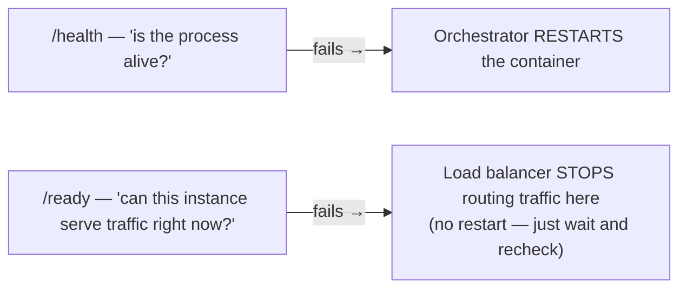

# Chapter 20: Observability — Logging, Metrics, and Tracing

> Part III — Advanced: Production Engineering · Chapter 20 of 28

Chapter 7 generated a `request_id` inside a single exception handler, with an explicit caveat that it only covered that one handler. Chapter 12 built a `RequestIDMiddleware` that covers every request, but still required manually reading `request.state.request_id` anywhere you wanted to log it. This chapter finishes the job properly — a `request_id` that shows up in *every* log line for a request automatically, structured JSON logs, the health-check-vs-readiness-check distinction that trips up a surprising number of production deployments, and basic Prometheus metrics.

## Learning Objectives

By the end of this chapter you will be able to:

- Produce structured (JSON) logs instead of free-form text, and explain why that matters for anything beyond reading logs by eye.
- Propagate a `request_id` into every log statement for a request automatically, using `contextvars`, without passing it as a parameter through every function call.
- Explain the difference between a liveness (`/health`) check and a readiness (`/ready`) check, and why conflating them causes real production incidents.
- Instrument an application with basic Prometheus metrics (`Counter`, `Histogram`), and avoid the label-cardinality mistake that quietly breaks metrics systems.
- Explain, at a conceptual level, how distributed tracing generalizes this chapter's single-service `request_id` into a multi-service `trace_id`.

---

## 20.1 Structured Logging

Chapter 12's logging middleware produced lines like `request_id=abc method=GET path=/products status=200 duration_ms=12.34` — readable by a human scanning a terminal, but awkward for anything else. A **structured** log line is a JSON object instead:

```python
{"timestamp": "2026-07-10T14:22:01Z", "level": "INFO", "message": "request completed", "request_id": "abc-123", "method": "GET", "path": "/products", "status": 200, "duration_ms": 12.34}
```

The difference matters the moment logs need to be *queried* rather than just read — "show me every request with `status >= 500` and `duration_ms > 1000` in the last hour" is a trivial query against structured fields in any real log aggregation system (CloudWatch Logs Insights, Datadog, an ELK stack), and a fragile, error-prone regex against free-form text. Structured logging isn't about making logs prettier; it's about making them a queryable dataset rather than a wall of text a human has to visually scan.

```python
# logging_config.py
import logging, json
from datetime import datetime, timezone

class JSONFormatter(logging.Formatter):
    def format(self, record: logging.LogRecord) -> str:
        payload = {
            "timestamp": datetime.now(timezone.utc).isoformat(),
            "level": record.levelname,
            "message": record.getMessage(),
            "logger": record.name,
        }
        if record.exc_info:
            payload["exception"] = self.formatException(record.exc_info)
        return json.dumps(payload)
```

(`structlog` is a popular, more fully-featured third-party library for this same purpose, adding richer context-binding and formatting options — worth knowing it exists for a production system; this chapter builds the underlying mechanism from the standard library directly, so the concept isn't hidden behind a library's abstraction.)

## 20.2 `request_id` in Every Log Line, Automatically, via `contextvars`

Chapter 12's `request_id` lived on `request.state` — accessible in middleware, but not automatically available to a `logger.info(...)` call three layers deep inside a repository, which has no `request` object in scope at all and shouldn't need one (recall Chapter 18's rule: repositories don't know about FastAPI or HTTP). `contextvars.ContextVar` solves exactly this: a value that's set once per request, and is then transparently readable from *anywhere* running within that same async task — no explicit passing required.

```python
# logging_config.py (addition)
import contextvars

request_id_var: contextvars.ContextVar[str] = contextvars.ContextVar("request_id", default="-")

class RequestIDFilter(logging.Filter):
    def filter(self, record: logging.LogRecord) -> bool:
        record.request_id = request_id_var.get()
        return True
```

```python
# middleware.py (updated from Chapter 12)
from logging_config import request_id_var

class RequestIDMiddleware(BaseHTTPMiddleware):
    async def dispatch(self, request: Request, call_next):
        request_id = str(uuid.uuid4())
        token = request_id_var.set(request_id)
        try:
            response = await call_next(request)
            response.headers["X-Request-ID"] = request_id
            return response
        finally:
            request_id_var.reset(token)
```

With `RequestIDFilter` attached to your logging handler, **every** `logger.info(...)` call anywhere in the codebase — a router, a service, a repository, a background task running within the same request's context — automatically gets `record.request_id` populated correctly, with zero code changes at any of those call sites. This is the direct payoff of `contextvars` over manually threading a `request_id` parameter through every function signature in the call chain: the logging *infrastructure* reads it once, centrally, and every log statement benefits without knowing anything about where the value came from. `token = request_id_var.set(...)` and the corresponding `request_id_var.reset(token)` in `finally` matter for correctness under concurrency — resetting ensures this request's ID doesn't leak into a *different*, concurrently-running request's logs once this one finishes.

## 20.3 Health Checks vs. Readiness Checks

This distinction is small to state and easy to get backwards in a way that causes real incidents:

- **A health (liveness) check** answers: *is this process alive and able to respond at all?* It should be nearly trivial — return `200 OK`, nothing more — and should almost never check external dependencies. An orchestrator (Kubernetes, for instance) uses this to decide whether to **restart** the container. If your health check pinged the database and the database had a brief blip, a naive liveness check would report unhealthy, and the orchestrator would restart a perfectly healthy application process — solving nothing, since restarting your app doesn't fix the database, and now you've also paid the cost of a restart (dropped connections, cold caches) for no benefit.
- **A readiness check** answers: *is this instance ready to accept real traffic right now?* This one *should* check real dependencies — can it reach the database, can it reach Redis — because if a dependency is genuinely down, this instance genuinely cannot serve requests correctly. An orchestrator or load balancer uses readiness to decide whether to **route traffic** to this instance, temporarily pulling it out of rotation without touching the process itself, and restoring it automatically once the dependency recovers and readiness passes again.



```python
# routers/health.py
from fastapi import APIRouter, Response, status
from sqlalchemy import text
from database import engine
from cache import redis_client

router = APIRouter(tags=["monitoring"])

@router.get("/health")
async def health():
    return {"status": "ok"}

@router.get("/ready")
async def ready(response: Response):
    checks = {}
    try:
        async with engine.connect() as conn:
            await conn.execute(text("SELECT 1"))
        checks["database"] = "ok"
    except Exception:
        checks["database"] = "failed"

    try:
        await redis_client.ping()
        checks["redis"] = "ok"
    except Exception:
        checks["redis"] = "failed"

    all_ok = all(v == "ok" for v in checks.values())
    response.status_code = status.HTTP_200_OK if all_ok else status.HTTP_503_SERVICE_UNAVAILABLE
    return {"status": "ready" if all_ok else "not_ready", "checks": checks}
```

## 20.4 Prometheus Metrics, and a Real Cardinality Gotcha

Prometheus's data model centers on a small number of metric types — this chapter needs two: a **Counter** (a value that only ever increases — total requests served) and a **Histogram** (a distribution of observed values, bucketed — request durations, letting you later compute percentiles like p95 latency).

```python
# metrics.py
import time
from prometheus_client import Counter, Histogram, generate_latest, CONTENT_TYPE_LATEST
from starlette.middleware.base import BaseHTTPMiddleware

REQUEST_COUNT = Counter("http_requests_total", "Total HTTP requests", ["method", "path", "status"])
REQUEST_DURATION = Histogram("http_request_duration_seconds", "Request duration", ["method", "path"])

class MetricsMiddleware(BaseHTTPMiddleware):
    async def dispatch(self, request, call_next):
        start = time.perf_counter()
        response = await call_next(request)
        duration = time.perf_counter() - start

        route = request.scope.get("route")
        path_label = route.path if route else request.url.path   # see the cardinality note below

        REQUEST_COUNT.labels(method=request.method, path=path_label, status=response.status_code).inc()
        REQUEST_DURATION.labels(method=request.method, path=path_label).observe(duration)
        return response
```

**`path_label` uses the route's *template* (`/products/{product_id}`), not the resolved concrete URL (`/products/42`) — and this is not a stylistic choice, it's avoiding a genuine, common mistake.** Prometheus stores a separate time series for every unique combination of label values. If you labeled metrics with `request.url.path` directly, then `/products/1`, `/products/2`, `/products/3`, ... each become a **distinct** label value, and a busy API serving thousands of different product IDs would create thousands of distinct time series for what is conceptually *one* endpoint — a real phenomenon called **cardinality explosion**, which degrades or crashes real Prometheus deployments in production, not a theoretical concern. `request.scope["route"]`, populated by Starlette once routing has matched, gives you the *template* string instead — `/products/{product_id}` — collapsing every concrete product ID request into one time series, exactly as intended. Exercise 20.4 has you reproduce the cardinality explosion on purpose, specifically so the fix isn't just a line you copy without seeing the failure it prevents.

```python
# routers/health.py (addition)
from fastapi import Response
from prometheus_client import generate_latest, CONTENT_TYPE_LATEST

@router.get("/metrics")
async def metrics():
    return Response(content=generate_latest(), media_type=CONTENT_TYPE_LATEST)
```

## 20.5 Distributed Tracing — The Concept, Briefly

Everything this chapter has built assumes one service. The moment a single logical request spans *multiple* services (Chapter 26's microservices territory) — your API calls a payment service, which calls a fraud-check service — `request_id` alone isn't enough, because each service would generate its own, unrelated ID, with no way to connect them into one story. **Distributed tracing** generalizes this chapter's `request_id` into a **trace** (the whole journey, across every service involved) made of **spans** (one span per service/operation along the way), each span carrying a shared `trace_id` (the same across the entire journey) and its own unique `span_id`, with a `parent_span_id` linking each span back to whichever one called it — reconstructing the full call graph after the fact.

**OpenTelemetry** is the current vendor-neutral standard for this, with auto-instrumentation available for FastAPI (`opentelemetry-instrumentation-fastapi`) that can generate spans for incoming requests with minimal manual setup. This chapter deliberately keeps tracing at the conceptual level — a complete working setup needs a collector/backend (Jaeger, Tempo, or a commercial equivalent) to actually receive and visualize spans, which is real infrastructure beyond what one chapter can meaningfully set up and verify. Treat `request_id` (this chapter, one service) as the single-service special case of the same underlying idea `trace_id`/`span_id` generalizes across many — Chapter 26 is where multi-service tracing becomes something you can't avoid setting up for real.

---

## Hands-On Project: Structured Logs, Health/Readiness, and Metrics

### Step 1 — Wire up `JSONFormatter` + `RequestIDFilter` at application startup

```python
# main.py (addition, near the top, before the app handles any requests)
import logging
from logging_config import JSONFormatter, RequestIDFilter

handler = logging.StreamHandler()
handler.setFormatter(JSONFormatter())
handler.addFilter(RequestIDFilter())
logging.getLogger().addHandler(handler)
logging.getLogger().setLevel(logging.INFO)
```

### Step 2 — Update `RequestIDMiddleware` to set the `contextvars` value (section 20.2)

### Step 3 — Add `/health`, `/ready`, and `/metrics` (sections 20.3–20.4), included in `main.py` with no prefix, so they're reachable at the root regardless of API versioning (Chapter 18) — health/readiness/metrics are infrastructure concerns, not versioned API surface.

### Step 4 — Confirm end to end

Hit any route, and confirm your terminal now shows JSON log lines, each containing the same `request_id` your `X-Request-ID` response header carries. Stop Redis (or misconfigure its URL temporarily) and confirm `/ready` returns `503` with `{"checks": {"redis": "failed", ...}}`, while `/health` continues returning a plain `200` — the process is still alive, it simply can't serve real traffic correctly at the moment, exactly the distinction section 20.3 draws. Hit `/metrics` and confirm you see `http_requests_total` and `http_request_duration_seconds` entries, labeled by route template, not raw resolved paths.

---

## Practice Exercises

**Exercise 20.1 — Trace one `request_id` through three separate layers.**
Add a `logger.info("fetching product from repository")` call inside `ProductRepository.get_or_raise`, deep in the call stack, with no `request_id` parameter passed to it anywhere. Make one request to `GET /products/1`, and find all three log lines it produced (middleware, router/service level if you have logging there, and this new repository-level line) in your terminal output. Confirm all three carry the *exact same* `request_id`, despite that value never being explicitly passed into `get_or_raise`'s function signature at all.

**Exercise 20.2 — A custom business metric.**
Add a `PRODUCTS_CREATED = Counter("products_created_total", "Total products created")` metric, incremented inside `ProductService.create_product` (not the generic HTTP middleware — this is a business-level metric, not a generic request metric). Create a few products, hit `/metrics`, and confirm `products_created_total` reflects the count accurately — distinguishing a business metric you chose to track deliberately from the generic, automatic `http_requests_total` every endpoint gets for free.

**Exercise 20.3 — Simulate a dependency failure and verify `/ready` catches it.**
Stop your Redis container (`docker stop redis-cache`) without stopping your application. Call `/health` and `/ready` and record both responses. Restart Redis and confirm `/ready` recovers automatically on its very next call, with no restart of your application needed at any point in this exercise.

**Exercise 20.4 — Reproduce the cardinality explosion, then fix it.**
Temporarily change `MetricsMiddleware` to label with `request.url.path` (the resolved concrete path) instead of `route.path` (the template). Hit `GET /products/1` through `GET /products/50` (50 distinct, even if nonexistent, product IDs are fine for this exercise). Check `/metrics` and count how many distinct `http_requests_total` time series now exist for what is conceptually one endpoint. Revert to `route.path` and confirm the count collapses back to one.

**Exercise 20.5 (stretch) — Sketch a distributed trace, conceptually.**
Without implementing OpenTelemetry, describe in writing: if `POST /orders` in this application needed to call an external payment service, and that payment service in turn called a fraud-detection service, sketch what the resulting trace would look like — how many spans, what each span's `parent_span_id` would point to, and what would (and wouldn't) show up if you only had Chapter 20's single-service `request_id` and nothing else spanning the three services involved.

---

## Solutions & Discussion

<details>
<summary>Exercise 20.1</summary>

All three log lines — the request-completion line from your logging middleware, any router/service-level line, and the new `"fetching product from repository"` line from deep inside `ProductRepository` — show the identical `request_id` value in their JSON output, for the same request. This works because `contextvars.ContextVar` is scoped to the current async execution context, which persists across `await` boundaries within the same request's handling — `RequestIDMiddleware` sets it once, at the very start, and every subsequent piece of code running as part of handling *this* request (regardless of how many layers deep, regardless of whether it's a router, a service, or a repository function that has never heard of FastAPI) reads the same value when `RequestIDFilter` asks for it during log formatting. No parameter was threaded through `get_or_raise`'s signature at all — the propagation is entirely a property of the execution context, not of explicit function arguments.
</details>

<details>
<summary>Exercise 20.2</summary>

```python
# metrics.py (addition)
from prometheus_client import Counter
PRODUCTS_CREATED = Counter("products_created_total", "Total products created")
```

```python
# services/product.py
from metrics import PRODUCTS_CREATED

class ProductService:
    async def create_product(self, data: dict):
        product = await self.repo.create(data)
        PRODUCTS_CREATED.inc()
        return product
```

After creating, say, 3 products, `/metrics` shows `products_created_total 3.0`. This is a genuinely different kind of signal from `http_requests_total{path="/products/",method="POST",status="201"}` — the HTTP-level counter tells you "how many `POST /products/` requests succeeded," which happens to correlate with product creation *only if* every successful `POST` actually resulted in a product (usually true, but not guaranteed to remain true forever as the endpoint's logic evolves) — the business-level counter tracks the thing you actually care about directly, independent of how many HTTP layers or retries were involved in getting there.
</details>

<details>
<summary>Exercise 20.3</summary>

With Redis stopped: `/health` still returns `200 {"status": "ok"}` — the application process itself is completely unaffected by Redis being down, so liveness correctly reports fine. `/ready` returns `503 {"status": "not_ready", "checks": {"database": "ok", "redis": "failed"}}` — correctly identifying *which specific dependency* is the problem, without claiming the whole application is broken (the database check still passes independently). Restarting Redis and calling `/ready` again immediately shows `{"status": "ready", ...}` with no application restart, deployment, or manual intervention needed — readiness is re-evaluated fresh on every single call, so recovery is automatic and immediate the moment the underlying dependency is actually available again.
</details>

<details>
<summary>Exercise 20.4</summary>

With `request.url.path` used directly, hitting product IDs 1 through 50 creates 50 *distinct* `http_requests_total{path="/products/1",...}`, `{path="/products/2",...}`, ... time series — one per concrete path, even though conceptually every one of these requests hit the exact same *endpoint*. In a real API serving genuinely large numbers of distinct resource IDs over time, this pattern creates an ever-growing, effectively unbounded number of time series — real Prometheus deployments have documented, serious performance and memory problems from exactly this mistake, generally referred to as cardinality explosion. Reverting to `route.path` (`/products/{product_id}`) collapses all 50 requests back into a single time series, correctly reflecting "50 requests hit this one templated endpoint" rather than fifty separate, permanently-accumulating series.
</details>

<details>
<summary>Exercise 20.5</summary>

The resulting trace would have (at minimum) three spans: one for this application's own handling of `POST /orders` (the root span, `parent_span_id` unset or null, since nothing called it), one for the call *to* the payment service (a child span, `parent_span_id` pointing at the root span), and one for the payment service's own call to the fraud-detection service (a grandchild span, `parent_span_id` pointing at the payment-service span) — all three sharing one common `trace_id`, letting a tracing UI reconstruct the entire three-service journey as a single connected timeline, including which call happened inside which other call, and how long each one individually took.

With only Chapter 20's single-service `request_id` and nothing else: your own application's logs would be perfectly correlated internally (every log line from handling this one `POST /orders` sharing one `request_id`), but that ID would mean nothing to the payment service or the fraud-detection service — each would generate (if anything) its own separate identifier, with no shared thread connecting the three services' logs into one coherent story. You'd be able to fully debug what happened *inside* any one service in isolation, but reconstructing "which specific payment-service call corresponded to which specific incoming order request" across the service boundary would require manually correlating timestamps and guessing — exactly the gap distributed tracing's shared `trace_id` closes.
</details>

---

## Chapter Summary

- Structured (JSON) logs turn "text a human reads" into "data a system can query" — the difference matters the moment you need to filter or aggregate logs rather than scroll through them.
- `contextvars.ContextVar`, set once in middleware, makes `request_id` available to every log statement anywhere in the call stack — including repositories that, by Chapter 18's rule, know nothing about FastAPI or the current request object — with zero explicit parameter-passing required.
- `/health` (liveness — "don't restart me") and `/ready` (readiness — "don't route traffic to me right now") answer genuinely different questions, and conflating them causes real incidents: a health check that pings a flaky dependency can cause an orchestrator to restart a perfectly healthy process for no benefit.
- Prometheus `Counter`/`Histogram` metrics need route *templates*, not resolved concrete paths, as labels — using the wrong one causes a real, documented failure mode (cardinality explosion) in production metrics systems.
- Distributed tracing (`trace_id`/`span_id`, OpenTelemetry) generalizes this chapter's single-service `request_id` correlation across multiple services — necessary the moment Chapter 26's microservices architecture makes "which service actually caused this" a question spanning process boundaries.

**Next:** Chapter 21 covers security hardening — the OWASP API Top 10 as it applies to FastAPI specifically, security headers, secrets management, and an audit pass over the authentication system built back in Chapter 11.
