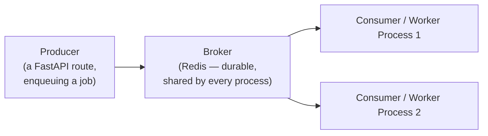

# Chapter 22: Task Queues and Distributed Processing

> Part III — Advanced: Production Engineering · Chapter 22 of 28

Chapter 13 named three specific gaps in `BackgroundTasks` and left all three open: no durability (a crashed process loses the task entirely), no retries (one failure is final), and no correctness across multiple workers (Exercise 13.4's `jobs_db` living in one process's memory, invisible to every other worker). This chapter closes all three, replacing `BackgroundTasks` with ARQ — a real, Redis-backed task queue — and closes out Part III.

## Learning Objectives

By the end of this chapter you will be able to:

- Explain, precisely, why `BackgroundTasks` cannot provide durability, retries, or multi-worker correctness, and what architectural change actually fixes each.
- Explain the producer/broker/consumer model underlying every real task queue, and where FastAPI, Redis, and a worker process each sit in it.
- Choose between ARQ and Celery for a given project, and explain why this curriculum's existing async-and-Redis investment makes ARQ the natural fit.
- Implement retries with exponential backoff for a task that fails transiently.
- Implement a dead-letter pattern so a task that exhausts every retry is recorded for follow-up, not silently lost.

---

## 22.1 Why `BackgroundTasks` Breaks Down, Formalized

Three specific, previously-demonstrated failures, restated as requirements a real solution must satisfy:

1. **Durability** (Chapter 13.1, 13.2): a queued task exists only as an in-memory callback in the process that queued it. A crash or restart before it runs loses it completely, with no record it was ever supposed to happen.
2. **Retries** (Chapter 13.2): a task that fails gets exactly one attempt. There is no built-in mechanism to try again.
3. **Multi-worker correctness** (Chapter 13's Exercise 13.4): job state (Chapter 13's `jobs_db`) lived in one worker's memory. A different worker handling a later poll request has no way to see it — a `job_id` created on worker 2 is invisible to worker 3.

The fix for all three is the same architectural change: **move the task's existence and state out of any single web-server process's memory, into something durable and shared, and execute the task in a genuinely separate process** — not a callback squeezed in after a response, but a real worker, running independently, pulling work from a shared, durable queue.

## 22.2 Producer, Broker, Consumer

Every real task queue has the same three roles:



The **producer** is a FastAPI route, enqueuing a job description (which function, with what arguments) into the **broker** — Redis, in this chapter, playing a genuinely different role than it did in Chapter 19 (caching) and Chapter 20 (nothing) — here it's the durable, shared record of "what work needs doing," surviving any single process's crash or restart, and visible to every process connected to it, web servers and workers alike. The **consumer** — a worker process, started and run entirely separately from your Uvicorn/FastAPI process — pulls jobs from the broker and actually executes them. This is the concrete fix for the multi-worker problem: job state lives in Redis, not in worker 2's or worker 3's memory, so it doesn't matter which web-server process handled the original enqueue or which one handles a later status poll — both talk to the same shared broker.

## 22.3 Choosing a Tool: ARQ vs. Celery

**Celery** is the older, far more battle-tested option — broad backend support (Redis, RabbitMQ, others), rich features (complex multi-step workflows, scheduled/periodic tasks), and genuinely common in production Python systems, worth recognizing by name and reputation even if you don't reach for it here. Its core design, though, is fundamentally **synchronous** — async support exists but is layered on afterward, somewhat awkwardly, rather than being the foundation.

**ARQ** is lighter, built on `asyncio` from the ground up, and Redis-only. For a project that has been all-in on async and Redis since Chapter 9 (async SQLAlchemy) and Chapter 19 (Redis caching and rate limiting), ARQ is the more natural fit — task functions are `async def`, integrating directly with the same event-loop-based model every other chapter has used, without introducing a sync-first tool's own threading model into an otherwise fully async codebase. This chapter builds with ARQ for exactly that reason; Celery remains the right choice for many real production systems, particularly ones with more complex workflow orchestration needs than this curriculum's examples require.

## 22.4 Retries with Exponential Backoff

A naive retry — fail, immediately try again — can make a transient failure *worse*: if a downstream service is struggling (briefly overloaded, restarting), hammering it again immediately, repeatedly, across every failed task, adds load to something already failing. **Exponential backoff** — waiting progressively longer between attempts (1s, then 2s, then 4s, then 8s...) — gives a genuinely transient problem realistic time to resolve before the next attempt, rather than attacking it repeatedly at the worst possible moment.

```python
from arq.jobs import Retry

async def send_welcome_email(ctx, email: str, username: str) -> None:
    try:
        # ...real email-sending logic...
        pass
    except ConnectionError as exc:
        attempt = ctx["job_try"]
        if attempt >= 3:
            raise   # exhausted retries — let it fail for good; section 22.5 handles this
        backoff_seconds = 2 ** attempt   # 2s, 4s, 8s...
        raise Retry(defer=backoff_seconds) from exc
```

`ctx["job_try"]` — a value ARQ provides to every task, tracking which attempt this is — is what makes backoff *and* an eventual, deliberate stop possible: without it, a task has no way to know "this is attempt 3 of 3, stop retrying," and would either retry forever or need some other external bookkeeping to know when to give up.

## 22.5 Dead-Letter Patterns: Failing Loudly, Not Silently

A task that exhausts every retry attempt has genuinely, permanently failed — and Chapter 13.4's core lesson still applies here without modification: **a failure with no record anywhere is worse than a failure someone can see and act on.** A **dead-letter** pattern records permanently-failed tasks — their original arguments and the final error — somewhere durable and reviewable, rather than letting the exception simply vanish once ARQ gives up retrying:

```python
# worker.py
async def send_welcome_email(ctx, email: str, username: str) -> None:
    try:
        # ...email logic, with retry-on-failure as in section 22.4...
        pass
    except ConnectionError as exc:
        attempt = ctx["job_try"]
        if attempt >= 3:
            await record_dead_letter(
                job_id=ctx["job_id"], function_name="send_welcome_email",
                args={"email": email, "username": username}, error=str(exc),
            )
            raise
        raise Retry(defer=2 ** attempt) from exc
```

```python
async def record_dead_letter(job_id: str, function_name: str, args: dict, error: str) -> None:
    async with async_session_maker() as session:
        session.add(DeadLetterTable(
            job_id=job_id, function_name=function_name,
            args=json.dumps(args), error=error, failed_at=datetime.utcnow(),
        ))
        await session.commit()
```

A permanently failed welcome email is now a row in a `dead_letters` table, not a vanished exception — an operator (or an automated alert watching that table) can see exactly which emails failed to send, to whom, and why, and decide whether to manually retry, investigate a broader outage, or simply accept the loss for a genuinely non-critical notification — a decision made deliberately, with real information, rather than by default, silently.

---

## Hands-On Project: Replacing `BackgroundTasks` with ARQ

### Step 1 — Install and configure

```bash
uv pip install arq
```

```python
# worker.py
import logging
from arq.connections import RedisSettings
from arq.jobs import Retry
import asyncio

logger = logging.getLogger("app.worker")


async def send_welcome_email(ctx, email: str, username: str) -> None:
    try:
        logger.info(f"Attempt {ctx['job_try']}: sending welcome email to {email}")
        # ...real email-provider call would go here...
    except ConnectionError as exc:
        attempt = ctx["job_try"]
        if attempt >= 3:
            await record_dead_letter(ctx["job_id"], "send_welcome_email", {"email": email, "username": username}, str(exc))
            raise
        raise Retry(defer=2 ** attempt) from exc


async def generate_report(ctx, product_count: int) -> dict:
    logger.info(f"Generating report for job {ctx['job_id']}")
    await asyncio.sleep(5)
    return {"summary": f"Report covering {product_count} products"}


class WorkerSettings:
    functions = [send_welcome_email, generate_report]
    redis_settings = RedisSettings(host="localhost", port=6379)
    max_tries = 3
```

Run the worker as a genuinely separate process from your FastAPI app:

```bash
arq worker.WorkerSettings
```

### Step 2 — Enqueue from FastAPI routes instead of `BackgroundTasks`

```python
# arq_pool.py
from arq import create_pool
from arq.connections import RedisSettings

_pool = None

async def get_arq_pool():
    global _pool
    if _pool is None:
        _pool = await create_pool(RedisSettings(host="localhost", port=6379))
    return _pool
```

```python
# routers/v1/auth.py
from arq_pool import get_arq_pool

@router.post("/signup", response_model=UserPublic, status_code=201)
async def signup(user_in: UserCreate, session: SessionDep):
    # ...existing user-creation logic, unchanged...
    pool = await get_arq_pool()
    await pool.enqueue_job("send_welcome_email", f"{user.username}@example.com", user.username)
    return user
```

```python
# routers/v1/reports.py
@router.post("/", status_code=202)
async def create_report(pool=Depends(get_arq_pool)):
    job = await pool.enqueue_job("generate_report", product_count=42)
    return {"job_id": job.job_id, "status": "pending"}

@router.get("/{job_id}")
async def get_report_status(job_id: str, pool=Depends(get_arq_pool)):
    job_status = await pool.job_status_by_id(job_id)   # consult ARQ's current API for the exact call shape
    if job_status == "complete":
        result = await pool.job_result_by_id(job_id)
        return {"job_id": job_id, "status": "complete", "result": result}
    return {"job_id": job_id, "status": job_status}
```

### Step 3 — Confirm the multi-worker problem is actually fixed

Start your FastAPI app with multiple Uvicorn workers (`fastapi run --workers 4`, or simulate it with two separate processes on different ports behind a simple proxy). `POST /reports` against one, then poll `GET /reports/{job_id}` and deliberately target a *different* worker for the poll than the one that handled the original `POST`. Confirm it correctly returns the job's real status, regardless of which worker handles which request — Exercise 13.4's documented failure, now genuinely fixed, because job state lives in Redis rather than in either worker's own memory.

---

## Practice Exercises

**Exercise 22.1 — Exponential backoff on a different, deliberately flaky task.**
Modify `generate_report` to fail roughly half the time (a random check, simulating a flaky downstream dependency it depends on), and add the same retry-with-backoff pattern from section 22.4, with `max_tries = 4`. Run it several times and observe, via your worker's logs, the increasing delay between attempts (`ctx["job_try"]` incrementing, backoff roughly doubling each time) until it eventually succeeds or exhausts its retries.

**Exercise 22.2 — A dead-letter review endpoint.**
Add a `DeadLetterTable` (SQLModel) and a `GET /admin/dead-letters` endpoint on Chapter 18's mounted admin sub-application, listing every permanently-failed task recorded via `record_dead_letter`. Deliberately exhaust `send_welcome_email`'s retries (force every attempt to fail) and confirm the resulting dead-letter entry appears correctly in this endpoint's output.

**Exercise 22.3 — Benchmark `BackgroundTasks` vs. ARQ under load.**
Fire 50 rapid signups (each triggering a welcome-email task) against two versions of your signup endpoint — one using Chapter 13's `BackgroundTasks`, one using this chapter's ARQ enqueue — and measure each signup request's *own* response latency as the number of concurrent signups grows. Explain, using Chapter 13.1's explanation of what `BackgroundTasks` actually is (same process, same event loop), why the `BackgroundTasks` version's request latency is more likely to degrade under heavy background load than the ARQ version's, whose task execution happens in an entirely separate process.

**Exercise 22.4 — Verify idempotency survives real retries.**
Apply Chapter 13's Exercise 13.5 idempotency guard (skip work if a job's result is already recorded as complete) to `generate_report`, now running under ARQ's *real* retry mechanism rather than a hypothetical. Force a failure partway through a report generation (after some, but not all, of its work is "done" — simulate with a flag), let ARQ retry it, and confirm the retried attempt doesn't redundantly redo work whose result was already durably recorded.

**Exercise 22.5 (stretch) — Add jitter to backoff.**
Modify the backoff calculation to add a small random jitter (e.g., `2 ** attempt + random.uniform(0, 1)`) rather than a purely deterministic delay. Explain, in a scenario where *many* tasks fail at roughly the same moment (a downstream outage affecting a batch of queued emails simultaneously), why pure exponential backoff without jitter can cause all of them to retry at the exact same moments repeatedly, and how jitter spreads that out.

---

## Solutions & Discussion

<details>
<summary>Exercise 22.1</summary>

```python
import random

async def generate_report(ctx, product_count: int) -> dict:
    if random.random() < 0.5:
        attempt = ctx["job_try"]
        if attempt >= 4:
            await record_dead_letter(ctx["job_id"], "generate_report", {"product_count": product_count}, "simulated flaky failure")
            raise RuntimeError("generate_report failed permanently after 4 attempts")
        raise Retry(defer=2 ** attempt)
    await asyncio.sleep(5)
    return {"summary": f"Report covering {product_count} products"}
```

Across several runs, worker logs show attempts spaced roughly 2s, 4s, 8s apart (rounding aside) whenever a retry is needed, with `ctx["job_try"]` incrementing each time — directly observable evidence of the backoff schedule actually being followed, rather than a naive immediate-retry loop hammering the (simulated) flaky dependency repeatedly with no pause at all.
</details>

<details>
<summary>Exercise 22.2</summary>

```python
class DeadLetterTable(SQLModel, table=True):
    __tablename__ = "dead_letters"
    id: int | None = Field(default=None, primary_key=True)
    job_id: str
    function_name: str
    args: str
    error: str
    failed_at: datetime
```

```python
# admin/app.py
@admin_app.get("/dead-letters")
async def list_dead_letters(session: SessionDep):
    result = await session.execute(select(DeadLetterTable).order_by(DeadLetterTable.failed_at.desc()))
    return result.scalars().all()
```

After deliberately forcing every attempt of `send_welcome_email` to fail (e.g., temporarily hardcoding the `ConnectionError` to always raise), `GET /admin/dead-letters` (reachable at `/admin/dead-letters` per Chapter 18's mounting) shows exactly one entry, with `function_name="send_welcome_email"`, the original `email`/`username` arguments, and the final error message — confirming the dead-letter path captures genuinely actionable detail, not just "something failed."
</details>

<details>
<summary>Exercise 22.3</summary>

Expect the `BackgroundTasks` version's individual signup response latency to noticeably increase as concurrent signup volume grows — because every queued welcome-email task runs in the *same* process, competing for the same thread pool (Chapter 13.1) that's also handling every other concurrent HTTP request on that worker; enough queued background work can genuinely start slowing down request handling on the same process. The ARQ version's signup response latency should stay comparatively flat regardless of how many emails are queued, because `pool.enqueue_job(...)` only needs to write one small message to Redis — a fast, constant-time operation — before returning; the actual (potentially slow) work of sending each email happens entirely inside the separate worker process, with zero competition for the web server's own resources. This is the concrete, measurable version of section 22.1's architectural claim: moving execution to a genuinely separate process isn't just a durability fix, it's also a request-latency isolation fix.
</details>

<details>
<summary>Exercise 22.4</summary>

```python
async def generate_report(ctx, job_id: str, product_count: int) -> dict:
    existing = await get_report_result(job_id)
    if existing is not None:
        logger.info(f"Job {job_id} already has a recorded result — skipping redundant work")
        return existing

    # ...(simulate partial completion, then a forced failure, then a retry)...
    result = {"summary": f"Report covering {product_count} products"}
    await save_report_result(job_id, result)
    return result
```

With the idempotency guard in place, forcing a failure after partial work completes but before the final result is saved, followed by an ARQ-driven retry, results in the retried attempt either safely redoing the (idempotent, side-effect-free) work from scratch or — if a result was already durably saved before the simulated failure point — returning the existing result immediately without recomputation. Without the guard, the same retry scenario would silently redo work whose earlier partial completion was never checked for, exactly the risk Chapter 13.5 raised hypothetically and this exercise now confirms concretely, under ARQ's real retry mechanism rather than an imagined one.
</details>

<details>
<summary>Exercise 22.5</summary>

Without jitter, if ten queued email tasks all fail simultaneously (a shared downstream outage), all ten compute the *exact same* backoff delay (`2 ** attempt`) and therefore all retry at the *exact same* moment — and if the outage hasn't resolved by then, all ten fail again, simultaneously, and retry again at the next identical moment, repeating in lockstep indefinitely. This synchronized retry pattern can itself become a mini "thundering herd" against the recovering downstream service, arriving all at once repeatedively rather than spread out. Adding jitter (`2 ** attempt + random.uniform(0, 1)`) spreads those ten retries across a small random window instead of one single instant, meaningfully reducing the odds that a recovering downstream dependency gets hit by every failed task's retry attempt simultaneously, over and over, in a synchronized rhythm.
</details>

---

## Chapter Summary

- `BackgroundTasks`' three gaps — no durability, no retries, no multi-worker correctness — all trace back to one root cause: task state lives in a single process's memory. A real task queue fixes all three by moving that state into a shared, durable broker (Redis) and executing tasks in a genuinely separate worker process.
- The producer/broker/consumer model is universal across task queues — FastAPI enqueues, Redis durably holds the job, an independent worker process executes it.
- ARQ's async-native design fits this curriculum's existing async-and-Redis investment more naturally than Celery's sync-first design, though Celery remains a mature, extremely common production choice worth recognizing.
- Exponential backoff (with optional jitter) gives transient failures realistic time to resolve, rather than hammering a struggling dependency with immediate, repeated, potentially-synchronized retries.
- A dead-letter pattern ensures a task that exhausts every retry is recorded for follow-up — restating Chapter 13's core lesson in a context where it finally has a durable, systematic answer instead of just a logged warning.

**This closes Part III.** The application is now layered, versioned, cached, rate-limited, observable, hardened against its own historical BOLA bug, and backed by a real task queue rather than an in-process stopgap. Part IV begins in Chapter 23 with serving machine learning models through FastAPI — the first of six chapters (through the Chapter 28 capstone) covering deployment, containerization, CI/CD, microservices, and alternative API styles.
