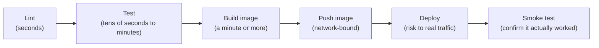

# Chapter 25: CI/CD for FastAPI Services

> Part IV — Deployment & Production Systems · Chapter 25 of 28

Every verification this curriculum has built — Chapter 15's test suite, Chapter 18's layering check, Chapter 24's Docker build — has been run by hand so far. This chapter automates all of it into one pipeline: lint, test, build, push, deploy, and a post-deploy smoke test, gated so that bad code never reaches a later, more expensive or riskier stage.

## Learning Objectives

By the end of this chapter you will be able to:

- Design a CI/CD pipeline ordered by cost and speed — cheap, fast checks first, expensive or risky steps last.
- Configure `ruff` for linting and formatting, and run it as a required CI gate.
- Run Chapter 15's test suite in CI, including a real Redis service container for anything that genuinely needs one.
- Build and push a tagged Docker image, and explain why tagging by commit SHA matters.
- Explain the difference between rolling and blue/green deploys, and write a post-deploy smoke test that actually verifies a deployment succeeded.

---

## 25.1 Pipeline Shape: Ordered by Cost

A CI/CD pipeline is a sequence of gates, each one stopping the pipeline entirely if it fails — and the order those gates run in should be deliberate, not incidental:



**Cheapest and fastest checks run first.** A linting error is detected in seconds — there's no reason to wait for a multi-minute test suite to run before telling a contributor about a formatting mistake `ruff` would have caught immediately. Each stage is a genuine gate: a lint failure stops the pipeline before tests even start; a test failure stops it before an image is ever built; a failed build never gets pushed; a failed push never gets deployed; and — the stage most pipelines skip, to their detriment — **a deploy that "succeeded" from the deployment tool's point of view but doesn't actually respond correctly should still be treated as a failure**, which is exactly what section 25.6's smoke test exists to catch.

## 25.2 `ruff`: Linting and Formatting

`ruff`, mentioned as this curriculum's tooling baseline since Chapter 1, replaces what used to be several separate tools (`flake8` for linting, `black` for formatting, `isort` for import sorting) with one fast, Rust-based tool covering all three:

```toml
# pyproject.toml
[tool.ruff]
line-length = 100
target-version = "py313"

[tool.ruff.lint]
select = ["E", "F", "I", "UP"]   # pycodestyle errors, pyflakes, import sorting, pyupgrade
```

```bash
uv run ruff check .          # lint
uv run ruff format --check .  # confirm formatting, without modifying files
```

`ruff format --check` (rather than plain `ruff format`) is the correct invocation for CI specifically — it reports whether formatting is already correct without silently rewriting files in a pipeline run, where you want a clear pass/fail signal, not files quietly changed underneath a build that already checked out a specific commit.

## 25.3 Running Chapter 15's Test Suite in CI

Chapter 15's deliberate design choice — an isolated, in-memory SQLite database per test, created fresh via fixtures — pays off directly here: the bulk of that test suite needs **no external services at all** to run in CI, which means a CI job for it can be minimal and fast. Anything genuinely testing Redis-dependent behavior (Chapter 19's caching, rate limiting), though, needs a real Redis instance — GitHub Actions' `services:` key spins up a container alongside your test job for exactly this:

```yaml
test:
  runs-on: ubuntu-latest
  services:
    redis:
      image: redis:7-alpine
      ports:
        - 6379:6379
      options: >-
        --health-cmd "redis-cli ping"
        --health-interval 10s
        --health-retries 5
  steps:
    - uses: actions/checkout@v4
    - uses: astral-sh/setup-uv@v3
    - run: uv sync --frozen
    - run: uv run pytest -v
      env:
        REDIS_URL: redis://localhost:6379/0
        SECRET_KEY: test-secret-key-not-for-production
```

Note `SECRET_KEY` supplied directly as a plain, clearly-fake CI environment variable — appropriate here specifically because it's a value used only within an ephemeral, isolated CI test run, never a real production secret; Chapter 21's "never hardcode secrets" guidance is about *real* credentials, not throwaway values scoped to a single automated test job.

## 25.4 Building and Pushing the Image

```yaml
build-and-push:
  runs-on: ubuntu-latest
  needs: [test, architecture-check]
  if: github.ref == 'refs/heads/main'
  steps:
    - uses: actions/checkout@v4
    - uses: docker/login-action@v3
      with:
        registry: ghcr.io
        username: ${{ github.actor }}
        password: ${{ secrets.GITHUB_TOKEN }}
    - uses: docker/build-push-action@v5
      with:
        context: .
        push: true
        tags: |
          ghcr.io/${{ github.repository }}:${{ github.sha }}
          ghcr.io/${{ github.repository }}:latest
```

**Tagging by commit SHA (`${{ github.sha }}`), in addition to a floating tag like `latest`, matters concretely**: `latest` always points at whatever was most recently pushed, telling you nothing about *which* commit produced it once a few more pushes have happened — the SHA-tagged image gives you exact, permanent traceability: given any running container, you can always identify precisely which commit built it, essential the moment you need to debug a production issue or roll back to a known-good version with certainty rather than a guess.

## 25.5 Rolling vs. Blue/Green Deploys

A **rolling deploy** replaces old instances with new ones gradually, a few at a time — capacity never drops to zero, but there's a real window where *both* old and new versions serve traffic simultaneously. This is fine for a backward-compatible change (Chapter 18's versioning approach — `/v1` untouched, `/v2` added alongside it — is specifically designed to make this window safe, since old and new code genuinely coexist correctly). It's a real risk for a change that isn't backward-compatible in some subtle way nobody accounted for.

A **blue/green deploy** runs a complete second environment ("green") fully alongside the current one ("blue"), verifies it, then cuts traffic over all at once — no mixed-version window at all, and the old ("blue") environment stays available briefly for instant rollback if something's wrong. The cost: roughly double capacity, briefly, during the cutover.

Worth connecting directly back to Chapter 24: **FastAPI Cloud's zero-downtime deploys, with automatic rollback if a deployment appears broken, already implement a version of this pattern for you** — one of the concrete conveniences that platform's opinionated design provides, versus configuring rolling or blue/green behavior yourself on a self-managed platform.

## 25.6 Post-Deploy Smoke Tests

A deploy "succeeding" (the deployment tool reporting no error) and a deploy actually *working* are different claims. A **smoke test** — a small, fast check run immediately after deployment, hitting a real endpoint and confirming a real, correct response — is what actually verifies the second claim:

```yaml
smoke-test:
  runs-on: ubuntu-latest
  needs: deploy
  steps:
    - name: Hit /health and /ready post-deploy
      run: |
        for i in {1..10}; do
          if curl -sf https://your-deployed-url/health && curl -sf https://your-deployed-url/ready; then
            echo "Smoke test passed"
            exit 0
          fi
          echo "Waiting for deployment to become healthy... ($i/10)"
          sleep 5
        done
        echo "::error::Smoke test failed"
        exit 1
```

Retrying with a short delay accounts for a real, normal startup window (a fresh container taking a few seconds to finish `lifespan` startup) without waiting indefinitely — if it's still failing after a reasonable number of attempts, the deploy should be treated as failed, ideally triggering an alert or an automatic rollback, rather than silently leaving a broken deployment live and undetected.

---

## Hands-On Project: A Complete GitHub Actions Pipeline

```yaml
# .github/workflows/ci.yml
name: CI

on:
  push:
    branches: [main]
  pull_request:
    branches: [main]

jobs:
  lint:
    runs-on: ubuntu-latest
    steps:
      - uses: actions/checkout@v4
      - uses: astral-sh/setup-uv@v3
      - run: uv sync --frozen
      - run: uv run ruff check .
      - run: uv run ruff format --check .

  architecture-check:
    runs-on: ubuntu-latest
    needs: lint
    steps:
      - uses: actions/checkout@v4
      - name: Verify layering rule (Chapter 18)
        run: |
          if grep -rl "from fastapi" repositories/ services/ 2>/dev/null; then
            echo "::error::fastapi import found in repositories/ or services/ — layering violation"
            exit 1
          fi

  test:
    runs-on: ubuntu-latest
    needs: lint
    services:
      redis:
        image: redis:7-alpine
        ports: ["6379:6379"]
        options: >-
          --health-cmd "redis-cli ping" --health-interval 10s --health-retries 5
    steps:
      - uses: actions/checkout@v4
      - uses: astral-sh/setup-uv@v3
      - uses: actions/cache@v4
        with:
          path: ~/.cache/uv
          key: uv-${{ runner.os }}-${{ hashFiles('uv.lock') }}
      - run: uv sync --frozen
      - run: uv run pytest -v
        env:
          REDIS_URL: redis://localhost:6379/0
          SECRET_KEY: test-secret-key-not-for-production

  build-and-push:
    runs-on: ubuntu-latest
    needs: [test, architecture-check]
    if: github.ref == 'refs/heads/main'
    steps:
      - uses: actions/checkout@v4
      - uses: docker/login-action@v3
        with:
          registry: ghcr.io
          username: ${{ github.actor }}
          password: ${{ secrets.GITHUB_TOKEN }}
      - uses: docker/build-push-action@v5
        with:
          context: .
          push: true
          tags: |
            ghcr.io/${{ github.repository }}:${{ github.sha }}
            ghcr.io/${{ github.repository }}:latest

  deploy:
    runs-on: ubuntu-latest
    needs: build-and-push
    steps:
      - name: Deploy
        run: echo "Deploying ghcr.io/${{ github.repository }}:${{ github.sha }}"
        # a real step here: `fastapi deploy` (Ch. 24) or your platform's deploy command

  smoke-test:
    runs-on: ubuntu-latest
    needs: deploy
    steps:
      - name: Hit /health post-deploy
        run: |
          for i in {1..10}; do
            if curl -sf "${{ vars.DEPLOY_URL }}/health"; then exit 0; fi
            sleep 5
          done
          exit 1
```

Notice `build-and-push` depends on **both** `test` and `architecture-check` — Chapter 18's grep-based layering check (originally a local pytest) is now a genuine, independent CI gate, running in parallel with the test suite, and an image is only ever built once *both* have passed.

Push this to a repository and confirm: a deliberately broken test blocks `build-and-push` from ever running; a deliberate `from fastapi import ...` added to a `repositories/` file is caught by `architecture-check` independently of whether the tests themselves happen to pass.

---

## Practice Exercises

**Exercise 25.1 — Make `test` a required status check.**
In your repository's Settings → Branches → branch protection rules for `main`, enable "Require status checks to pass before merging" and select the `test` job specifically. Open a pull request with a deliberately failing test and confirm GitHub's UI blocks merging until it's fixed — a real, verified enforcement, not just a pipeline that runs but doesn't actually gate anything.

**Exercise 25.2 — Measure the dependency-cache speedup.**
Run the `test` job's pipeline once with the `actions/cache` step temporarily removed (a cold `uv sync` every time), and once with it restored. Compare total job duration for each. Report the difference in seconds and as a percentage.

**Exercise 25.3 — Extend the smoke test to check `/ready`, not just `/health`.**
Referencing Chapter 20.3's health-vs-readiness distinction directly: explain, in a sentence or two, a specific scenario where a smoke test checking only `/health` would report success on a deployment that is, in practice, completely broken for real users. Then update the smoke-test step to check both `/health` and `/ready`, failing the pipeline if either doesn't return success.

**Exercise 25.4 — Confirm `architecture-check` genuinely gates the build.**
Deliberately add `from fastapi import HTTPException` to one file under `repositories/`, push it, and confirm in your pipeline's run history that `architecture-check` fails and `build-and-push` never runs at all (rather than running and simply also failing) — checking the *dependency graph* actually prevented wasted work, not just that a failure was eventually reported somewhere.

**Exercise 25.5 (stretch) — Reason through rolling vs. blue/green for a real breaking change.**
Imagine Chapter 18's `/v2/products/{id}` had, instead of being added alongside `/v1`, replaced `/v1`'s response shape entirely (a genuinely breaking change, not an additive one). Write two or three sentences explaining what could go wrong during a *rolling* deploy of this specific change (think about a client mid-session hitting old and new instances across consecutive requests) versus how a *blue/green* deploy would avoid that specific failure mode — and why Chapter 18's actual approach (additive versioning, `/v1` never touched) sidesteps needing to make this trade-off at all for most changes.

---

## Solutions & Discussion

<details>
<summary>Exercise 25.1</summary>

With the `test` status check required, a pull request containing a failing test shows a red "Required — test" indicator in GitHub's PR interface, and the "Merge" button is disabled entirely — not just discouraged, structurally blocked — until a subsequent push makes that check pass. This converts "the team is supposed to check tests pass before merging" (a social convention people occasionally forget under deadline pressure) into "GitHub will not let this merge regardless of anyone's intentions," a meaningfully stronger guarantee.
</details>

<details>
<summary>Exercise 25.2</summary>

Exact numbers depend on your dependency tree's size, but expect the cold-cache run to take noticeably longer — often several times longer for a project with a substantial set of dependencies, since every package must be freshly downloaded and installed rather than restored from a cache hit. Reporting a concrete before/after number (rather than just "caching helps") is the point of this exercise — matching this curriculum's general habit of measuring claims rather than trusting them by default.
</details>

<details>
<summary>Exercise 25.3</summary>

A concrete failure scenario: a new deployment's container starts successfully (the process is alive, `/health` returns `200` immediately) but its database connection string was misconfigured during this particular deploy — `/health` never touches the database at all (Chapter 20.3's whole point), so it reports healthy regardless, while every *real* request that actually needs the database fails outright. A smoke test checking only `/health` would report this deploy as successful, moments before real users start experiencing a completely broken application.

```yaml
- name: Hit /health and /ready post-deploy
  run: |
    for i in {1..10}; do
      if curl -sf "${{ vars.DEPLOY_URL }}/health" && curl -sf "${{ vars.DEPLOY_URL }}/ready"; then
        exit 0
      fi
      sleep 5
    done
    exit 1
```

Checking both catches exactly the failure mode `/health` alone is structurally incapable of catching — `/ready`'s real dependency checks (Chapter 20.3) are precisely what would fail in the misconfigured-database scenario above.
</details>

<details>
<summary>Exercise 25.4</summary>

Checking the pipeline's run history after pushing the violation shows `architecture-check` failing quickly (a plain `grep`, essentially instant), while `build-and-push` shows as **skipped**, not run-and-failed — GitHub Actions' `needs: [test, architecture-check]` dependency means a job only runs once every listed dependency has succeeded; if one fails, dependents are skipped outright. This confirms the gate is doing real work: the (comparatively expensive) Docker build step never executes at all for a commit that's already known to violate the layering rule, rather than wastefully running anyway and failing for a second, redundant reason.
</details>

<details>
<summary>Exercise 25.5</summary>

During a rolling deploy of a genuinely breaking `/v2`-style change applied *in place* of `/v1` (rather than Chapter 18's actual additive approach): a client mid-session could have its first request land on an already-upgraded instance (new response shape) and its very next request land on a not-yet-upgraded instance (old response shape) — inconsistent behavior across consecutive requests from the same client, potentially breaking a frontend that isn't expecting its API contract to change mid-session. A blue/green deploy avoids this specific failure mode because the cutover is effectively instantaneous from any single client's point of view — there's no meaningful window where some fraction of traffic hits the old shape and some hits the new one simultaneously, since traffic switches over as a single event rather than gradually across many individually-replaced instances.

Chapter 18's actual approach — `/v1` never modified, `/v2` added as a genuinely new, separate endpoint — sidesteps this entire trade-off for the vast majority of changes: since old and new versions are simply different endpoints being served *simultaneously and indefinitely* (not a transient rollout window that resolves itself), a rolling deploy of an additive version bump has no inconsistent-mid-session-behavior problem at all, because nothing about `/v1`'s contract ever changed underneath any client depending on it.
</details>

---

## Chapter Summary

- Pipeline stages should be ordered by cost — lint, then test, then build, then push, then deploy, then smoke test — so a cheap failure stops the pipeline before expensive or risky later stages ever run.
- `ruff check` and `ruff format --check` provide fast, comprehensive linting and formatting verification as an early, cheap CI gate.
- Chapter 15's isolated, in-memory test design means most tests need no external services in CI; anything genuinely testing Redis-backed behavior needs a real service container via GitHub Actions' `services:` key.
- Tagging built images by commit SHA, not just a floating tag like `latest`, provides exact traceability from any running container back to the exact commit that produced it.
- Rolling deploys risk a real mixed-old-and-new-version window; blue/green deploys avoid it at the cost of temporarily doubled capacity — Chapter 18's additive versioning approach sidesteps needing this trade-off for most changes by never actually breaking an existing contract in place.
- A post-deploy smoke test should check both `/health` and `/ready` (Chapter 20.3) — a deployment can report success and pass a liveness check while still being completely broken for real users if only liveness, not readiness, is verified.

**Next:** Chapter 26 covers microservices and multi-service architectures — service boundaries, service-to-service authentication, and the point at which this curriculum's single-service versioning and deployment story (Chapters 18, 24, 25) needs to become a multi-service one.
