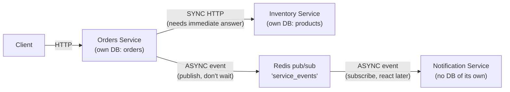

# Chapter 26: Microservices and Multi-Service Architectures

> Part IV — Deployment & Production Systems · Chapter 26 of 28

Every chapter so far has built one application, however well-layered internally (Chapter 18). This chapter is about the point at which "one application, layered well" stops being the right shape — splitting into genuinely separate services, each independently deployable, with their own data, communicating only over the network. This is a deliberate trade-off, not a strict upgrade, and this chapter is honest about the costs alongside the benefits.

## Learning Objectives

By the end of this chapter you will be able to:

- Explain "shared-nothing" service boundaries, and what a microservices split gives up that a well-layered monolith (Chapter 18) still has for free.
- Choose an appropriate service-to-service authentication mechanism, including why forwarding the original user's JWT matters for authorization, not just identifying which service is calling.
- Choose between synchronous HTTP and asynchronous event-driven communication for a given inter-service interaction, using a concrete rule rather than a vague preference.
- Build two services that communicate both ways — a synchronous call that needs an immediate answer, and an asynchronous event that doesn't.

---

## 26.1 Service Boundaries and What Shared-Nothing Actually Costs

Chapter 18 organized *one application* into routers, services, and repositories — internal structure, still one deployable unit, one database, one process (or set of identical worker processes). A **microservices** split goes further: instead of internal layers within one app, you have *multiple independently deployable applications*, each owning its own data store, communicating with each other only over the network, via a well-defined API contract — never by sharing a database, never by sharing in-memory state, never by importing each other's internal code directly. This is "shared-nothing" design.

The genuine benefits: **independent deployability** (an Orders team ships a change without coordinating a simultaneous deploy with the Inventory team), **independent scaling** (Orders might need ten replicas under load while Inventory needs two), and **fault isolation** (Inventory having a bad day doesn't necessarily have to take Orders down with it, if the boundary between them is designed with that resilience in mind — section 26.5's exercises test this directly).

**The genuine costs, stated as plainly as the benefits:** network calls are slower and meaningfully less reliable than in-process function calls — a call that would have been a guaranteed, near-instant Python function call inside one process is now a real network request that can time out, get dropped, or arrive out of order. **Distributed transactions become genuinely hard**: Chapter 10's `transfer_stock`, wrapped in one atomic `session.begin()` block, relied entirely on both halves of that operation living in the *same database*, under the *same transaction* — the moment "decrement source" and "increment destination" live in two separate services with two separate databases, there is no single transaction that can span both, and section 26.5 confronts exactly what that means when something fails partway through. And operationally, you now have two or more services, two or more deployments, two or more things that can each independently break — real complexity that a single well-layered application simply doesn't have to pay.

**This choice should be deliberate, not a default.** A well-layered monolith (Chapter 18) is frequently the *correct* answer for a team and workload that doesn't yet have a genuine, specific reason (an organizational scaling need, a workload with wildly different resource profiles across parts of the system — recall Chapter 23's GPU-bound inference service, which arguably *does* want its own independent scaling story) to pay microservices' real costs. Adopting this architecture before you need it is a well-documented, common mistake — paying real, ongoing complexity costs for benefits the project doesn't yet require.

## 26.2 Service-to-Service Authentication

Three real approaches, each solving a genuinely different aspect of "should this call be trusted":

- **Shared API keys** — the simplest option: each service holds a static secret the other recognizes, sent as a header (`X-API-Key`). Simple to implement, but the key needs rotation discipline, and a single compromised key grants broad access to whatever that key authorizes.
- **mTLS (mutual TLS)** — both sides present certificates, verified cryptographically at the transport layer. Strong, but operationally heavier — real certificate issuance and rotation infrastructure, often provided by a service mesh (Istio, Linkerd) rather than something you'd hand-roll.
- **JWT propagation** — forwarding (or re-issuing) the *original end user's* JWT (Chapter 11) as part of the service-to-service call, so the downstream service knows not just "a trusted service is calling me" but **on whose behalf**. This matters directly for Chapter 21's BOLA lesson: if the downstream operation is genuinely user-scoped (canceling *this specific user's* order, say), a downstream service trusting "Orders service says this is fine" without knowing *which user* Orders was acting for reintroduces exactly the ownership-checking gap Chapter 21 fixed within one service — just moved across a network boundary instead of eliminated.

This chapter's hands-on project combines the first and third: a shared API key establishes basic service identity (this call is genuinely coming from the Orders service, not an arbitrary caller), and — where an operation is genuinely user-scoped — the calling user's JWT is forwarded alongside it, so authorization decisions downstream still have the information they need.

## 26.3 The API Gateway Pattern, Briefly

Once there's more than one service, a common pattern places a single entry point — an **API gateway** — in front of all of them, handling cross-cutting concerns (authentication, rate limiting, routing each request to the correct backend service) in one place, rather than every individual service reimplementing them. Conceptually, this is Chapter 12's middleware, moved from "in front of one app" to "in front of many services" — real tools exist for this at scale (Kong, cloud-provider-native API gateways), and it's worth knowing the pattern exists even though this chapter's hands-on project, with just two services, doesn't need a dedicated gateway to stay manageable.

## 26.4 Synchronous HTTP vs. Asynchronous Events

**Synchronous HTTP**: one service calls another directly, over `httpx`, and *waits* for the response before proceeding. Simple to reason about — the call either succeeds (with a result you can use immediately) or fails, right there, in a way your code can react to on the spot. The cost: **temporal coupling** — both services must be up and responsive *right now*, simultaneously, for the calling operation to complete at all, and a slow downstream service directly makes the calling service slow too (a cascading-latency risk, distinct from but related to Chapter 19's caching motivations).

**Asynchronous events**: one service publishes a message describing something that happened ("an order was created") to a broker, and moves on immediately, without waiting for anything to consume or react to it. Whatever else needs to know about that event subscribes and reacts on its own schedule. This decouples the two services' uptime and latency from each other entirely — at the cost of **eventual, not immediate, consistency** (a subscriber might process the event a second later, or a minute later, under load) and generally harder reasoning about ordering and failure handling than a direct call's straightforward success-or-failure shape.

**The rule for choosing, concretely: if the calling service genuinely needs the result *right now* to decide what to do next, use synchronous HTTP; if the calling service just needs to notify something else that a fact now exists, and doesn't need to wait for any response to proceed with its own work, use an asynchronous event.** "Is there enough stock to confirm this order?" needs an answer *before* the order can be confirmed — synchronous. "A new order was just confirmed, and something else might want to know" doesn't block anything about confirming the order itself — asynchronous.

---

## Hands-On Project: Orders and Inventory, Communicating Both Ways

This chapter reframes the Products API this curriculum has built since Chapter 3 as the **Inventory Service**, and adds a new, minimal **Orders Service** alongside it.

### Step 1 — Inventory Service: a service-authenticated reservation endpoint

```python
# inventory_service/routers/products.py (addition)
from fastapi import Header, HTTPException, Depends
from config import settings

async def verify_service_api_key(x_api_key: str = Header(...)):
    if x_api_key != settings.orders_service_api_key:
        raise HTTPException(status_code=401, detail="Invalid service API key")

@router.post("/{product_id}/reserve", dependencies=[Depends(verify_service_api_key)])
async def reserve_product_stock(product_id: int, quantity: int, repo: ProductRepoDep):
    product = await repo.get_or_raise(product_id)
    if product.stock_qty < quantity:
        raise HTTPException(status_code=409, detail="Insufficient stock")
    await repo.update(product_id, {"stock_qty": product.stock_qty - quantity})
    return {"reserved": True}
```

### Step 2 — Orders Service: a synchronous call that needs an immediate answer

```python
# orders_service/clients/inventory_client.py
import httpx
from config import settings

class InventoryServiceError(Exception):
    pass

async def reserve_stock(product_id: int, quantity: int) -> bool:
    async with httpx.AsyncClient(timeout=5.0) as client:
        try:
            response = await client.post(
                f"{settings.inventory_service_url}/products/{product_id}/reserve",
                json={"quantity": quantity},
                headers={"X-API-Key": settings.inventory_service_api_key},
            )
        except httpx.RequestError as exc:
            raise InventoryServiceError(f"Inventory service unreachable: {exc}") from exc

    if response.status_code == 409:
        return False
    if response.status_code >= 400:
        raise InventoryServiceError(f"Inventory service error: {response.status_code}")
    return True
```

### Step 3 — An asynchronous event, published without waiting

```python
# orders_service/events.py
import json
from redis import asyncio as redis

redis_client = redis.from_url("redis://localhost:6379/2")

async def publish_event(event_type: str, payload: dict) -> None:
    await redis_client.publish("service_events", json.dumps({"type": event_type, "payload": payload}))
```

```python
# orders_service/routers/orders.py
from fastapi import APIRouter, HTTPException
from clients.inventory_client import reserve_stock, InventoryServiceError
from events import publish_event

router = APIRouter(prefix="/orders", tags=["orders"])

@router.post("/")
async def create_order(product_id: int, quantity: int, repo: OrderRepoDep):
    try:
        reserved = await reserve_stock(product_id, quantity)          # SYNC — needs an answer now
    except InventoryServiceError as exc:
        raise HTTPException(status_code=502, detail="Inventory service unavailable") from exc

    if not reserved:
        raise HTTPException(status_code=409, detail="Insufficient stock")

    order = await repo.create({"product_id": product_id, "quantity": quantity, "status": "confirmed"})

    await publish_event("order_created", {                              # ASYNC — fire and move on
        "order_id": order.id, "product_id": product_id, "quantity": quantity,
    })
    return order
```

### Step 4 — A third, independent subscriber

```python
# notification_service/subscriber.py
import asyncio, json
from redis import asyncio as redis

async def listen():
    client = redis.from_url("redis://localhost:6379/2")
    pubsub = client.pubsub()
    await pubsub.subscribe("service_events")
    async for message in pubsub.listen():
        if message["type"] == "message":
            event = json.loads(message["data"])
            if event["type"] == "order_created":
                print(f"Notify: order {event['payload']['order_id']} confirmed")

asyncio.run(listen())
```

Run all three (Inventory, Orders, the subscriber) and place an order. Confirm: the `POST /orders` call genuinely waits on the Inventory reservation (try it against a product with zero stock and confirm a `409`), and the notification subscriber prints its message shortly after, without `POST /orders` itself waiting for that to happen — the response to the client returns as soon as the order is confirmed, regardless of whether the notification subscriber is even running at all.

---

## Practice Exercises

**Exercise 26.1 — A circuit breaker for the Inventory call.**
Extend `reserve_stock` with a simple circuit-breaker: track recent failures (a count, in a module-level variable or Redis), and if Inventory has failed more than N times within the last W seconds, **skip calling it entirely** for a cooldown period, failing fast with a clear error immediately rather than waiting out a full timeout against a service you already have strong evidence is down. Explain, in a sentence or two, how this differs from — and complements — Chapter 22's retry-with-backoff (hint: retrying assumes the call is worth attempting again; a circuit breaker is about recognizing when it very likely isn't, yet).

**Exercise 26.2 — Convert the stock check itself to async, and reason about the consequence.**
Redesign `create_order` so that instead of synchronously reserving stock before confirming the order, it optimistically creates the order immediately and publishes an `order_placed` event for Inventory to process asynchronously — with a *compensating* event (`order_cancelled_insufficient_stock`) published back if Inventory later determines stock was actually insufficient. Implement this alternate flow, and write a short paragraph on what got harder (hint: the client's `POST /orders` response can no longer say "confirmed" — what *can* it honestly say now?) versus what got more resilient (Orders no longer needs Inventory to be up at all to accept a new order).

**Exercise 26.3 — Document the actual service architecture you built.**
Draw a Mermaid diagram of the real three-part system (Orders, Inventory, the notification subscriber) you built in this chapter's hands-on project — every arrow labeled with whether it's a synchronous HTTP call or an asynchronous event, and each service's own data store shown separately, reinforcing the shared-nothing boundary from section 26.1.

**Exercise 26.4 — Propagate the user's JWT for a genuinely user-scoped operation.**
Add a `POST /orders/{order_id}/cancel` endpoint that must verify the *same user* who created the order is the one cancelling it. Since this check needs to happen with information about who the original order belonged to, ensure the Orders service itself performs this check directly (it already knows both the order's owner and, via the incoming request's JWT, who's asking) — but for a variant where a *downstream* service also needed to make a user-scoped decision, describe how you'd forward the calling user's JWT (not just the service API key) to that downstream call, and why relying on the API key alone would be insufficient for that case (tying back to Chapter 21's BOLA lesson, now across a service boundary).

**Exercise 26.5 (stretch) — The lost-response problem, and idempotency keys.**
Simulate a network partition: have Inventory's `/reserve` endpoint successfully decrement stock but then deliberately delay or drop its response (e.g., `await asyncio.sleep(10)` after already committing the stock change, with Orders' `httpx` timeout set to 3 seconds). From Orders' point of view, the call *timed out* — but the reservation may have actually succeeded. If Orders naively retries on timeout, what could go wrong? Implement an idempotency key (a UUID generated once per logical order-creation attempt, sent with every retry of the *same* logical request, checked and deduplicated on Inventory's side before decrementing stock again) and explain how it prevents a retried, already-succeeded reservation from being applied twice.

---

## Solutions & Discussion

<details>
<summary>Exercise 26.1</summary>

```python
import time

_failure_times: list[float] = []
FAILURE_THRESHOLD = 5
WINDOW_SECONDS = 30
COOLDOWN_SECONDS = 15
_circuit_opened_at: float | None = None

async def reserve_stock(product_id: int, quantity: int) -> bool:
    global _circuit_opened_at
    now = time.time()

    if _circuit_opened_at is not None:
        if now - _circuit_opened_at < COOLDOWN_SECONDS:
            raise InventoryServiceError("Circuit open — Inventory service assumed down, failing fast")
        _circuit_opened_at = None   # cooldown elapsed — allow one attempt through

    try:
        result = await _do_reserve_stock_call(product_id, quantity)
        _failure_times.clear()   # a success resets the failure count
        return result
    except InventoryServiceError:
        _failure_times.append(now)
        recent = [t for t in _failure_times if now - t < WINDOW_SECONDS]
        if len(recent) >= FAILURE_THRESHOLD:
            _circuit_opened_at = now
        raise
```

A circuit breaker and a retry policy solve genuinely different problems: retrying assumes *this specific attempt* might just be a one-off blip, worth trying again, possibly with backoff. A circuit breaker tracks a *pattern* across many attempts and, once that pattern strongly suggests the downstream service is systemically down (not just unlucky once), stops even *attempting* calls for a while — sparing both services the wasted cost of repeatedly waiting out full timeouts against something that isn't going to succeed anytime soon. In practice, the two compose: retry a handful of times with backoff for transient blips; if failures keep accumulating past that, open the circuit and stop trying altogether until the cooldown elapses.
</details>

<details>
<summary>Exercise 26.2</summary>

```python
@router.post("/")
async def create_order_optimistic(product_id: int, quantity: int, repo: OrderRepoDep):
    order = await repo.create({"product_id": product_id, "quantity": quantity, "status": "pending_stock_check"})
    await publish_event("order_placed", {"order_id": order.id, "product_id": product_id, "quantity": quantity})
    return order   # status is "pending_stock_check" — NOT "confirmed"
```

What got harder: the client's response can no longer honestly say "confirmed" — it has to say something like `"pending_stock_check"`, and the client needs a way to find out the *actual* outcome later (polling, Chapter 17's WebSocket push, or a follow-up notification) — you've reintroduced exactly Chapter 13's "accept now, resolve later" pattern, at the service-to-service level this time. The order might also need to be cancelled automatically (a compensating action) if Inventory later determines stock was actually insufficient — logic that didn't need to exist at all in the synchronous version, where insufficient stock was caught and reported immediately, before the order was ever created in a "confirmed"-looking state.

What got more resilient: Orders can accept new orders even if Inventory is completely down at that exact moment — the order simply sits in `"pending_stock_check"` until Inventory processes the event whenever it recovers, rather than Orders itself failing outright because a downstream dependency wasn't reachable. This is the real trade-off section 26.4 named in the abstract, now felt concretely: better resilience to Inventory's downtime, at the cost of a genuinely more complex state machine and a client-facing contract that can no longer promise an immediate, definite answer.
</details>

<details>
<summary>Exercise 26.3</summary>



Each service's own data store is drawn separately and explicitly — no shared database anywhere in this diagram — reinforcing section 26.1's shared-nothing boundary as something visibly true of the actual system, not just a principle stated in prose.
</details>

<details>
<summary>Exercise 26.4</summary>

```python
@router.post("/{order_id}/cancel")
async def cancel_order(order_id: int, current_user: CurrentUserDep, repo: OrderRepoDep):
    order = await repo.get_owned_or_raise(order_id, owner_id=current_user.id)   # Chapter 21's pattern, unchanged
    await repo.update(order_id, {"status": "cancelled"})
    return order
```

Since Orders itself already has both the order's `owner_id` and, via the incoming request's own JWT (Chapter 11), the identity of whoever is asking, this particular check needs no service-to-service propagation at all — it's a single-service BOLA check, identical in shape to Chapter 21.2's original fix.

For a genuinely different scenario — say, Orders needing to ask a hypothetical "Loyalty Points" service to deduct points specifically from *this* user's balance as part of the cancellation — relying on the Orders→Loyalty API key alone would tell Loyalty only "a trusted service is asking for a deduction," with no information about *which* user's points to actually deduct, or whether the original request was even legitimately authorized for that specific user in the first place. Forwarding the original user's JWT alongside the service API key gives Loyalty what it actually needs: cryptographic assurance of *which* user this deduction is genuinely on behalf of, letting Loyalty perform its own ownership check (deduct from *this* JWT's subject's balance, not just "whichever balance Orders says") rather than blindly trusting an intermediary service's say-so about a decision that's ultimately about one specific end user's data.
</details>

<details>
<summary>Exercise 26.5</summary>

Naive retry-on-timeout risk: Orders doesn't actually know whether Inventory's stock decrement succeeded before the response was lost — from Orders' point of view, a timeout is genuinely ambiguous between "it never happened" and "it happened, but I never found out." A naive retry, resending the identical reservation request, risks Inventory decrementing stock a *second* time for what was really only one logical order — a duplicate deduction, silently, with no error anywhere to indicate it happened.

```python
import uuid

# Orders side — generated ONCE per logical order attempt, reused across every retry of it
idempotency_key = str(uuid.uuid4())

async def reserve_stock_with_key(product_id: int, quantity: int, idempotency_key: str) -> bool:
    async with httpx.AsyncClient(timeout=3.0) as client:
        response = await client.post(
            f"{settings.inventory_service_url}/products/{product_id}/reserve",
            json={"quantity": quantity},
            headers={"X-API-Key": settings.inventory_service_api_key, "Idempotency-Key": idempotency_key},
        )
    return response.status_code < 400
```

```python
# Inventory side
processed_keys: dict[str, dict] = {}   # in a real system: a persisted table, not an in-memory dict

@router.post("/{product_id}/reserve")
async def reserve_product_stock(product_id: int, quantity: int, idempotency_key: str = Header(..., alias="Idempotency-Key"), repo: ProductRepoDep = ...):
    if idempotency_key in processed_keys:
        return processed_keys[idempotency_key]   # already handled — return the SAME result, don't redo the deduction

    product = await repo.get_or_raise(product_id)
    if product.stock_qty < quantity:
        raise HTTPException(status_code=409, detail="Insufficient stock")
    await repo.update(product_id, {"stock_qty": product.stock_qty - quantity})
    result = {"reserved": True}
    processed_keys[idempotency_key] = result
    return result
```

With the idempotency key, a retried request carrying the *same* key as the original (lost-response) attempt is recognized by Inventory as "I've already handled this exact logical request" — it returns the previously-computed result without touching `stock_qty` a second time, regardless of how many times Orders retries after a timeout. This is the concrete, cross-service mechanism that makes retries *safe* in the presence of genuinely ambiguous "did that actually happen or not" failures — directly generalizing Chapter 13 and Chapter 22's idempotency lessons from a single service's background tasks to a real network boundary between two independently-failing services, where "did my last request actually succeed" is a question you frequently cannot answer with certainty, only design around safely.
</details>

---

## Chapter Summary

- Microservices trade a well-layered monolith's simplicity (Chapter 18) for independent deployability, scaling, and fault isolation — at real costs: slower/less reliable network calls, genuinely hard distributed transactions (no single atomic operation can span two services' separate databases), and more operational surface area. This should be a deliberate choice driven by a genuine need, not a default upgrade path.
- Service-to-service auth via API keys establishes basic service identity; forwarding the original user's JWT is what lets a downstream service make correct, user-scoped authorization decisions (Chapter 21's BOLA lesson, now across a network boundary) rather than blindly trusting an intermediary's say-so.
- Choose synchronous HTTP when the calling service genuinely needs an answer right now to proceed; choose an asynchronous event when it just needs to notify something else that a fact now exists, without waiting on a response.
- A circuit breaker complements retries: retries assume a specific attempt might succeed; a circuit breaker recognizes a *pattern* of failures and stops attempting calls altogether for a cooldown period, sparing both services wasted effort against a service that's very likely still down.
- Idempotency keys are the concrete cross-service mechanism for making retries safe when a network failure leaves the calling service genuinely unable to know whether the original request actually succeeded — a real, common problem at any service boundary, not an edge case.

**Next:** Chapter 27 covers GraphQL and alternative API styles — when REST genuinely isn't the right fit, and how Strawberry (GraphQL) and gRPC compare to the REST approach this entire curriculum has built around.
