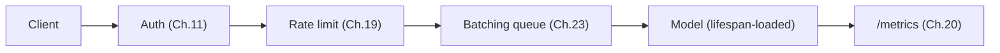
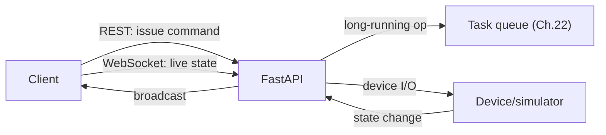

# Chapter 28: Capstone — Full Production System

> Part IV — Deployment & Production Systems · Chapter 28 of 28 (Final Chapter)

Twenty-seven chapters have each built one piece: routing, validation, a database, auth, middleware, background work, testing, architecture, performance, observability, security, deployment, CI/CD, and the boundaries where REST stops being the right tool. This chapter doesn't teach anything new — it's a design-review checklist distilling every one of those chapters into a single audit, and three project tracks, each one a genuine synthesis of a specific subset of everything you've built.

## How to Use This Chapter

This is not a chapter to read passively. Pick one of the three tracks below (or propose your own, following the same shape), and build it — using the checklist as both a build guide and a final audit. The point of a capstone isn't new material; it's applying twenty-seven chapters' worth of individually-learned lessons *simultaneously*, to one system, where they have to actually work together rather than being demonstrated in isolation.

---

## The Full Design-Review Checklist

Run any new endpoint, or your finished capstone project as a whole, through this list. Each item names the chapter it comes from — if an item doesn't make sense, that's a signal to go back and re-read that chapter's summary before proceeding.

**Foundations**
- [ ] Type hints are used correctly throughout; every `async def` route is free of blocking calls, and CPU-bound work uses plain `def` deliberately (Ch. 2, 3, 9, 23).
- [ ] Fixed-string routes are declared before parameterized siblings that could otherwise swallow them (Ch. 3, 14).
- [ ] `Query`/`Path`/`Body` constraints are applied wherever a value has a real domain restriction, not left as unconstrained primitives (Ch. 4).
- [ ] Cross-field validation lives in `model_validator`; single-field rules live in `field_validator`; `ConfigDict` choices (`strict`, `extra`, `from_attributes`) are deliberate, not defaults left unexamined (Ch. 5).
- [ ] Every resource has separate input/update/output models; nothing sensitive leaks through an output schema by omission-of-thought rather than deliberate design (Ch. 6, 21).
- [ ] Every error — validation, domain, unhandled — surfaces through one consistent envelope; the catch-all handler logs fully server-side and reveals nothing client-side (Ch. 7).

**Intermediate**
- [ ] Dependencies handle cross-cutting, reusable concerns; anything needing setup/teardown uses `yield` (Ch. 8).
- [ ] Every database driver is genuinely async end-to-end; sessions are created fresh per request (Ch. 9).
- [ ] Schema changes go through Alembic, not hand-written scripts; any query touching a relationship in a loop has been checked for N+1 (Ch. 10, 27).
- [ ] Passwords are hashed with `pwdlib`/Argon2; JWTs are short-lived with a working refresh path; role checks re-verify against the database, not a token claim alone (Ch. 11).
- [ ] Middleware ordering is understood, not accidental; CORS is configured for real, specific origins — never a wildcard combined with credentials (Ch. 12).
- [ ] `BackgroundTasks` (if used at all) is reserved for genuinely tolerable-to-lose work; every background task logs its own failures explicitly (Ch. 13).
- [ ] Large uploads/downloads are streamed in chunks, never fully buffered; upload type is checked by content signature, not just a client-supplied header (Ch. 14).
- [ ] A real, isolated test suite exists — fresh database per test, dependency overrides for auth and external services, mocks patched at the correct call-site (Ch. 15).

**Advanced**
- [ ] Repeated response shapes use a generic wrapper; all configuration goes through `pydantic-settings`, failing fast on anything required and missing (Ch. 16).
- [ ] Any WebSocket usage handles disconnects gracefully, with per-connection send failures isolated from the rest of a broadcast (Ch. 17).
- [ ] The codebase is layered (routers → services → repositories); nothing under `services/`/`repositories/` imports `fastapi` (Ch. 18) — ideally enforced by an automated test, not just a convention.
- [ ] Any cache has correct, verified invalidation on writes; any endpoint at real risk of abuse has an appropriate rate limit (Ch. 19).
- [ ] Logs are structured, with `request_id` propagated automatically via `contextvars`; `/health` and `/ready` answer genuinely different questions correctly (Ch. 20).
- [ ] Every user-owned resource is checked for ownership, not just existence (BOLA); failed ownership checks return `404`, not `403`; secrets are never hardcoded, committed, or logged (Ch. 21).
- [ ] Anything that must not be silently lost runs through a real task queue with retries and a dead-letter path, not bare `BackgroundTasks` (Ch. 22).

**Production Systems**
- [ ] Any ML model is loaded once via `lifespan`, never lazily or per-request; inference is batched if throughput matters; worker count matches whether the workload is CPU- or GPU-bound (Ch. 23).
- [ ] The Dockerfile is multi-stage, with an exec-form `CMD`; worker count is deliberate, not copy-pasted from an unrelated project (Ch. 24).
- [ ] CI gates lint → test → build → push → deploy → smoke-test, in that order, with the architecture-layering check as an automated, independent gate (Ch. 18, 25).
- [ ] Any multi-service boundary is genuinely justified, not adopted by default; retries across service boundaries use idempotency keys (Ch. 26).
- [ ] GraphQL or gRPC, if present at all, is applied only where their specific strengths are actually needed for this system — not adopted because they seemed more advanced (Ch. 27).

---

## Three Tracks

### Track 1: ML-Serving

A production inference API: authenticated, rate-limited, batched, observable, containerized, with a CI/CD pipeline.

**Draws primarily from:** Ch. 23 (`lifespan` model loading, batching), Ch. 11 (auth), Ch. 19 (caching identical repeated inputs, rate limiting the inference endpoint specifically), Ch. 20 (structured logs, `/ready` checking the model is actually loaded, a `ml_inference_duration_seconds` metric), Ch. 24–25 (Dockerfile respecting GPU-vs-CPU worker guidance, full CI pipeline).

**Minimum viable shape:**

### Track 2: Device/Control

A FastAPI service exposing REST + WebSocket endpoints to control and monitor a real or simulated device in real time, with an async job queue for anything longer-running than an immediate command.

**Draws primarily from:** Ch. 17 (WebSocket connection manager, broadcasting device state changes), Ch. 22 (a real task queue for long-running operations — a calibration routine, a multi-step movement sequence — that shouldn't block a REST response), Ch. 8 (dependencies wrapping the device connection itself), Ch. 12 (middleware for request logging on every device command, since auditability matters more here than in a typical CRUD API), Ch. 20 (observability — is the device actually reachable, not just is the API process alive).

**Minimum viable shape:**

### Track 3: SaaS-Style Platform

A multi-tenant CRUD platform with auth, roles, background jobs, caching, and a distinct public API surface plus an admin sub-application.

**Draws primarily from:** Ch. 9–10 (a genuinely multi-tenant schema — every table carries an `organization_id`), Ch. 11 (auth and roles), Ch. 21 (tenant isolation is BOLA at an organization level rather than a user level — the exact same `get_owned_or_raise` pattern, keyed by `organization_id` instead of `owner_id`), Ch. 13/22 (background jobs — a report export, a bulk import), Ch. 19 (per-tenant caching and rate limiting), Ch. 18 (the admin sub-application, mounted separately per Chapter 18.4).

**Minimum viable shape:** every table gets an `organization_id`; every repository method takes an `organization_id` alongside whatever other filters it needs; every route derives `organization_id` from the authenticated user's token, never from a client-supplied parameter (the multi-tenant version of Chapter 21's core BOLA lesson — trusting a client-supplied tenant ID instead of deriving it from the authenticated session is exactly the same class of mistake as trusting a client-supplied user ID).

---

## A Suggested Build Order

Regardless of track: **(1)** stand up the layered structure (Ch. 18) and a real database (Ch. 9–10) first, empty of features. **(2)** Add auth (Ch. 11) before building anything that needs to be protected — retrofitting auth onto already-built endpoints is more error-prone than building against it from the start. **(3)** Build the track's one or two *core* features completely, end to end, including tests (Ch. 15), before adding a second feature — a single, fully-realized vertical slice teaches more than five half-built ones. **(4)** Add observability (Ch. 20) once there's real behavior worth observing. **(5)** Run the security checklist (Ch. 21) specifically before considering any feature "done." **(6)** Containerize and set up CI (Ch. 24–25) once the core system is stable, not as an afterthought bolted on at the very end.

---

## Capstone Exercises

**Exercise 28.1 — Run your system through the full checklist, and fix at least three real gaps.**
Go through every item in this chapter's checklist against your actual capstone project. Be honest about what you skipped, rushed, or forgot. Pick at least three genuine gaps — not hypothetical ones — and fix them. Document what each gap was, which chapter it maps to, and what you changed.

**Exercise 28.2 — Write a short architecture document, as a handoff to another engineer.**
Write one to two pages covering: the layered structure and where each major piece of logic lives; the data model and its key relationships; the authentication/authorization model; how errors are surfaced consistently; what's cached and how invalidation works; what runs as a background job versus inline; and how the system is deployed and what CI gates protect it. Write it as if a competent engineer, unfamiliar with this specific codebase, needs to get productive in it within a day — assume FastAPI/Python competence, assume nothing about *this* system's specific decisions.

**Exercise 28.3 — Identify the single next bottleneck at 10x traffic.**
Assuming your current system works correctly at today's traffic level, reason through what breaks first if traffic grew 10x overnight — not everything that *could* eventually break, the single most likely first failure point. Is it the database (missing an index, a query pattern that scales linearly with data size)? The cache (a hot key becoming contended, or a cache hit rate that degrades under a wider variety of requests)? A single-instance component that was never designed to run more than one copy of (Chapter 22's original `jobs_db`, before the ARQ fix)? Justify your answer with something specific about your actual system's design, not a generic answer that could apply to any API.

---

## Closing

This curriculum started with a single-file `main.py` and a `/items/{item_id}` route in Chapter 1, built entirely on the claim that a type hint could simultaneously validate, document, and inform an editor. Every chapter since has been an elaboration or a complication of that same starting idea — dependencies as declared requirements, repositories as a boundary, middleware as a wrapper around everything, a task queue as durability that a single process's memory can't provide, a service boundary as a deliberate trade rather than a default.

None of the individual pieces in this curriculum are exotic. What's genuinely hard — and what this capstone is actually testing — is holding all of them correctly, simultaneously, in one system, under the kind of pressure a checklist alone can't simulate: a deadline, an unfamiliar bug, a decision made at 11pm that a fresh morning reveals was wrong. That's not a failure of the material; it's the actual shape of the job. The checklist above is worth keeping — not because you'll remember to run it every time, but because the one time you're rushed and skip it is exactly the time something on it would have mattered.
