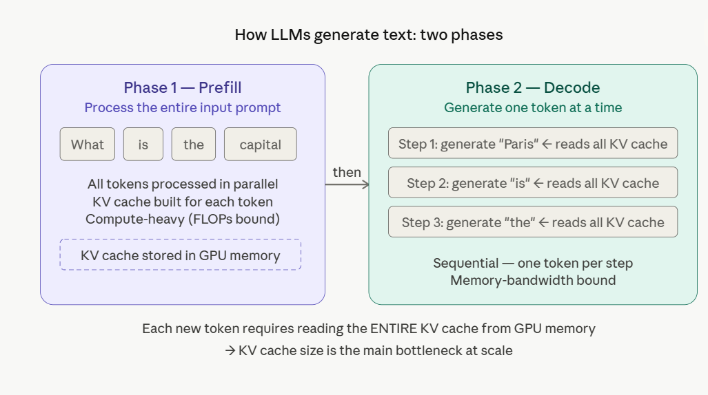
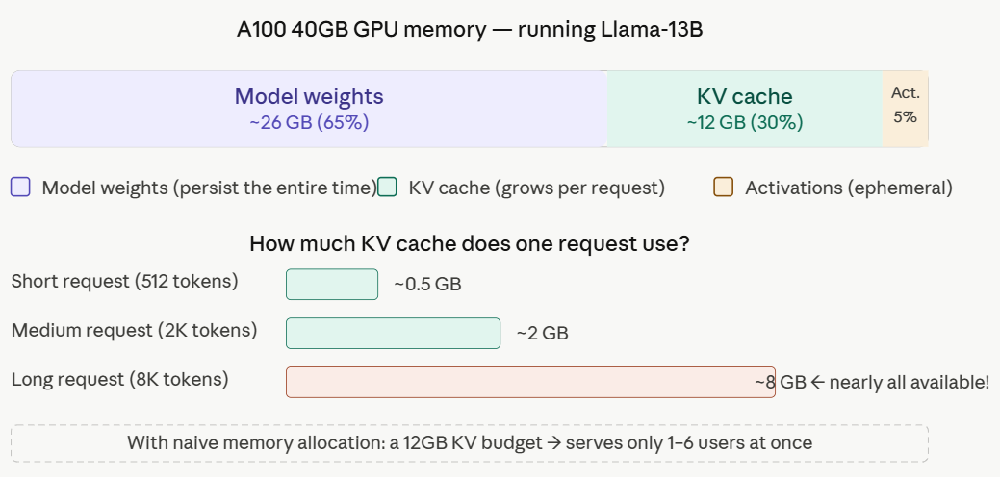
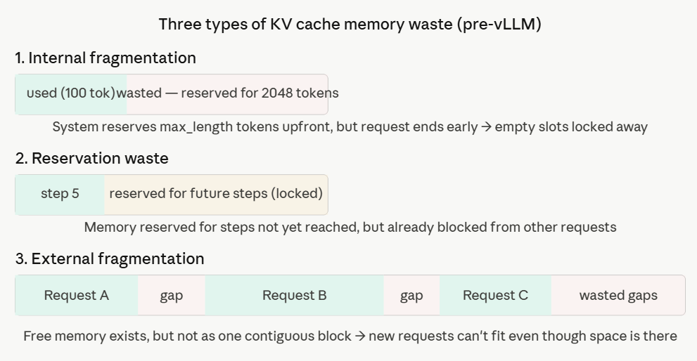
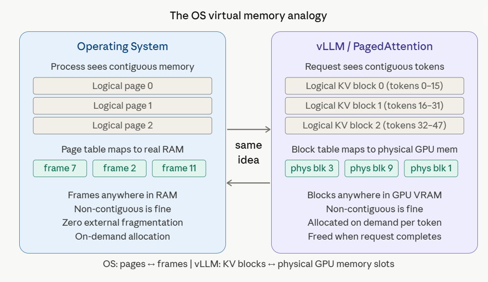

## Chapter 1 — What is vLLM and why does it exist

Let's start at the very root of the problem. To understand *why* vLLM exists, you first need to understand how LLMs generate text and what makes serving them at scale so expensive.

---

### 1.1 How LLMs generate text

Every time an LLM generates a response, it goes through two distinct phases, shown above.

**Prefill** processes your entire input prompt in one parallel forward pass through the model. This is computationally heavy but fast — all input tokens are handled simultaneously. The key output of this phase isn't just "understanding the prompt" — it's building the **KV cache**: a set of key and value vectors stored for every token, at every layer of the model. This cache is what lets the model "remember" the context.

**Decode** generates the output one token at a time. Each step, to generate the next token, the model must read the *entire* KV cache that has accumulated so far. This is sequential and cannot be parallelized. More tokens generated = bigger KV cache to read = slower each step. This is why the first token takes longer than subsequent ones (the "time to first token" problem).

> **The critical insight:** The KV cache grows with every token and must fit entirely in GPU memory. This is the bottleneck at scale.

---

### 1.2 The memory math — why this gets expensive fast

Here's what the numbers look like for a real model:

This is the core problem. On a 40GB A100 running a 13B model, the model parameters already consume about 26GB, leaving only roughly 30% of the GPU memory for KV cache management. That's roughly 12GB for KV cache — shared across *all* concurrent users.

---

### 1.3 The three types of memory waste

Before vLLM, existing systems allocated KV cache as one big **contiguous block per request** — reserved upfront. Requests to an LLM can vary in size widely, which leads to significant waste of memory blocks. The original paper breaks this into three categories:

The three types of waste are:

**1. Internal fragmentation** — The system doesn't know how long the model's response will be, so it pre-allocates the *maximum possible* token slots upfront. If the model generates 80 tokens when 2048 were reserved, those 1,968 empty slots are locked and unavailable to anyone else.

**2. Reservation waste** — Memory is reserved for future decoding steps that haven't happened yet. It's not *currently* in use, but it's blocked — like paying for a hotel room you won't check into for three days.

**3. External fragmentation** — Even when old requests finish and free their memory, the freed chunks are scattered throughout GPU memory as non-contiguous gaps. A new request needing 4GB of contiguous space can't use four 1GB scattered gaps.

The vLLM paper measures that only 20–38% of the allocated KV cache memory is actually used in existing systems — a shockingly low number for the largest memory consumer in LLM inference.

---

### 1.4 The result: terrible throughput

These three waste types compound into one outcome: **very low batch sizes**. If you can only fit 2–4 requests in memory at once, your GPU spends most of its time waiting, underutilized. Fine-grained batching solves the compute bottleneck but amplifies the memory bottleneck — the system becomes memory-bound, not compute-bound.

---

### 1.5 The insight: borrow from OS virtual memory

The vLLM team at UC Berkeley asked: *"Who has already solved non-contiguous memory management elegantly?"* The answer was sitting in every OS textbook.

The analogy is exact. One can think of blocks as pages, tokens as bytes, and requests as processes. Just as an OS lets a process *believe* its memory is contiguous while physically scattering it across RAM wherever space exists, vLLM lets the attention computation *believe* KV cache is contiguous while physically storing blocks wherever GPU memory is available.

The result: while previous systems waste 60–80% of the KV cache memory, vLLM achieves near-optimal memory usage with a mere waste of under 4%.

---

### 1.6 What vLLM actually is — and what it gives you

vLLM is a high-throughput and memory-efficient inference and serving engine for Large Language Models. At its core is PagedAttention, a novel attention algorithm that manages key-value caches with near-zero memory waste by treating GPU memory like an operating system's virtual memory.

Built on PagedAttention, vLLM delivers:

- **2–4× higher throughput** vs FasterTransformer and Orca at the same latency
- **Up to 24× higher throughput** vs vanilla HuggingFace Transformers
- An **OpenAI-compatible API server** — any OpenAI SDK client works out of the box
- Support for **continuous batching**, **quantization** (GPTQ, AWQ, INT8, FP8), **speculative decoding**, **LoRA**, and **distributed multi-GPU inference**
- Works on NVIDIA, AMD, Intel GPUs, and CPUs

---

### 1.7 vLLM vs the ecosystem — when to use what

| Situation | Best Choice |
|---|---|
| Serving open-source models at scale | **vLLM** |
| Quick prototyping / research | HuggingFace `transformers` |
| Maximum NVIDIA-specific performance (after careful tuning) | TensorRT-LLM |
| Already on HuggingFace infrastructure | TGI (Text Generation Inference) |
| On-device / edge inference | llama.cpp, Ollama |

vLLM hits the sweet spot of **performance + ease of use + ecosystem compatibility**.

---

### 1.8 The origin story

Originally developed in the Sky Computing Lab at UC Berkeley, vLLM has evolved into a community-driven project with contributions from both academia and industry. The original paper — *"Efficient Memory Management for Large Language Model Serving with PagedAttention"* — was published at SOSP 2023 (one of the top systems conferences). The latest version is 0.19.0 (April 2026), requiring Python 3.10–3.13, under the Apache 2.0 license.

---

### Chapter 1 Summary

Here's the mental model to carry forward:

| Problem | Cause | vLLM's solution |
|---|---|---|
| 60–80% GPU memory wasted | Contiguous KV cache allocation | PagedAttention: fixed-size blocks, allocated on demand |
| Few concurrent users | Not enough memory per request | Non-contiguous storage → fit more requests |
| Gaps between freed memory | External fragmentation | All blocks same size → no gaps |
| Pre-allocated unused space | Unknown output length | Allocate block-by-block as tokens are generated |

The KV cache memory problem is the **root cause** of poor LLM serving throughput. Everything vLLM does flows from solving this one thing.

---
